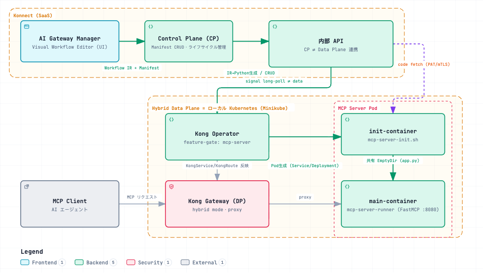
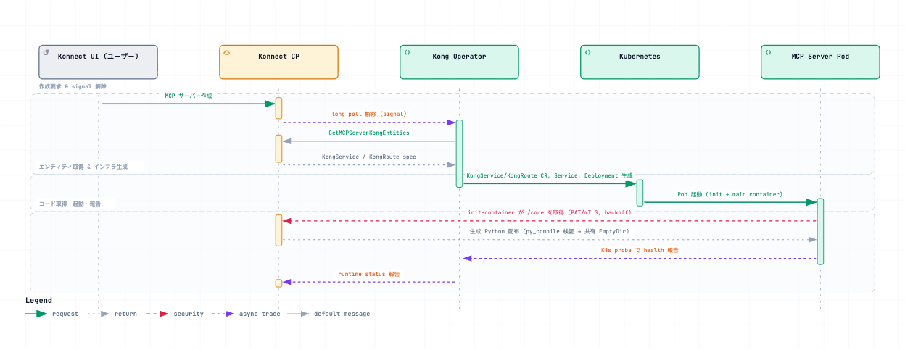
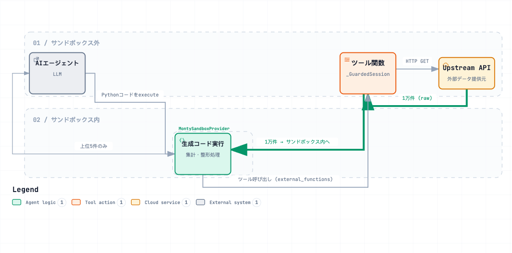

# Context Mesh / Code Mode Research Notes

> Japanese (authoritative): [CODE_MODE.md](CODE_MODE.md) — this English version is a translation.

Target repository: <https://github.com/kong-gateway/context-mesh>
Research date: 2026-07-04

This document summarizes research and the implementation approach for a demo that uses Kong Konnect **Context Mesh** to “reduce the amount of LLM tokens passed to an AI agent.”

- Goal: When an API returns 10,000 records, return only “grouping → sum of a selected field per group → top 5” to the AI agent.
- Key feature: **Code Mode** (FastMCP's `CodeMode` transform). It processes data with Python in a sandbox and returns **only the smaller processed result** to the LLM context.

---

## 1. What is Context Mesh?

> Expose API resources as context to LLMs via MCP tools.
> (Automatically generates and manages MCP servers from existing API definitions.)

Expose a customer's existing APIs to an LLM as MCP Tools without hand-writing each MCP server. Import API definitions from an **OpenAPI spec** or **Kong Service Catalog**.

### Subproject structure

| Subproject | Purpose | Status |
|---|---|---|
| `docs/` | Architecture, ADRs, diagrams | Active |
| `oas-to-python/` | **Generates an executable FastMCP server (Python) from an OpenAPI spec**. Supports Code Mode. **Core to this demo** | Active |
| `init-container/` | Init container (shell) that retrieves generated Python code from Konnect Control Plane and places it in a shared volume | Active |
| `mcp-server-runner/` | Runtime container that starts Python from the shared volume with `python app.py` | Active |
| `mcp-translator/` | Converts JSON visual workflow IR to Python | ⚠️ On Hold |

> Note: The repository contains code generation and runtime components. It does **not** contain the Konnect Control Plane (CP) API server or Visual Workflow Editor UI implementation (these are described only as architecture in the docs). CP is expected to invoke `oas-to-python` internally.

---

## 2. Overall system architecture

[](https://picketfence-labs.github.io/diagrams/fc57f2610c3a/)

*(Click the image to open the interactive version.)*

### Lifecycle (from docs/0003-lifecycle-management.md)

[](https://picketfence-labs.github.io/diagrams/243533e984f4/)

*(Click the image to open the interactive version.)*

> Traffic path: MCP Client → Kong Gateway → MCP Server Pod → (when a Tool runs) Kong Gateway → another Upstream API. The MCP Server is treated as “another Upstream Service.”

---

## 3. How Code Mode works (★ most important)

The token reduction comes from FastMCP's **`CodeMode` transform** (`fastmcp.experimental.transforms.code_mode`). The latest version is `3.4.2` (used for this demo's local verification). `oas-to-python/runtime-requirements.txt` pins `fastmcp[code-mode]==3.3.1` (see §3.4 for the version difference).

### 3.1 Problem with standard MCP (without Code Mode)

- **Tool catalog cost**: Schemas for all Tools are loaded into context at the start of the conversation (tens of thousands of tokens).
- **Intermediate result cost**: Each Tool call makes a round trip. **All raw data returned by the API** enters the LLM context; 10,000 records consume tokens for all 10,000.

### 3.2 Code Mode behavior

Add `CodeMode(sandbox_provider=...)` as a transform to a FastMCP server:

- The client (LLM) no longer sees the original individual Tools. Instead, it sees **meta-tools** in 3 stages: `search` (BM25 Tool search) → `get schemas` → `execute` (Python code execution). A small catalog may use 2 stages or omit discovery.
- The LLM **writes Python code and passes it to `execute`** rather than calling Tools directly.
- The code runs in a **sandbox** (default `MontySandboxProvider`).
- Inside the sandbox, original Tools can be called as **regular Python functions** (injected as `external_functions`).

  ```
  LLM が書くコード（サンドボックス内、本デモの例）:
      cities = listCities()                     # ← ツール呼び出し = 実 HTTP は外で実行
      data = [getTemperatures(c["id"]) ...]     # ← 各都市を取得（サンドボックス外で HTTP）
      groups = group_and_avg(data)              # ← 純 Python でデータ加工
      return top5(groups)                       # ← 小さい結果だけ返る
  ```

- **Important boundary**: HTTP fetches (retrieving 10,000 records) occur in the Tool functions, outside the sandbox, and the results are passed into the sandbox as Python objects. Processing (group/sum/top5) occurs inside the sandbox. Only the final return value goes to the LLM. → **The 10,000 records never enter the LLM context.**

[](https://picketfence-labs.github.io/diagrams/6eb74034255d/)

*(Click the image to open the interactive version. Thick line = 10,000 records kept inside the sandbox (not sent to the LLM); thin line = 5 records returned to the LLM.)*

### 3.3 Token reduction principle (demo claim)

| | Standard mode | Code Mode |
|---|---|---|
| Tool catalog | Schemas for all Tools always present | Meta-tools only (on-demand search) |
| Data retrieval | 10,000 records enter the LLM | Processed in the sandbox; not sent to the LLM |
| Amount received by LLM | ~10,000 records | **Top 5 only** |

### 3.4 Two types of runtime limits (this demo assumes latest 3.4.2)

- **Tool call limit = `CodeMode(max_tool_calls=...)`**
  - **Introduced in v3.4.0**, default `50` (`call_tool()` calls per `execute` block), or unlimited with `None`. Exceeding it raises `ToolError`. It is an argument to the `CodeMode` class, **not the sandbox**.
  - This demo uses a normalized API and makes about 100 calls, exceeding the default 50. Add `max_tool_calls=200` (or `None`) to `CodeMode(sandbox_provider=sandbox)` in the generated `app.py`.
  - ⚠️ **Version difference**: `oas-to-python` pins `fastmcp==3.3.1` in `runtime-requirements.txt`; **3.3.1 does not have `max_tool_calls`** (passing it raises `TypeError`; call limits are not implemented in 3.3.1). Install latest 3.4.2 for local verification ([CODE_MODE_LOCAL_TEST.md](CODE_MODE_LOCAL_TEST.en.md)).
- **Sandbox limits = `MontySandboxProvider(limits={...})`**
  - Valid keys: `max_duration_secs`, `max_memory`, `max_allocations`, `max_recursion_depth`, `gc_interval`.
  - FastMCP defaults (when omitted): `max_duration_secs=30` / `max_memory=100MB`.
  - `oas-to-python` generated code overrides these with `max_duration_secs=10` / `max_memory=50MB` (defaults in `oastopython.go`; no CLI flag; can be changed with the Go API `GenerateConfig`).
  - 12,000 records use about 1.1MB of memory, but **100 HTTP calls count toward execution time**, so they may exceed `max_duration_secs=10`. Increase the limit in the generated `app.py`'s `MontySandboxProvider`.

### 3.5 Sources for the limits (verification references)

- **Latest FastMCP**: latest is `3.4.2` (`max_tool_calls` introduced in v3.4.0). Official docs: <https://gofastmcp.com/servers/transforms/code-mode> — `max_tool_calls` (`CodeMode` argument, default `50`, unlimited with `None`) and `MontySandboxProvider` (defaults `max_duration_secs=30` / `max_memory=100MB` without arguments).
- **In context-mesh / oas-to-python**: there is **no reference** to `max_tool_calls` (only `CodeMode(sandbox_provider=sandbox)` is output). Sandbox limits are in `oas-to-python/internal/generator/generator.go` (`MontySandboxProvider(limits={"max_duration_secs":10,"max_memory":50000000})`) and `oas-to-python/pkg/oastopython/oastopython.go` (defaults 10 / 50MB). `runtime-requirements.txt` pins **`fastmcp==3.3.1`** (so `max_tool_calls` is unsupported with that version).

---

## 4. Code generation details (oas-to-python)

Written in Go. Converts `OpenAPI 3.0 spec → FastMCP Python server`. Processing flows through `pkg/oastopython/oastopython.go` (settings and defaults) → `internal/mapper` (spec parsing) → `internal/generator` (rendering `server.tmpl`).

### 4.1 CLI

```bash
# 通常サーバー
oas-to-python spec.json -o server.py

# Code Mode（+ 生成コードのログ出力）
oas-to-python spec.json --code-mode --debug -o server.py
```

Main flags:

| Flag | Default | Description |
|---|---|---|
| `-o, --output` | stdout | Output destination |
| `--base-url` | from spec | Override API base URL |
| `--transport` | `http` | `http` (port 8080) / `stdio` |
| `--host` | `127.0.0.1` | Use `0.0.0.0` when exposing a container |
| `--port` | `8080` | HTTP port |
| `--auth` | auto-detect | `none` / `api-key` / `bearer` |
| `--env-prefix` | derived from name | Environment variable prefix |
| `--code-mode` | `false` | **Enable CodeMode transform** |
| `--debug` | `false` | **Log LLM-generated code** (`--code-mode` required; useful for the demo) |

> ⚠️ There is no CLI flag to change sandbox `max_duration_secs` / `max_memory`. If needed, use the Go API (`GenerateConfig.SandboxMaxDuration/Memory` in `oastopython.Generate`) or edit the generated Python.

### 4.2 Structure of generated Python (`server.tmpl` + `generator.go`)

1. **imports**: `fastmcp`, `requests`, and (in code-mode) `from fastmcp.experimental.transforms.code_mode import CodeMode, MontySandboxProvider`.
2. **config**: Read `BASE_URL` / `TIMEOUT` / auth from environment variables.
   - Auth precedence: ① connection headers `X-Upstream-Api-Key` / `X-Upstream-Bearer-Token` (recommended; secrets are hidden from the model) ② Tool arguments `api_key` / `token` ③ environment variables `{PREFIX}_API_KEY` / `_TOKEN`.
3. **egress guard**: `_GuardedSession(requests.Session)` rejects requests to origins other than the configured upstream with `EgressTrafficError` (`trust_env=False` also prevents proxy bypass). This prevents sandbox code from calling arbitrary URLs.
4. **sandbox creation** (code-mode):
   - Normal: `sandbox = MontySandboxProvider(limits={"max_duration_secs":10,"max_memory":50000000})`
   - With `--debug`: `LoggingSandboxProvider` prints **LLM-generated Python before execution**, available Tools, and results; ideal for demonstrating behavior.
5. **`mcp = FastMCP(..., transforms=[CodeMode(sandbox_provider=sandbox)])`**.
6. **One `@mcp.tool()` function per operation**. The function makes HTTP requests using `_GuardedSession`. Dict responses pass through; **list responses are wrapped as `{"results": [...]}`** (the key used by the demo's data processing below).

### 4.3 Sample output

Examples are in `oas-to-python/examples/specs/*_code_mode.py` (`openweathermap_code_mode.py`, `kongair_code_mode.py`, `petstore_code_mode.py`, `minimal_code_mode.py`). Refer to them to see the completed `--code-mode --debug` output.

### 4.4 Code Mode prompt example (`docs/CodeModePrompts.md`)

Example wording to perform multiple calls and aggregation in a “single code mode request”:

> Get the weather for Goiânia, São Paulo, Rio, Curitiba, and Manaus in metric.
> If any city is above 35°C flag heat alert ... Return a summary with alerts and the
> average temperature. **Perform a single code mode request.**

Tip: Adding **“Perform a single code mode request.”** at the end of the prompt encourages one code execution instead of sequential Tool calls.

---

## 5. Demo design and local verification → separate document

The detailed demo design (test data, example queries, generation commands, expected code generated in the sandbox, and how to demonstrate token reduction) and local unit verification without Konnect / K8s are in [CODE_MODE_LOCAL_TEST.md](CODE_MODE_LOCAL_TEST.en.md).

Key points:

- The upstream API and test data are ready in [mock-api/](mock-api/) (100 major world cities × 12 months × 10 years = **12,000 records**, normalized as `cities` / `temperatures`).
- Expected query: **“Get the Top5 average temperature in March over the past 10 years.”**
- Since the API is normalized, loop through `listCities()` → `getTemperatures(city_id)` for each city in the sandbox (**about 100 Tool calls**). Latest 3.4.x exceeds the default `max_tool_calls=50`; add `max_tool_calls=200` (or `None`) to generated `app.py`'s `CodeMode(...)`. Also note that 100 HTTP calls count toward execution time and the default `max_duration_secs` is 10 seconds (see §3.4).

---

## 6. Work required in the Konnect UI (to be performed with Shinichi)

This repository does not implement CP/UI, so actual operations in Konnect require separate verification. Expected flow:

1. Create a **Hybrid Control Plane** in Konnect and connect the **Kong DP** on Minikube.
2. Deploy **Kong Operator** to Minikube with `--feature-gates=mcp-server` (requires MCPServer CRD).
3. Define an MCP Server in Konnect **AI Gateway Manager / MCP Composer** (import an OpenAPI spec or Service Catalog; verify whether Code Mode can be enabled).
4. The Operator generates a K8s workload from the `MCPServer` CR. The init-container retrieves generated Python from `/code` and starts it.

> ⚠️ Unverified: (a) whether the Konnect UI exposes a toggle/setting to enable Code Mode, (b) whether sandbox limits can be changed in the UI when Code Mode is enabled, and (c) whether MCP Composer is available in the current tenant (at the M1–M3 roadmap stage, it was Technical Preview). → **Shinichi needs to check the Konnect UI and fill these in.**

---

## 7. Open items / checklist for verification

- [x] Create a large-record API for the demo ([mock-api/](mock-api/); normalized into cities/temperatures).
- [x] Prepare test data (100 cities × 12 months × 10 years, Celsius, deterministic generation).
- [ ] Build `oas-to-python` (`go.mod` requires Go 1.26; check local Go version).
- [ ] Complete local unit verification ([CODE_MODE_LOCAL_TEST.md](CODE_MODE_LOCAL_TEST.en.md)).
- [ ] Add `max_tool_calls=200` to generated `app.py`'s `CodeMode(...)` (latest 3.4.x defaults to 50, which is insufficient).
- [ ] Measure whether 100 calls fit within the sandbox `max_duration_secs` (default 10 seconds). Increase `MontySandboxProvider(limits=...)` if they do not.
- [ ] Check the FastMCP version used by Konnect (`3.3.1` does not support `max_tool_calls`; 3.4.0+ does).
- [ ] Check whether MCP Composer / Context Mesh is available in the current tenant (Preview availability).
- [ ] Establish how to add the `mcp-server` feature gate to Kong Operator on Minikube.

---

## Reference files

### This repository

- [CODE_MODE_LOCAL_TEST.md](CODE_MODE_LOCAL_TEST.en.md) — local unit verification
- [mock-api/](mock-api/) — demo mock API and test data (12,000 temperature records)

### In the context-mesh repository

- `docs/0001-architecture.md`, `docs/0003-lifecycle-management.md` — architecture / lifecycle
- `AGENTS.md` — CP-DP API list, UI nodes / data model, roadmap
- `oas-to-python/README.md` — generator usage
- `oas-to-python/internal/generator/{generator.go,server.tmpl}` — code generator
- `oas-to-python/pkg/oastopython/oastopython.go` — defaults (including sandbox limits)
- `oas-to-python/examples/specs/*_code_mode.py` — generated code examples
- `oas-to-python/docs/{CodeModePrompts.md,ProductDemo.md}` — prompt examples / demo notes
- `init-container/mcp-server-init.sh`, `mcp-server-runner/mcp-server-runner.sh` — startup behavior

## References (external)

- Code Mode — FastMCP official docs: <https://gofastmcp.com/servers/transforms/code-mode>
- “Stop Calling Tools, Start Writing Code (Mode)”: <https://jlowin.dev/blog/fastmcp-3-1-code-mode>
