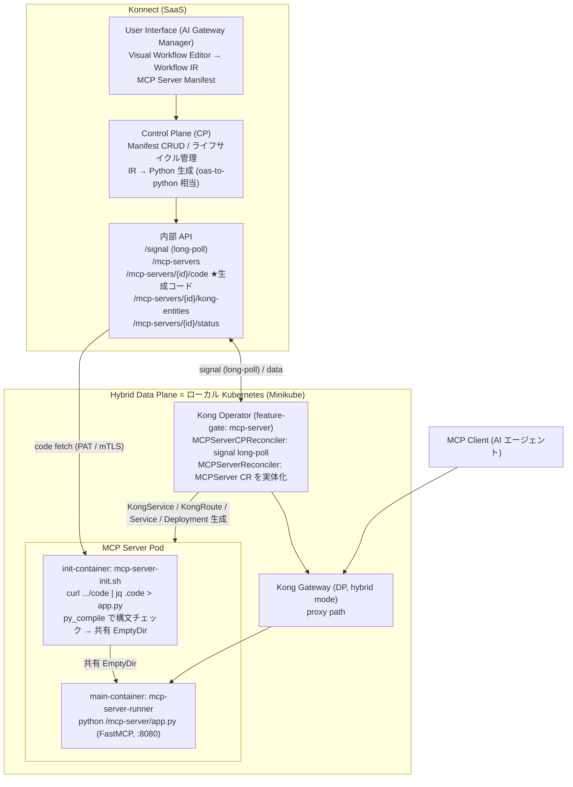
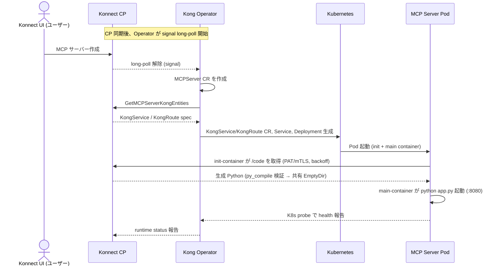

# Context Mesh / Code Mode 調査メモ

対象リポジトリ: <https://github.com/kong-gateway/context-mesh>
調査日: 2026-07-04

本ドキュメントは、Kong Konnect の **Context Mesh** を使って「AI エージェントに渡す LLM
トークン量を削減する」デモを実装するための調査結果と、実装方針をまとめたものである。

- ゴール: API が 1 万件のレコードを返す状況で、AI エージェントには
  「グループ化 → グループごとの特定フィールドの Sum → 上位 5 件」だけを返す。
- 鍵となる機能: **Code Mode**（FastMCP の `CodeMode` transform）。データ加工をサンドボックス内の
  Python で行い、**加工後の小さな結果だけ**を LLM コンテキストに返す。

---

## 1. Context Mesh とは

> Expose API resources as context to LLMs via MCP tools.
> （既存の API 定義から MCP サーバーを自動生成・管理する仕組み）

顧客の既存 API を、いちいち MCP サーバーを手書きせずに MCP ツール化して LLM に露出させる。
API 定義は **OpenAPI spec** もしくは **Kong の Service Catalog** から取り込む。

### サブプロジェクト構成

| サブプロジェクト | 役割 | 状態 |
|---|---|---|
| `docs/` | アーキテクチャ・ADR・図 | Active |
| `oas-to-python/` | **OpenAPI spec → 実行可能な FastMCP サーバー(Python) を生成**。Code Mode 対応。**今回の核心** | Active |
| `init-container/` | Konnect Control Plane から生成済み Python コードを取得し、共有ボリュームに配置する init コンテナ(shell) | Active |
| `mcp-server-runner/` | 共有ボリューム上の Python を `python app.py` で起動するランタイムコンテナ | Active |
| `mcp-translator/` | JSON ビジュアルワークフロー IR → Python への変換器 | ⚠️ On Hold |

> 補足: リポジトリ上の実体は「コード生成器 + ランタイム部品」であり、Konnect Control Plane
> (CP) 側の API サーバーや Visual Workflow Editor UI の実装は**このリポジトリには含まれない**
> （docs にアーキテクチャとして記述があるのみ）。CP は `oas-to-python` を内部で呼び出す想定。

---

## 2. システム全体アーキテクチャ



### ライフサイクル（docs/0003-lifecycle-management.md より）



> トラフィック経路: MCP Client → Kong Gateway → MCP Server Pod → (Tool 実行で) Kong Gateway
> → 別の Upstream API。MCP Server は「もう 1 つの Upstream Service」として扱われる。

---

## 3. Code Mode の仕組み（★最重要）

トークン削減の本体は **FastMCP の `CodeMode` transform**
（`fastmcp.experimental.transforms.code_mode`）。最新版は `3.4.2`（本デモのローカル検証はこれを使う）。
なお `oas-to-python/runtime-requirements.txt` は `fastmcp[code-mode]==3.3.1` をピン留めしている
（版差は §3.4 参照）。

### 3.1 通常の MCP（Code Mode なし）の課題

- **ツールカタログのコスト**: 全ツールのスキーマが会話冒頭でコンテキストに載る（数万トークン）。
- **中間結果のコスト**: ツール呼び出しは 1 回ごとに往復。**API が返す生データが丸ごと**
  LLM コンテキストに流れ込む。1 万件返れば 1 万件分がトークンになる。

### 3.2 Code Mode の動作

`CodeMode(sandbox_provider=...)` を FastMCP サーバーに transform として追加すると:

- クライアント（LLM）には元の個別ツールは見えなくなり、代わりに **メタツール** が見える:
  `search（BM25 でツール検索）→ get schemas → execute（Python コード実行）` の 3 段構成
  （小さいカタログなら 2 段や discovery なしに縮約可能）。
- LLM は「ツールを直接呼ぶ」のではなく **Python コードを書いて `execute` に渡す**。
- そのコードは **サンドボックス**（デフォルト `MontySandboxProvider`）内で実行される。
- サンドボックス内から、元の各ツールは **通常の Python 関数として呼べる**
  （`external_functions` として注入される）。

  ```
  LLM が書くコード（サンドボックス内、本デモの例）:
      cities = listCities()                     # ← ツール呼び出し = 実 HTTP は外で実行
      data = [getTemperatures(c["id"]) ...]     # ← 各都市を取得（サンドボックス外で HTTP）
      groups = group_and_avg(data)              # ← 純 Python でデータ加工
      return top5(groups)                       # ← 小さい結果だけ返る
  ```

- **重要な境界**: HTTP フェッチ（1 万件取得）はツール関数側=サンドボックス外で行われ、
  結果がサンドボックスに Python オブジェクトとして渡る。加工（group/sum/top5）はサンドボックス内。
  最終 return 値だけが LLM に返る。→ **1 万件は LLM コンテキストに一切入らない。**

```mermaid
flowchart LR
  LLM["AI エージェント (LLM)"] -->|"Python コードを execute"| SB
  subgraph SB["サンドボックス (MontySandboxProvider)"]
    CODE["LLM 生成コード<br/>listCities() + getTemperatures()<br/>group / avg<br/>return top5"]
  end
  CODE -->|"ツール呼び出し (external_functions)"| TOOL["ツール関数 (_GuardedSession)"]
  TOOL -->|"HTTP GET"| API["Upstream API"]
  API -->|"1 万件 (raw)"| TOOL
  TOOL -->|"1 万件 → サンドボックス内へ"| CODE
  SB -->|"上位 5 件のみ"| LLM
  linkStyle 5 stroke:#e0a000,stroke-width:2px
  linkStyle 6 stroke:#2ca02c,stroke-width:2px
```

> 黄色線 = サンドボックス内に留まる 1 万件（LLM に入らない）／緑線 = LLM に返る 5 件。

### 3.3 トークン削減の原理（デモの主張）

| | 通常モード | Code Mode |
|---|---|---|
| ツールカタログ | 全ツールのスキーマが常時 | メタツールのみ（オンデマンド検索） |
| データ取得 | 1 万件が LLM に流入 | サンドボックス内で処理、LLM には入らない |
| LLM が受け取る量 | ~1 万レコード | **上位 5 件のみ** |

### 3.4 実行時の 2 種類の上限（本デモは最新版 3.4.2 前提）

- **ツール呼び出し回数の上限 = `CodeMode(max_tool_calls=...)`**
  - **v3.4.0 で導入**、既定 `50`（1 execute ブロックあたりの `call_tool()` 回数）、`None` で無制限。
    超過すると `ToolError`。**サンドボックスではなく `CodeMode` クラスの引数**。
  - 本デモは正規化 API のため ~100 回呼ぶ → 既定 50 を超える。生成 `app.py` の
    `CodeMode(sandbox_provider=sandbox)` に `max_tool_calls=200`（または `None`）を追加して回避。
  - ⚠️ **バージョン差異**: `oas-to-python` の `runtime-requirements.txt` は `fastmcp==3.3.1` を
    ピン留めしており、**3.3.1 には `max_tool_calls` が無い**（渡すと `TypeError`。3.3.1 は回数上限
    そのものが未実装）。ローカル検証は最新 3.4.2 を入れる（[CODE_MODE_LOCAL_TEST.md](CODE_MODE_LOCAL_TEST.md)）。
- **サンドボックスの制限 = `MontySandboxProvider(limits={...})`**
  - 有効キー: `max_duration_secs`, `max_memory`, `max_allocations`, `max_recursion_depth`, `gc_interval`。
  - FastMCP 側デフォルト（引数なし）: `max_duration_secs=30` / `max_memory=100MB`。
  - `oas-to-python` 生成コードはこれを上書きして `max_duration_secs=10` / `max_memory=50MB`
    （`oastopython.go` の既定値。CLI フラグ不可 / Go API `GenerateConfig` で変更可）。
  - メモリは 12,000 件 ≈ 1.1MB で収まるが、**100 回の HTTP が実行時間に含まれる**ため
    `max_duration_secs=10` を超える場合あり → 生成 `app.py` の `MontySandboxProvider` を引き上げる。

### 3.5 上限の出典（確認先）

- **FastMCP 最新版**: 最新は `3.4.2`（`max_tool_calls` は v3.4.0 導入）。
  公式ドキュメント <https://gofastmcp.com/servers/transforms/code-mode>
  — `max_tool_calls`（`CodeMode` 引数、既定 `50`、`None` で無制限）、
  `MontySandboxProvider`（引数なしで `max_duration_secs=30` / `max_memory=100MB`）。
- **context-mesh / oas-to-python 内**: `max_tool_calls` の記述は **無い**（`CodeMode(sandbox_provider=sandbox)`
  のみ出力）。サンドボックス上限は `oas-to-python/internal/generator/generator.go`
  （`MontySandboxProvider(limits={"max_duration_secs":10,"max_memory":50000000})`）と
  `oas-to-python/pkg/oastopython/oastopython.go`（既定値 10 / 50MB）、`runtime-requirements.txt` は
  **`fastmcp==3.3.1` をピン留め**（＝この版で動かすと `max_tool_calls` 非対応）。

---

## 4. コード生成の詳細（oas-to-python）

Go 製。`OpenAPI 3.0 spec → FastMCP Python サーバー`。処理は
`pkg/oastopython/oastopython.go`（設定・既定値）→ `internal/mapper`（spec 解析）→
`internal/generator`（`server.tmpl` に流し込み）。

### 4.1 CLI

```bash
# 通常サーバー
oas-to-python spec.json -o server.py

# Code Mode（+ 生成コードのログ出力）
oas-to-python spec.json --code-mode --debug -o server.py
```

主なフラグ:

| フラグ | 既定 | 説明 |
|---|---|---|
| `-o, --output` | stdout | 出力先 |
| `--base-url` | spec から | API ベース URL 上書き |
| `--transport` | `http` | `http`(port 8080) / `stdio` |
| `--host` | `127.0.0.1` | コンテナ公開時は `0.0.0.0` |
| `--port` | `8080` | HTTP ポート |
| `--auth` | 自動検出 | `none`/`api-key`/`bearer` |
| `--env-prefix` | 名前から導出 | 環境変数プレフィックス |
| `--code-mode` | `false` | **CodeMode transform を有効化** |
| `--debug` | `false` | **LLM 生成コードをログ出力**（`--code-mode` 必須。デモで有用） |

> ⚠️ サンドボックスの `max_duration_secs` / `max_memory` を変える CLI フラグは無い。
> 変更が必要なら Go API (`oastopython.Generate` に `GenerateConfig.SandboxMaxDuration/Memory`)
> 経由か、生成後の Python を手で書き換える。

### 4.2 生成される Python の構造（`server.tmpl` + `generator.go`）

1. **imports**: `fastmcp`, `requests`, （code-mode 時）
   `from fastmcp.experimental.transforms.code_mode import CodeMode, MontySandboxProvider`。
2. **config**: `BASE_URL` / `TIMEOUT` / 認証を環境変数から読む。
   - 認証優先順位: ①接続ヘッダー `X-Upstream-Api-Key` / `X-Upstream-Bearer-Token`（推奨。
     モデルに秘匿情報が見えない） ②ツール引数 `api_key`/`token` ③環境変数 `{PREFIX}_API_KEY`/`_TOKEN`。
3. **egress ガード**: `_GuardedSession(requests.Session)` が、設定した upstream origin 以外への
   リクエストを `EgressTrafficError` で拒否（`trust_env=False` でプロキシ経由バイパスも防止）。
   → サンドボックス内コードが任意 URL を叩けない安全設計。
4. **sandbox 生成**（code-mode 時）:
   - 通常: `sandbox = MontySandboxProvider(limits={"max_duration_secs":10,"max_memory":50000000})`
   - `--debug` 時: `LoggingSandboxProvider`（実行前に **LLM 生成 Python を print**、
     使用可能ツール一覧・結果も print）→ デモの「見せ場」に最適。
5. **`mcp = FastMCP(..., transforms=[CodeMode(sandbox_provider=sandbox)])`**。
6. **各オペレーション → `@mcp.tool()` の関数 1 個**。関数内で `_GuardedSession` を使って
   HTTP リクエスト。レスポンスは `dict` ならそのまま、**list なら `{"results": [...]}` で包む**
   （← 後述、デモのデータ処理で参照するキー）。

### 4.3 サンプル出力

`oas-to-python/examples/specs/*_code_mode.py` に生成例あり
（`openweathermap_code_mode.py`, `kongair_code_mode.py`, `petstore_code_mode.py`,
`minimal_code_mode.py`）。`--code-mode --debug` の完成形を確認したい場合はこれらが参考になる。

### 4.4 Code Mode プロンプト例（`docs/CodeModePrompts.md`）

複数呼び出し + 集計を「単一の code mode リクエスト」で行わせる書き方の例:

> Get the weather for Goiânia, São Paulo, Rio, Curitiba, and Manaus in metric.
> If any city is above 35°C flag heat alert ... Return a summary with alerts and the
> average temperature. **Perform a single code mode request.**

ポイント: プロンプト末尾に **"Perform a single code mode request."** を付けると、
逐次ツール呼び出しではなく 1 回の code 実行に集約させやすい。

---

## 5. デモ設計・ローカル検証 → 別ドキュメント

デモの具体設計（テストデータ・想定クエリ・生成コマンド・サンドボックス内で生成される
コードの期待形・トークン削減の見せ方）と、Konnect / K8s を挟まないローカル単体検証の
手順は **[CODE_MODE_LOCAL_TEST.md](CODE_MODE_LOCAL_TEST.md)** にまとめている。

要点だけ再掲:

- 上流 API とテストデータは [mock-api/](mock-api/) に準備済み（世界主要 100 都市 ×
  12 か月 × 10 年 = **12,000 レコード**、`cities`/`temperatures` に正規化）。
- 想定クエリ: **「過去 10 年の 3 月の平均気温 Top5 を取得」**。
- 正規化 API のため、サンドボックス内で `listCities()` → 各 `getTemperatures(city_id)` を
  ループ集計する（**約 100 回のツール呼び出し**）。最新版 3.4.x では既定 `max_tool_calls=50` を
  超えるため、生成 `app.py` の `CodeMode(...)` に `max_tool_calls=200`（または `None`）を追加。
  加えて 100 回の HTTP が実行時間に含まれるため `max_duration_secs`（既定 10 秒）にも注意（§3.4）。

---

## 6. Konnect UI 側で必要になる作業（Shinichi 側で確認しながら実施）

このリポジトリには CP/UI の実装は無いため、Konnect 上の実操作は別途確認が必要。想定される流れ:

1. Konnect で **Hybrid Control Plane** を作成し、Minikube 上の **Kong DP** を接続。
2. **Kong Operator** を `--feature-gates=mcp-server` 付きで Minikube にデプロイ
   （MCPServer CRD が必要）。
3. Konnect の **AI Gateway Manager / MCP Composer** で MCP サーバーを定義
   （OpenAPI spec 取り込み or Service Catalog、Code Mode 有効化の可否を確認）。
4. Operator が `MCPServer` CR → K8s ワークロードを自動生成。init-container が `/code` から
   生成 Python を取得して起動。

> ⚠️ 未確認: (a) Konnect UI 上で Code Mode を有効化するトグル/設定が公開されているか、
> (b) Code Mode 有効時にサンドボックス上限を UI から変更できるか、
> (c) MCP Composer 機能自体が現在のテナントで利用可能か（M1〜M3 のロードマップ上、
> Technical Preview 段階）。→ **Shinichi 側で Konnect UI を確認して埋める必要あり。**

---

## 7. 未確定事項・要確認リスト

- [x] デモ用の大量レコード API を作成（[mock-api/](mock-api/)。cities/temperatures に正規化）。
- [x] テストデータ準備（100 都市 × 12 か月 × 10 年、摂氏、決定論生成）。
- [ ] `oas-to-python` のビルド（go.mod が Go 1.26 要求。ローカル Go のバージョン確認が必要）。
- [ ] ローカル単体検証を実際に通す（[CODE_MODE_LOCAL_TEST.md](CODE_MODE_LOCAL_TEST.md)）。
- [ ] 生成 `app.py` の `CodeMode(...)` に `max_tool_calls=200` を追加（最新 3.4.x は既定 50 で不足）。
- [ ] 100 回呼び出しがサンドボックス `max_duration_secs`（既定 10 秒）に収まるか実測。超えたら
  `MontySandboxProvider(limits=...)` を引き上げ。
- [ ] Konnect が使う FastMCP のバージョン確認（3.3.1 は `max_tool_calls` 非対応、3.4.0+ は対応）。
- [ ] 現テナントで MCP Composer / Context Mesh 機能が使えるか（Preview 提供状況）。
- [ ] Minikube 上の Kong Operator に `mcp-server` feature gate を入れる手順の確立。

---

## 参考ファイル

### 本リポジトリ

- [CODE_MODE_LOCAL_TEST.md](CODE_MODE_LOCAL_TEST.md) — ローカル単体検証手順
- [mock-api/](mock-api/) — デモ用モック API + テストデータ（12,000 件の気温レコード）

### context-mesh リポジトリ内

- `docs/0001-architecture.md`, `docs/0003-lifecycle-management.md` — アーキ/ライフサイクル
- `AGENTS.md` — CP-DP API 一覧、UI ノード/データモデル、ロードマップ
- `oas-to-python/README.md` — 生成器の使い方
- `oas-to-python/internal/generator/{generator.go,server.tmpl}` — コード生成の本体
- `oas-to-python/pkg/oastopython/oastopython.go` — 既定値（sandbox 上限含む）
- `oas-to-python/examples/specs/*_code_mode.py` — 生成コードの実例
- `oas-to-python/docs/{CodeModePrompts.md,ProductDemo.md}` — プロンプト例/デモ注意点
- `init-container/mcp-server-init.sh`, `mcp-server-runner/mcp-server-runner.sh` — 起動時挙動

## 参考（外部）

- Code Mode — FastMCP 公式: <https://gofastmcp.com/servers/transforms/code-mode>
- "Stop Calling Tools, Start Writing Code (Mode)": <https://jlowin.dev/blog/fastmcp-3-1-code-mode>
