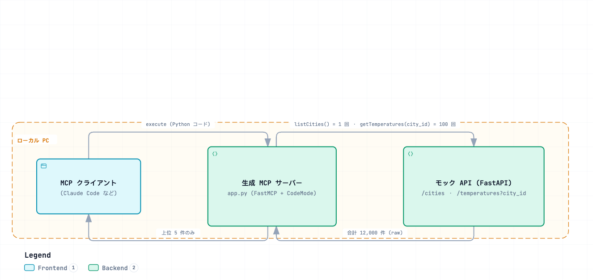

# Code Mode Local Unit Verification Steps

> Japanese (authoritative): [CODE_MODE_LOCAL_TEST.md](CODE_MODE_LOCAL_TEST.md) — this English version is a translation.

This procedure verifies **token reduction through Code Mode** entirely on a local PC without Konnect / Kubernetes, and describes the demo in detail. The mock API and generated MCP Server established here can be reused as the upstream API for the next-stage Konnect Code Mode MCP verification.

- For background, architecture, and how Code Mode works, see [CODE_MODE.md](CODE_MODE.en.md).
- Query under test: **“Get the Top5 average temperature in March over the past 10 years.”**
- Test data: **12,000 records** (100 major world cities × 12 months × 10 years) in [mock-api/](mock-api/).
- Expected behavior: the 12,000 records do not enter the LLM context; aggregation runs in the sandbox and returns **only 5 records**.

---

## 1. Demo design

### 1.1 Test data / mock API (ready; normalized)

This repository's [mock-api/](mock-api/) contains the upstream API and demo test data, normalized into two entities: `cities` and `temperatures`.

| Method / path | operationId | Returned data |
|---|---|---|
| `GET /cities` | `listCities` | **IDs and city names only** for all cities (100) |
| `GET /cities/{city_id}` | `getCity` | Details for one city (id, city, country, latitude, longitude) |
| `GET /temperatures?city_id=` | `getTemperatures` | Temperatures for the specified city (**city_id required**, 120 by default) |

- Temperature record fields: `id, city_id (FK), year, month, temp` (`temp` is Celsius °C).
- OpenAPI 3.0.3 spec: [mock-api/openapi.json](mock-api/openapi.json), ready to pass directly to `oas-to-python`.
- Since no real data is available, the values are deterministic approximations. See [mock-api/README.md](mock-api/README.en.md) for details.

### 1.2 Expected query and processing breakdown

> **“Get the Top5 average temperature in March over the past 10 years.”**

Because the API is normalized, this requires **multiple calls plus aggregation** (covering three requirements):

1. Call `listCities()` to get the IDs and names of 100 cities.
2. For each `city_id`, call `getTemperatures(city_id)` and **filter/group by `month==3`**.
3. **Average (aggregate)** the `temp` values for each city across 10 years.
4. Return only the **top 5 cities (Top5)** by average temperature.

### 1.3 Expected code generated by the LLM in the sandbox

All 100 API calls and processing of 12,000 records complete **inside the sandbox**; only **5 records** return to the LLM. With `--debug`, the generated code and “Available tools” / “Result” appear in the server log, so they can be shown in the demo. Expected results: Jakarta / Singapore / Khartoum / Luanda / Chennai.

Generated code can call Tools as regular Python functions. List responses are wrapped as `{"results": [...]}`.

```python
# ツールは通常の Python 関数として呼べる。list レスポンスは {"results": [...]} で包まれる
cities = listCities()["results"]           # 100 件 (id, city)  ← 1 回

ranked = []
for c in cities:
    temps = getTemperatures(city_id=c["id"])["results"]   # 各都市 120 件  ← 100 回
    march = [t["temp"] for t in temps if t["month"] == 3]
    if march:
        ranked.append({"city": c["city"], "avg_temp": sum(march) / len(march)})

top5 = sorted(ranked, key=lambda r: r["avg_temp"], reverse=True)[:5]
return [{"city": r["city"], "avg_temp": round(r["avg_temp"], 1)} for r in top5]
```

### 1.4 ⚠️ Tool call limit `max_tool_calls` (required for the latest version)

This procedure assumes the **latest `fastmcp==3.4.2`** (`max_tool_calls` was introduced in v3.4.0).

- In the latest version, Code Mode limits Tool calls per `execute` block to **`max_tool_calls` (default 50)**. This demo makes about **101 calls** (`listCities` plus `getTemperatures` for each city), so the default limit causes a `ToolError`.
- Avoid the limit by adding a higher value to `CodeMode(...)` in the generated `app.py` (see Step 2):

  ```python
  transforms=[CodeMode(sandbox_provider=sandbox, max_tool_calls=200)]   # または None で無制限
  ```

- Conversely, containing “many API calls + aggregation in one request” is where Code Mode provides the most value. In ordinary mode, 100 round trips and 12,000 records enter the LLM context.
- ⚠️ **Version difference**: `context-mesh/oas-to-python/runtime-requirements.txt` pins `fastmcp==3.3.1`, which does **not** have `max_tool_calls` (passing it to `CodeMode(...)` raises `TypeError`). Since 3.3.1 does not implement a call limit at all, no addition is needed. The fix depends on which version Konnect / `mcp-server-runner` uses.

### 1.5 Sandbox limits (watch execution time for ~100 calls)

- Configure sandbox limits with `MontySandboxProvider(limits={...})`. Valid keys: `max_duration_secs`, `max_memory`, `max_allocations`, `max_recursion_depth`, and `gc_interval`.
- The `oas-to-python` generated code defaults to `max_duration_secs=10` / `max_memory=50MB`.
- **Memory is not an issue** (12,000 records ≈ 1.1MB). With a normalized API, however, **100 HTTP calls count toward sandbox execution time**, so the run may exceed `max_duration_secs=10`. If it times out, raise the limits in the generated `app.py`:

  ```python
  sandbox = MontySandboxProvider(limits={"max_duration_secs": 60, "max_memory": 100000000})
  ```

---

## 2. Overview

[](https://picketfence-labs.github.io/diagrams/ab06b45edc33/)

*(Click the image to open the interactive version.)*

---

## 3. Prerequisites

- Python 3.11+ (3.11 or later is recommended for `fastmcp`).
- **Latest FastMCP `3.4.2`** (installed in Step 3; `max_tool_calls` requires v3.4.0 or later).
- Go 1.26+ (required to build `oas-to-python`; required by the bundled `context-mesh/oas-to-python/go.mod`).
- An MCP client (such as Claude Code).
- The `context-mesh` repository (to use `oas-to-python`).

```bash
git clone https://github.com/kong-gateway/context-mesh.git
```

---

## 4. Steps

### Step 1. Prepare test data and start the mock API

The test data (`mock-api/data/cities.json` with 100 records and `temperatures.json` with 12,000 records) is already generated. Run the generator only if you want to regenerate it.

```bash
cd mock-api

# （任意）テストデータ再生成 — 決定論的なので毎回同じ値
python3 generate_data.py

# モック API 起動
python3 -m venv .venv && source .venv/bin/activate
pip install -r requirements.txt
uvicorn server:app --host 0.0.0.0 --port 8000
```

In another terminal, check connectivity:

```bash
curl -s localhost:8000/health
curl -s localhost:8000/cities | jq 'length'                    # 100
curl -s 'localhost:8000/temperatures?city_id=30' | jq 'length' # 120 (Jakarta)
```

### Step 2. Generate the Code Mode MCP server

Build `oas-to-python` and generate a Code Mode server from `mock-api/openapi.json`.

```bash
cd context-mesh/oas-to-python
make install-tools          # mise 経由で Go 等
go build -o /tmp/oas-to-python ./cmd

cd ..
/tmp/oas-to-python mock-api/openapi.json \
  --code-mode --debug \
  --transport http --host 0.0.0.0 --port 8080 \
  --base-url http://localhost:8000 \
  -o /tmp/app.py
```

- `--base-url http://localhost:8000` points to the mock API. The generated code's egress guard rejects communication with any other origin.
- `--debug` prints the **LLM-generated Python** run in the sandbox and its result to the server log.
- The output has the same form as `context-mesh/oas-to-python/examples/specs/openweathermap_code_mode.py` and includes three Tools: `listCities` / `getCity` / `getTemperatures`.

**Edit `app.py` after generation** (assuming latest 3.4.x):

```python
# 1) ツール呼び出し回数の上限を引き上げ（既定 50 < ~100 回。§1.4）
transforms=[CodeMode(sandbox_provider=sandbox, max_tool_calls=200)]

# 2) （任意）時間超過が出る場合のみ、サンドボックス時間を引き上げ（§1.5）
sandbox = MontySandboxProvider(limits={"max_duration_secs": 60, "max_memory": 100000000})
```

> ⚠️ **Go toolchain note**: The bundled `oas-to-python/go.mod` requires `go 1.26`. If your local Go is older, the build will fail. Install Go 1.26+ or use one of the `*_code_mode.py` examples above as a template, replace the Tool definitions, and prepare `app.py` manually.

### Step 3. Start the generated MCP server

```bash
python3 -m venv /tmp/mcpvenv && source /tmp/mcpvenv/bin/activate
pip install "fastmcp[code-mode]==3.4.2" "requests==2.34.2"   # 最新版（max_tool_calls 対応は 3.4.0+）

# ベース URL は生成時の --base-url が既定になる（変える場合のみ環境変数）
export WORLD_CITY_MONTHLY_TEMPERATURES_API_BASE_URL=http://localhost:8000

python /tmp/app.py     # http://0.0.0.0:8080/mcp で待受
```

> The environment-variable prefix is derived from the spec title as `WORLD_CITY_MONTHLY_TEMPERATURES_API` (override it with `--env-prefix`).

### Step 4. Run it from an MCP client

For Claude Code, add this to `.mcp.json`:

```json
{
  "mcpServers": {
    "temperatures": { "url": "http://localhost:8080/mcp/" }
  }
}
```

> A URL ending in **`/mcp/`** is recommended. Without the trailing slash, several `POST /mcp 404` responses may appear on connection (a benign redirect behavior; see §7).

Query (prompt):

> Use the `listCities` Tool on the temperatures server to get all cities. For each city, use the `getTemperatures` Tool (required argument `city_id`) to get temperatures for the past 10 years, average only records where `month` is 3, and return the 5 cities with the highest average temperature.
> **Use the exact Tool names above (`listCities` / `getTemperatures`); do not guess.**
> **Perform a single code mode request.**

> 💡 **Why specify the Tool names**: Tool names are generated from the OpenAPI `operationId` (`listCities` / `getCity` / `getTemperatures`). If instructed to make a “single code mode request,” the LLM may skip Tool discovery and guess a name, often causing `Unknown tool` errors for nonexistent names such as `get_cities`. Providing the exact names makes this more reliable (see §7 Troubleshooting).

---

## 5. Expected result and observe token reduction

### Returned result (top 5 cities)

| Rank | City | Average temperature in March (°C) |
|---|---|---|
| 1 | Jakarta | 29.1 |
| 2 | Singapore | 28.1 |
| 3 | Khartoum | 27.9 |
| 4 | Luanda | 27.5 |
| 5 | Chennai | 27.3 |

### What `--debug` logs show (= evidence of reduction)

The `app.py` log shows the Python code that the LLM ran in the sandbox (in the form shown in §1.3), the list of Tools called, and the final result. This confirms that **100 API calls and 12,000 records reach only the sandbox, while only 5 records return to the LLM**.

---

## 6. Control experiment (compare with no Code Mode)

To show token reduction numerically, generate and compare the same spec **without `--code-mode`**:

```bash
/tmp/oas-to-python <このリポジトリ>/mock-api/openapi.json \
  --transport http --host 0.0.0.0 --port 8081 \
  --base-url http://localhost:8000 \
  -o /tmp/app_plain.py
```

- Ordinary mode: the agent calls `getTemperatures` for each city → **100 round trips and 12,000 records** enter the LLM context, and the LLM itself performs the aggregation (accurate arithmetic over large datasets is difficult).
- Code Mode: calls and aggregation both run in the sandbox; only 5 records return.

Comparison metrics: client-side token usage, number of round trips, and raw-data size (12,000 records ≈ 1.1MB vs. 5 records ≈ a few hundred bytes).

---

## 7. Troubleshooting

- **`MontyRuntimeError: Unknown tool: get_cities` (or similar)**: The LLM guessed a nonexistent Tool name. Tool names come from the OpenAPI `operationId`; the exact names are **`listCities` / `getCity` / `getTemperatures`** (keep camelCase). To fix this:
  - Check the actual names in the `Available tools: [...]` line of the `--debug` log, or run `grep -nE "@mcp.tool|^def " /tmp/app.py`.
  - Specify the exact names in the prompt (see Step 4). “Perform a single code mode request.” skips discovery and can prompt guessing, so use it together with the explicit names.
  - If you need natural names, rename the `operationId` in `mock-api/openapi.json` and regenerate (for example, `getTemperatures` → `get_temperatures`).
- **`ToolError: max tool calls exceeded` (when making ~100 calls in 3.4.x)**: Set `max_tool_calls=200` (or `None`) in the generated `app.py`'s `CodeMode(...)` (see §1.4 / Step 2).
- **`TypeError: CodeMode.__init__() got an unexpected keyword argument 'max_tool_calls'`**: You are using old `fastmcp==3.3.1`, which does not have the argument introduced in v3.4.0. Install `fastmcp[code-mode]==3.4.2` as in Step 3 (or remove `max_tool_calls=...` if staying on 3.3.1; the older version has no call limit).
- **Timeout**: If 100 HTTP calls exceed `max_duration_secs=10`, raise `max_duration_secs` in the generated `app.py`'s `MontySandboxProvider(limits=...)` (see §1.5).
- **`{"code":-32600,"message":"Session not found"}**: FastMCP Streamable HTTP is session-based. The server keeps the session ID (`Mcp-Session-Id`) in memory. **Restarting the server after editing `app.py` clears the old session**, but the client (Claude Code) reuses its old ID, causing `Session not found`. The path and server process can still be healthy. To fix it:
  - Check that the server is still running and has not exited with a traceback.
  - In Claude Code, reconnect / re-enable `temperatures` from `/mcp` (restart Claude Code if needed).
  - **After every server restart, reconnect the client before sending a query** (start server → connect client).
- **Several `POST /mcp 404 Not Found` responses appear before success**: FastMCP Streamable HTTP exposes the endpoint at **`/mcp/` (with a trailing slash)**. If `.mcp.json` uses `/mcp` without the slash, a redirect occurs during connection setup, so the first few requests appear as 404 in the log; the client retries and succeeds. This is benign. To remove the log entries, end the `.mcp.json` URL with `http://localhost:8080/mcp/`.
- **Egress blocked (`EgressTrafficError`)**: Check that the origin (scheme/host/port) in `--base-url` matches the mock API origin.
- **Sandbox limits**: Memory fits within the defaults, but 100 calls may exceed the time limit (see §1.5).
- **Array/object arguments are stringified**: Claude Code has a known issue where it sends MCP Tool array/object arguments as JSON strings (`context-mesh/oas-to-python/docs/ProductDemo.md`). This demo uses only the integer `city_id` argument, so it is unaffected.
- **`python3` is wrapped by safe-chain**: If a shell-function wrapper is inserted, call the executable directly (for example, `/usr/bin/python3`).

---

## 8. Handoff to the next stage (Konnect verification)

- Deploy this mock API (`mock-api/`) on Minikube and expose it as an upstream service through Kong DP. Konnect distributes the generated MCP Server at the `/code` endpoint, and an init-container retrieves and starts it (see the architecture section of [CODE_MODE.md](CODE_MODE.en.md)).
- Check which FastMCP version Konnect uses (3.3.1 does not support `max_tool_calls`; newer versions do). Proceed with the Konnect UI steps, including checking whether Code Mode can be enabled and sandbox limits configured.
