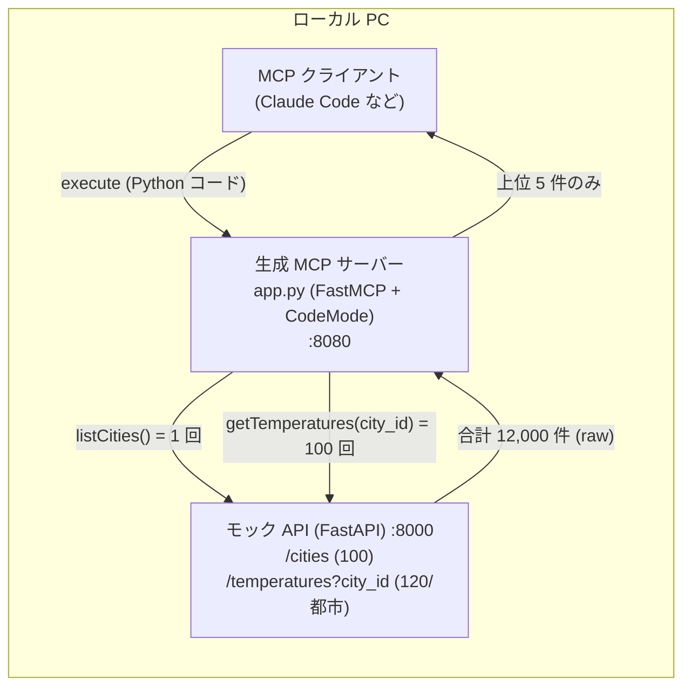

# Code Mode ローカル単体検証手順

Konnect / Kubernetes を挟まず、ローカル PC 上だけで **Code Mode によるトークン削減**を
検証する手順と、デモの具体設計。ここで確立した「モック API + 生成 MCP サーバー」は、
そのまま次段階の Konnect Code Mode MCP 実証テストでも上流 API として再利用する。

- 背景・アーキテクチャ・Code Mode の仕組みは [CODE_MODE.md](CODE_MODE.md) を参照。
- テスト対象クエリ: **「過去 10 年の 3 月の平均気温 Top5 を取得」**
- テストデータ: [mock-api/](mock-api/) の世界主要 100 都市 × 12 か月 × 10 年 = **12,000 レコード**
- 期待挙動: 12,000 件は LLM コンテキストに入らず、サンドボックス内で集計され **5 件だけ**返る

---

## 1. デモ設計

### 1.1 テストデータ / モック API（準備済み・正規化）

本リポジトリの [mock-api/](mock-api/) に、デモ用の上流 API とテストデータを用意済み。
`cities` / `temperatures` の 2 エンティティに正規化されている。

| メソッド / パス | operationId | 返却 |
|---|---|---|
| `GET /cities` | `listCities` | 全都市の **id と都市名のみ**（100 件） |
| `GET /cities/{city_id}` | `getCity` | 1 都市の詳細（id, city, country, latitude, longitude） |
| `GET /temperatures?city_id=` | `getTemperatures` | 指定都市の気温（**city_id 必須**、既定 120 件） |

- temperatures レコード: `id, city_id (FK), year, month, temp`（`temp` は摂氏 °C）。
- OpenAPI 3.0.3 spec: [mock-api/openapi.json](mock-api/openapi.json)（`oas-to-python` にそのまま渡せる）。
- 実データが無いため決定論的に生成した近似値（詳細は [mock-api/README.md](mock-api/README.md)）。

### 1.2 想定クエリと処理内訳

> **「過去 10 年の 3 月の平均気温 Top5 を取得」**

正規化 API のため、以下の**複数呼び出し + 集計**になる（3 要件に対応）:

1. `listCities()` で 100 都市の id/名を取得
2. 各 `city_id` について `getTemperatures(city_id)` を呼び、**`month==3` でフィルタ/グループ化**
3. 都市ごとに 10 年分の `temp` を**平均（集計）**
4. 平均値の**上位 5 都市（Top5）**のみを返す

### 1.3 サンドボックス内で LLM が生成するコード（期待形）

```python
# ツールは通常の Python 関数として呼べる。list レスポンスは {"results": [...]} で包まれる
cities = listCities()["results"]           # 100 件 (id, city)  ← 1 回

ranked = []
for c in cities:
    temps = getTemperatures(city_id=c["id"])["results"]   # 各都市 120 件  ← 100 回
    march = [t["temp"] for t in temps if t["month"] == 3]
    if march:
        ranked.append({"city": c["city"], "avg_temp": sum(march) / len(march)})

top5 = sorted(ranked, key=lambda r: r["avg_temp"], reverse=True)[:5]
return [{"city": r["city"], "avg_temp": round(r["avg_temp"], 1)} for r in top5]
```

→ 100 回の API 呼び出しと 12,000 件の処理はすべて**サンドボックス内**で完結し、LLM に返るのは
**5 件だけ**。`--debug` により、この生成コードと「Available tools」「Result」がサーバーログに
出るので、デモで実際に見せられる。期待結果: Jakarta / Singapore / Khartoum / Luanda / Chennai。

### 1.4 ⚠️ ツール呼び出し回数の上限 `max_tool_calls`（最新版で必須の対処）

> 本手順は **最新版 `fastmcp==3.4.2`（`max_tool_calls` は v3.4.0 で導入）** を前提とする。

- 最新版では Code Mode は 1 回の execute ブロックあたりのツール呼び出しを
  **`max_tool_calls`（既定 50）**に制限する。本デモは `listCities` + 各都市の
  `getTemperatures` で約 **101 回**呼ぶため、既定のままでは上限超過で `ToolError` になる。
- 生成された `app.py` の `CodeMode(...)` に上限を追加して回避する（Step 2 参照）:

  ```python
  transforms=[CodeMode(sandbox_provider=sandbox, max_tool_calls=200)]   # または None で無制限
  ```

- （逆に言えば、この「多数の API 呼び出し + 集計を 1 リクエストに閉じ込める」点こそ Code Mode の
  価値が最も出るところ。通常モードなら 100 回の往復と 12,000 件が LLM コンテキストに流入する。）
- ⚠️ **バージョン差異**: `context-mesh/oas-to-python` の `runtime-requirements.txt` は
  `fastmcp==3.3.1` をピン留めしており、**3.3.1 には `max_tool_calls` が無い**
  （`CodeMode(...)` に渡すと `TypeError`。3.3.1 は回数上限そのものが未実装なので追加不要）。
  Konnect / mcp-server-runner でどの版が使われるかで対処が変わる点に注意。

### 1.5 サンドボックス制限（~100 呼び出しでは時間に注意）

- サンドボックスの制限は `MontySandboxProvider(limits={...})` で設定する（有効キー:
  `max_duration_secs`, `max_memory`, `max_allocations`, `max_recursion_depth`, `gc_interval`）。
- `oas-to-python` 生成コードの既定は `max_duration_secs=10` / `max_memory=50MB`。
- **メモリは問題なし**（12,000 件 ≈ 1.1MB）。ただし正規化 API では **100 回の HTTP 呼び出しが
  サンドボックス実行時間に含まれる**ため、`max_duration_secs=10` を超える可能性がある。
  時間超過が出たら生成 `app.py` の `MontySandboxProvider` を引き上げる:

  ```python
  sandbox = MontySandboxProvider(limits={"max_duration_secs": 60, "max_memory": 100000000})
  ```

---

## 2. 全体像



---

## 3. 前提

- Python 3.11+（`fastmcp` のため 3.11 以上推奨）
- **FastMCP 最新版 `3.4.2`**（Step 3 で導入。`max_tool_calls` 対応は v3.4.0 以降）
- Go 1.26+（`oas-to-python` のビルド用。同梱 `context-mesh/oas-to-python` の go.mod が要求）
- MCP クライアント（Claude Code 等）
- `context-mesh` リポジトリ（`oas-to-python` を使うため）

```bash
git clone https://github.com/kong-gateway/context-mesh.git
```

---

## 4. 手順

### Step 1. テストデータ準備 & モック API 起動

テストデータ（`mock-api/data/cities.json` 100 件, `temperatures.json` 12,000 件）は生成済み。
再生成する場合のみ generator を実行する。

```bash
cd mock-api

# （任意）テストデータ再生成 — 決定論的なので毎回同じ値
python3 generate_data.py

# モック API 起動
python3 -m venv .venv && source .venv/bin/activate
pip install -r requirements.txt
uvicorn server:app --host 0.0.0.0 --port 8000
```

別ターミナルで疎通確認:

```bash
curl -s localhost:8000/health
curl -s localhost:8000/cities | jq 'length'                    # 100
curl -s 'localhost:8000/temperatures?city_id=30' | jq 'length' # 120 (Jakarta)
```

### Step 2. Code Mode MCP サーバーを生成

`oas-to-python` をビルドし、`mock-api/openapi.json` から Code Mode 版サーバーを生成する。

```bash
cd context-mesh/oas-to-python
make install-tools          # mise 経由で Go 等
go build -o /tmp/oas-to-python ./cmd

cd ..
/tmp/oas-to-python mock-api/openapi.json \
  --code-mode --debug \
  --transport http --host 0.0.0.0 --port 8080 \
  --base-url http://localhost:8000 \
  -o /tmp/app.py
```

- `--base-url http://localhost:8000` … モック API を指す。生成コードの egress ガードは
  この origin 以外への通信を拒否する。
- `--debug` … サンドボックスで実行される **LLM 生成 Python** と結果をサーバーログに出力。
- 生成物の形は `context-mesh/oas-to-python/examples/specs/openweathermap_code_mode.py`
  と同型。`listCities` / `getCity` / `getTemperatures` の 3 ツールを含む。

**生成後に `app.py` を編集**（最新版 3.4.x 前提）:

```python
# 1) ツール呼び出し回数の上限を引き上げ（既定 50 < ~100 回。§1.4）
transforms=[CodeMode(sandbox_provider=sandbox, max_tool_calls=200)]

# 2) （任意）時間超過が出る場合のみ、サンドボックス時間を引き上げ（§1.5）
sandbox = MontySandboxProvider(limits={"max_duration_secs": 60, "max_memory": 100000000})
```

> ⚠️ **Go ツールチェーン注意**: 同梱 `oas-to-python/go.mod` は `go 1.26` を要求する。
> ローカルの Go が古いとビルドできない。その場合は Go 1.26+ を導入するか、上記 examples の
> `*_code_mode.py` を雛形に、ツール定義部を差し替えて手動で `app.py` を用意してもよい。

### Step 3. 生成 MCP サーバーを起動

```bash
python3 -m venv /tmp/mcpvenv && source /tmp/mcpvenv/bin/activate
pip install "fastmcp[code-mode]==3.4.2" "requests==2.34.2"   # 最新版（max_tool_calls 対応は 3.4.0+）

# ベース URL は生成時の --base-url が既定になる（変える場合のみ環境変数）
export WORLD_CITY_MONTHLY_TEMPERATURES_API_BASE_URL=http://localhost:8000

python /tmp/app.py     # http://0.0.0.0:8080/mcp で待受
```

> 環境変数プレフィックスは spec の title から `WORLD_CITY_MONTHLY_TEMPERATURES_API` と
> 導出される（`--env-prefix` で上書き可）。

### Step 4. MCP クライアントから実行

Claude Code の場合、`.mcp.json` に登録:

```json
{
  "mcpServers": {
    "temperatures": { "url": "http://localhost:8080/mcp/" }
  }
}
```

> URL は **末尾スラッシュ付き `/mcp/`** を推奨。無しにすると接続時に
> `POST /mcp 404` が数回出る（リダイレクト由来の良性挙動、§7 参照）。

クエリ（プロンプト）:

> temperatures サーバーの `listCities` ツールで全都市を取得し、各都市について `getTemperatures`
> ツール（引数 `city_id` 必須）で過去 10 年分の気温を取得、`month` が 3 のものだけを平均して、
> 平均気温の高い上位 5 都市を返してください。
> **ツール名は上記の正確な名前（`listCities` / `getTemperatures`）を使い、推測しないこと。**
> **Perform a single code mode request.**

> 💡 **ツール名を明示する理由**: ツール名は OpenAPI の `operationId` から生成される
> （`listCities` / `getCity` / `getTemperatures`）。"single code mode request" を指示すると
> LLM はツール発見段階を飛ばして名前を推測し、`get_cities` のような存在しない名前で
> `Unknown tool` エラーになりがち。正確な名前を渡すと安定する（§7 トラブルシュート参照）。

---

## 5. 期待結果 & トークン削減の観察

### 返ってくる結果（上位 5 都市）

| 順位 | 都市 | 3 月平均気温 (°C) |
|---|---|---|
| 1 | Jakarta | 29.1 |
| 2 | Singapore | 28.1 |
| 3 | Khartoum | 27.9 |
| 4 | Luanda | 27.5 |
| 5 | Chennai | 27.3 |

### `--debug` ログで見えるもの（=削減の証拠）

`app.py` のログに、LLM がサンドボックス内で実行した Python コード（§1.3 の形）と、
呼び出したツール一覧・最終結果が出力される。**100 回の API 呼び出しと 12,000 件は
サンドボックスまでしか来ず、LLM に返るのは 5 件だけ**であることを確認できる。

---

## 6. 対照実験（Code Mode なし との比較）

削減効果を数値で示すには、同じ spec を **`--code-mode` なし**でも生成して比較する:

```bash
/tmp/oas-to-python <このリポジトリ>/mock-api/openapi.json \
  --transport http --host 0.0.0.0 --port 8081 \
  --base-url http://localhost:8000 \
  -o /tmp/app_plain.py
```

- 通常モード: エージェントが `getTemperatures` を都市ごとに呼ぶ → **100 往復・12,000 件**が
  LLM コンテキストへ流入し、さらに集計を LLM 自身が行う（大量データの正確な算術は苦手）。
- Code Mode: 呼び出しも集計もサンドボックス内、返るのは 5 件のみ。

比較指標: クライアント側のトークン使用量、往復回数、生データのバイト数
（12,000 件 ≈ 1.1MB vs 5 件 ≈ 数百 B）。

---

## 7. トラブルシュート

- **`MontyRuntimeError: Unknown tool: get_cities`（等）**: LLM が存在しないツール名を推測して
  呼んでいる。ツール名は OpenAPI の `operationId` から生成されるため、正しくは
  **`listCities` / `getCity` / `getTemperatures`**（camelCase のまま）。対策:
  - `--debug` ログの `Available tools: [...]` 行、または `grep -nE "@mcp.tool|^def " /tmp/app.py`
    で実際のツール名を確認する。
  - プロンプトで正確なツール名を明示する（Step 4 参照）。"Perform a single code mode request."
    は発見段階を省かせ推測を誘発するので、名前明示と併用する。
  - どうしても自然名で呼ばせたい場合は `mock-api/openapi.json` の `operationId` を
    リネームして再生成する（例 `getTemperatures` → `get_temperatures`）。
- **`ToolError: max tool calls exceeded`（3.4.x で ~100 回呼ぶと発生）**: 生成 `app.py` の
  `CodeMode(...)` に `max_tool_calls=200`（または `None`）を追加する（§1.4 / Step 2）。
- **`TypeError: CodeMode.__init__() got an unexpected keyword argument 'max_tool_calls'`**:
  古い `fastmcp==3.3.1` を使っている。`max_tool_calls` は v3.4.0 で追加されたため 3.3.1 には無い。
  Step 3 のとおり `fastmcp[code-mode]==3.4.2` を入れる（3.3.1 のままなら `max_tool_calls=...` を
  削除。3.3.1 は回数上限自体が無いので不要）。
- **時間超過エラー**: 100 回の HTTP 呼び出しが `max_duration_secs=10` を超える場合、生成
  `app.py` の `MontySandboxProvider(limits=...)` の `max_duration_secs` を引き上げる（§1.5）。
- **`{"code":-32600,"message":"Session not found"}`**: FastMCP の Streamable HTTP はセッション制で、
  セッションID（`Mcp-Session-Id`）をサーバーのメモリに保持する。`app.py` を編集して**サーバーを
  再起動**すると旧セッションが消えるが、クライアント（Claude Code）は旧IDを再利用するため
  `Session not found` になる（パスやサーバー稼働自体は正常）。対処:
  - サーバーが起動したままか確認（プロセス生存 / トレースバックで落ちていないか）。
  - Claude Code で `/mcp` から `temperatures` を **reconnect / 再有効化**（駄目なら Claude Code 再起動）。
  - 運用ルール: **サーバー再起動後は必ずクライアントを再接続してからクエリを投げる**
    （サーバー起動 → クライアント接続の順）。
- **`POST /mcp 404 Not Found` が数回出た後に成功する**: FastMCP の Streamable HTTP は
  エンドポイントを **`/mcp/`（末尾スラッシュ付き）** で公開する。`.mcp.json` を `/mcp`
  （スラッシュ無し）にしていると接続確立時にリダイレクトが挟まり、初回の数リクエストが
  404 としてログに出る（その後クライアントが再試行して成功する良性の挙動）。ログを消すには
  `.mcp.json` の URL を `http://localhost:8080/mcp/` と末尾スラッシュ付きにする。
- **egress ブロック (`EgressTrafficError`)**: `--base-url` とモック API の origin
  （scheme/host/port）が一致しているか確認。
- **サンドボックス上限**: メモリは既定で収まるが、時間は 100 回呼び出しで超過しうる（§1.5）。
- **配列/オブジェクト引数の文字列化**: Claude Code が MCP ツールの array/object 引数を
  JSON 文字列で送る既知不具合あり（`context-mesh/oas-to-python/docs/ProductDemo.md`）。
  本デモの引数は整数の `city_id` のみのため影響なし。
- **`python3` が safe-chain でラップされている環境**: シェル関数のラッパーが挟まる場合は
  実体（例 `/usr/bin/python3`）を直接呼ぶ。

---

## 8. 次段階（Konnect 実証テスト）への引き継ぎ

- このモック API（`mock-api/`）を Minikube 上にデプロイし、Kong DP 経由の上流サービスとして
  公開する。生成 MCP サーバーは Konnect が `/code` エンドポイントで配布し、init-container が
  取得して起動する（[CODE_MODE.md](CODE_MODE.md) のアーキテクチャ節を参照）。
- Konnect が使う FastMCP のバージョンに注意（3.3.1 は `max_tool_calls` 非対応、新しい版は対応）。
  Konnect UI 側の操作（Code Mode 有効化・サンドボックス上限設定の可否含む）は 作業者側で確認しながら進める。
