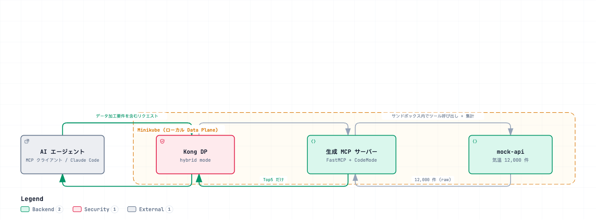
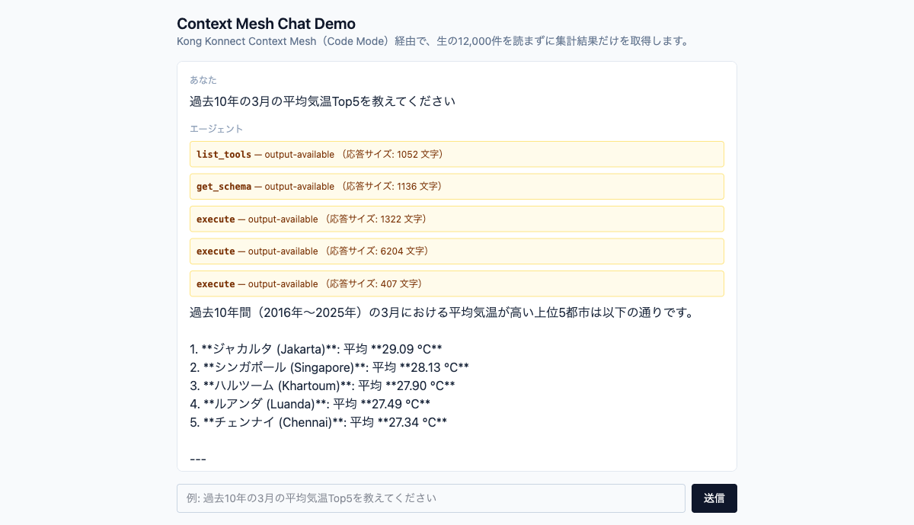
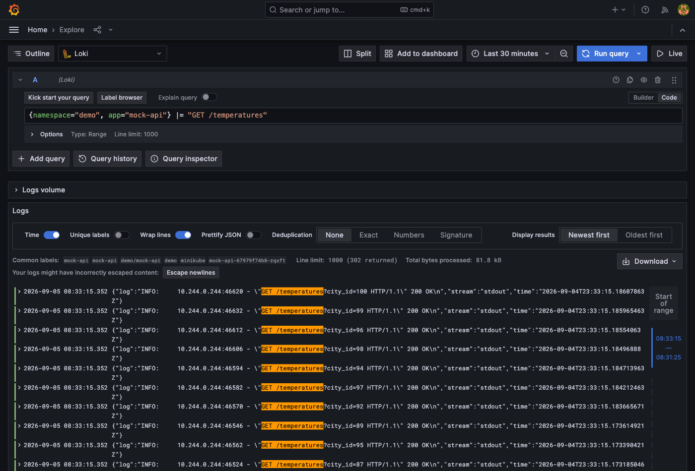
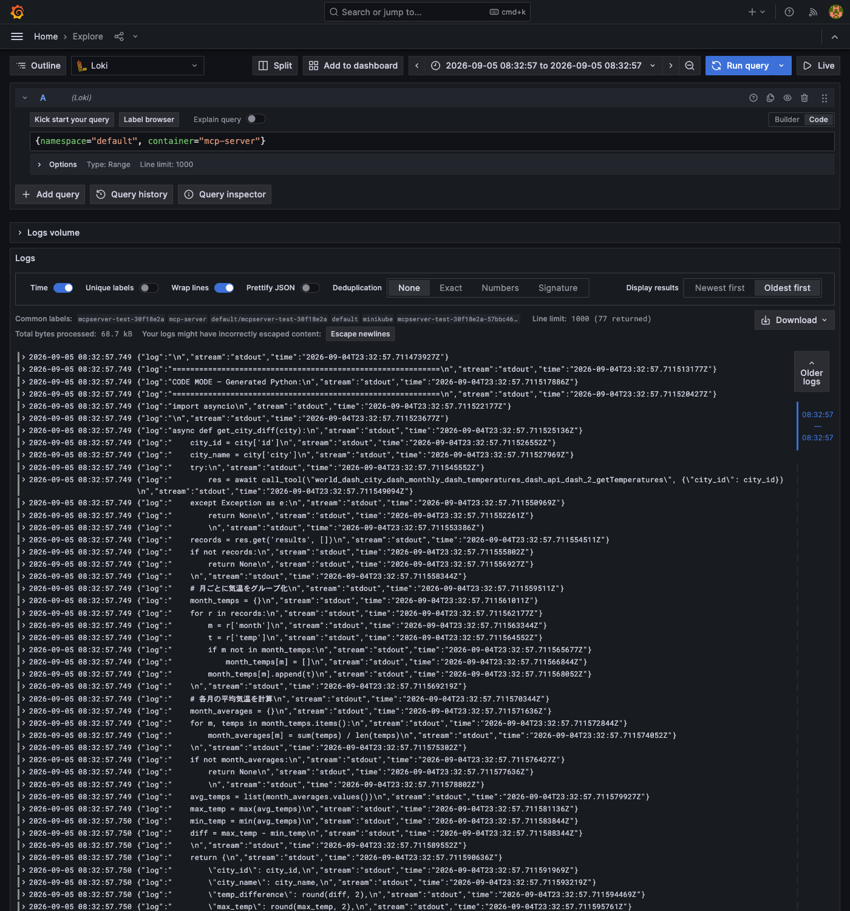

# INSTRUCTIONS — Demo Verification Steps

> Japanese (authoritative): [INSTRUCTIONS.md](INSTRUCTIONS.md) — this English version is a translation.

These steps verify the Kong Konnect **Context Mesh / Code Mode** demo after deployment. The goal is to process the upstream mock-api's large dataset in the sandbox, return **only the Top5** to the AI agent, and confirm that **LLM token usage is reduced**.

> **Deployment steps are not included here.**
> - Deploy mock-api to Minikube → [deploy/README.md](deploy/README.en.md)
> - Configure MCP / Code Mode in the Konnect UI → §2 of this document (added by Shinichi)
> - Local unit verification (usually unnecessary) → [CODE_MODE_LOCAL_TEST.md](CODE_MODE_LOCAL_TEST.en.md)

## Verification overview

[](https://picketfence-labs.github.io/diagrams/3f05a8bf9c35/)

*(Click the image to open the interactive version.)*

---

## §1. Verify the upstream API (mock-api) is running

As a prerequisite for the demo, verify that mock-api is reachable from Mac. Use the same **Kong DP path** (`http://localhost/mock-api`) as the production demo query path (details: [deploy/README.md](deploy/README.en.md), §5 “Make Kong DP reachable from Mac”).

> Prerequisite: keep `minikube tunnel` running in another terminal (starting it requires interactive `sudo` password input, so **the user must run it directly in a terminal**. It cannot be started from an agent's background shell).

```bash
# Mac から（Kong DP 経由。minikube tunnel 常駐済みが前提）
curl http://localhost/mock-api/health
# → {"status":"ok","cities":100,"temperatures":12000}
```

To isolate mock-api itself (direct access without Kong DP), you can use the port-forward method below (fixed port `8088`; §2 onward assumes the Kong DP path):

```bash
kubectl -n demo port-forward svc/mock-api 8088:80  # 別ターミナルで常駐
curl http://localhost:8088/health
```

Checklist:

- [ ] `kubectl -n demo get pods` → `mock-api-*` is Running
- [ ] `minikube tunnel` is running in another terminal
- [ ] `curl http://localhost/mock-api/health` returns 200 / `cities:100, temperatures:12000`

---

## §2. Configure Konnect / Context Mesh

Context Mesh appears as a separate menu in Konnect. Register an ```MCP Server``` under ```Context Mesh```.


Register the API that the MCP definition will connect to.


---

## §3. Verify using the Chat UI

The **Chat UI** lets you try the same demo queries in a browser without building your own MCP client (Next.js + Vercel AI SDK; see [ADR-0004](docs/decisions/0004-chat-ui-tech-stack.md) for technical background). Deployment and access instructions are in [deploy/README.md #Chat UI](deploy/README.en.md#chat-ui-nextjs--vercel-ai-sdk--mcp-client) (through Kong DP, with `minikube tunnel`; see [ADR-0007](docs/decisions/0007-chat-ui-kong-route-exposure.md)).

> Prerequisite: keep `minikube tunnel` running in another terminal and apply `deploy/kong/chat-ui-kong.yaml` (see [deploy/README.md](deploy/README.en.md#chat-ui-nextjs--vercel-ai-sdk--mcp-client)).

Open `http://localhost/chat-ui` in a browser, enter “過去10年の3月の平均気温Top5を教えてください” in the text box, and submit it.

While waiting for a response, the UI displays the Code Mode internal tool calls in sequence: `list_tools` → `get_schema` → `execute` (multiple times). You can also see each input/output size (`input: X tokens | output: Y tokens`, estimated from character counts). The final answer is formatted as a Markdown table containing only the Top5:



### How to inspect internal behavior (with screenshots)

In addition to the token counts shown in the UI, use LogQL in the Explore page of the logging stack (Grafana Loki + Promtail; see [deploy/observability/README.md](deploy/observability/README.en.md) and [ADR-0006](docs/decisions/0006-log-observability-stack.md)) to search actual mock-api and MCP Server logs. This directly verifies that Code Mode completes “retrieval and processing of large datasets inside the sandbox and returns only the result.”

Prerequisite: access Grafana through the same Kong DP path as mock-api and Chat UI (`minikube tunnel` running + `deploy/kong/grafana-kong.yaml` applied; see [deploy/observability/README.md](deploy/observability/README.en.md) for deployment).

Open **http://localhost/grafana/explore** in a browser (**no login required**; anonymous access has Admin privileges). Run LogQL as follows:

1. Select **`Code`** with the **`Builder` / `Code`** toggle at the top right of the query input (initial `Builder` is a GUI for selecting labels, with no field for pasting LogQL directly; this is the first common stumbling block).
2. Paste the LogQL below and click **`Run query`** (or press Shift+Enter).
3. Check that the time range at the top right (default **Last 1 hour**) includes the time the demo query actually ran; otherwise, there are 0 results.

**Logs showing that mock-api was called over 100 times** (the normalized API loops through `listCities` → `getTemperatures` for each city; see [CLAUDE.md](CLAUDE.md), Japanese). Search with:

```logql
{namespace="demo", app="mock-api"} |= "GET /temperatures"
```

Depending on the query, the results in the lower “Logs” panel may be normal while the upper “Logs volume” histogram displays the unrelated `Failed to load log volume for this query` error (an issue with Grafana's automatically generated aggregation query; it does not affect search results. Ignore it and check the “Logs” panel).

For 1 query, results such as `Line limit: 1000 (302 returned)` show over 300 hits from 2 Top10 queries and 2 Top5 queries (about 100 `getTemperatures` calls per query):



**Logs showing code generated by the MCP Server** (`app.py` is generated by Konnect Control Plane and cannot be changed from this repository; see [deploy/observability/README.md](deploy/observability/README.en.md)). Search with:

```logql
{namespace="default", container="mcp-server"} |= "CODE MODE"
```

Each hit contains only the first line of generated code. Narrow the time range (remove the `|=` filter and search a range of tens of milliseconds around the target time) and select “Oldest first” to inspect all generated code for that query. Example aggregation code generated for the query “Top10 cities with the smallest annual temperature range”:



### Test cases

We verified correct aggregation with several query patterns in addition to “Top5 average temperature in March over the past 10 years”: monthly aggregation, Top10, all monthly aggregates, and the difference between two months. Each test case's input, expected values, screenshots, and actual logs (mock-api / mcp-server) are recorded separately in [TEST_WORLD_WEATHER.md](TEST_WORLD_WEATHER.en.md).

For each case, we confirmed through input/output token counts and generated-code logs that after `execute` runs aggregation code inside the sandbox (calling mock-api about 100 times), only the Top5/Top10 aggregate results are returned to the LLM (2026-09-05; token counts were added on 2026-09-09 in PR #14).

### Insurance demo queries

Configure both the World Weather and Insurance MCP URLs in Chat UI ([Chat UI settings](deploy/README.en.md#chat-ui-nextjs--vercel-ai-sdk--mcp-client), [Insurance registration](deploy/insurance/README.en.md)). Send the following Japanese questions in order. See [TEST_INSURANCE.md](TEST_INSURANCE.en.md) for measured results and logs.

| Case | Question | What to check |
|---|---|---|
| I-1 | 商品ごとに申込件数と成立した契約件数を集計し、成立率の高い順に上位5商品を示してください。申込と契約は別のAPIから取得してください。 | Join applications, policies, and products, then calculate the conversion rate |
| I-2 | ステータスが「支払済」の保険金請求だけを対象に、支払額を商品別に合計し、上位5商品を示してください。請求対象の契約から商品を特定してください。 | Filter on 支払済, then join claims to policies and products |
| I-3 | 既存契約の保険料ではなく、新規の自動車保険PRD-002を1990-01-01生・補償額300万円で試算し、月額と年額を教えてください。 | Select the premium simulation Tool; do not use an existing policy's premium |

---

## §4. Verify token reduction

Show the effect of Code Mode (raw data is not passed to the LLM) with numbers.

- **Comparison**: plain MCP Tool calls (12,000 records passed to the LLM) vs. Code Mode (Top5 only)
- Example verification:
  - [ ] Compare response data volume using token measurement / logs on the MCP client side.
  - [ ] When Code Mode is enabled, confirm that only aggregate results (5 items) reach the LLM.

The Chat UI results in §3 also show the approximate input/output token counts for each `execute` call (hundreds to thousands of tokens, not 12,000 raw records). For exact LLM token usage (`usage.inputTokens` / `outputTokens`), chat-ui writes structured logs to stdout for each request (`onEnd`, [ADR-0006](docs/decisions/0006-log-observability-stack.md)); query the measured values with LogQL through the logging stack ([deploy/observability/README.md](deploy/observability/README.en.md)).

<!-- Measured values and screenshots can be added here -->

---

## Troubleshooting

For errors during the demo, see the troubleshooting section of [CODE_MODE_LOCAL_TEST.md](CODE_MODE_LOCAL_TEST.en.md) (Unknown tool / max tool calls / sandbox timeout / Session not found / egress guard, etc.).

## References

- World Weather test cases (Chat UI query inputs/outputs/logs): [TEST_WORLD_WEATHER.md](TEST_WORLD_WEATHER.en.md)
- Insurance test cases (Chat UI query inputs/outputs/logs): [TEST_INSURANCE.md](TEST_INSURANCE.en.md)
- Deployment: [deploy/README.md](deploy/README.en.md)
- Chat UI technical background: [ADR-0004](docs/decisions/0004-chat-ui-tech-stack.md)
- Logging stack (measured token usage): [deploy/observability/README.md](deploy/observability/README.en.md)
- Research notes / architecture: [CODE_MODE.md](CODE_MODE.en.md)
- Local unit verification (usually unnecessary): [CODE_MODE_LOCAL_TEST.md](CODE_MODE_LOCAL_TEST.en.md)
- Project guidance / constraints: [CLAUDE.md](CLAUDE.md)
