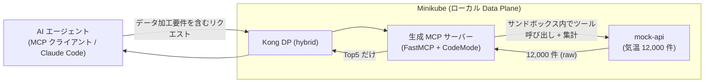
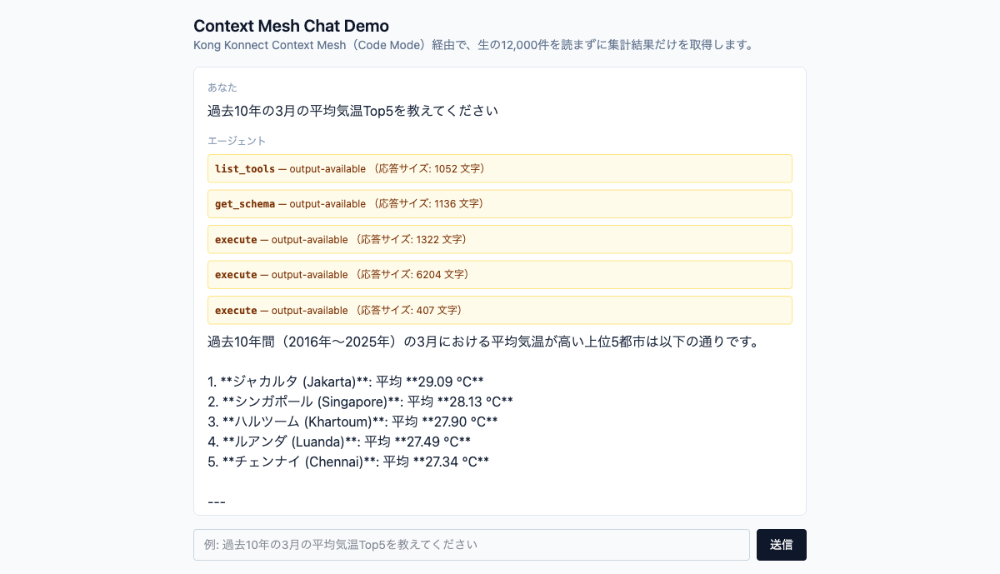
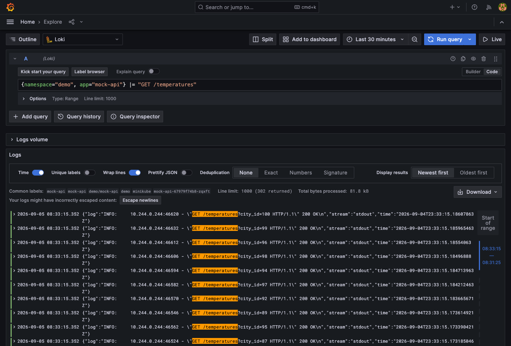
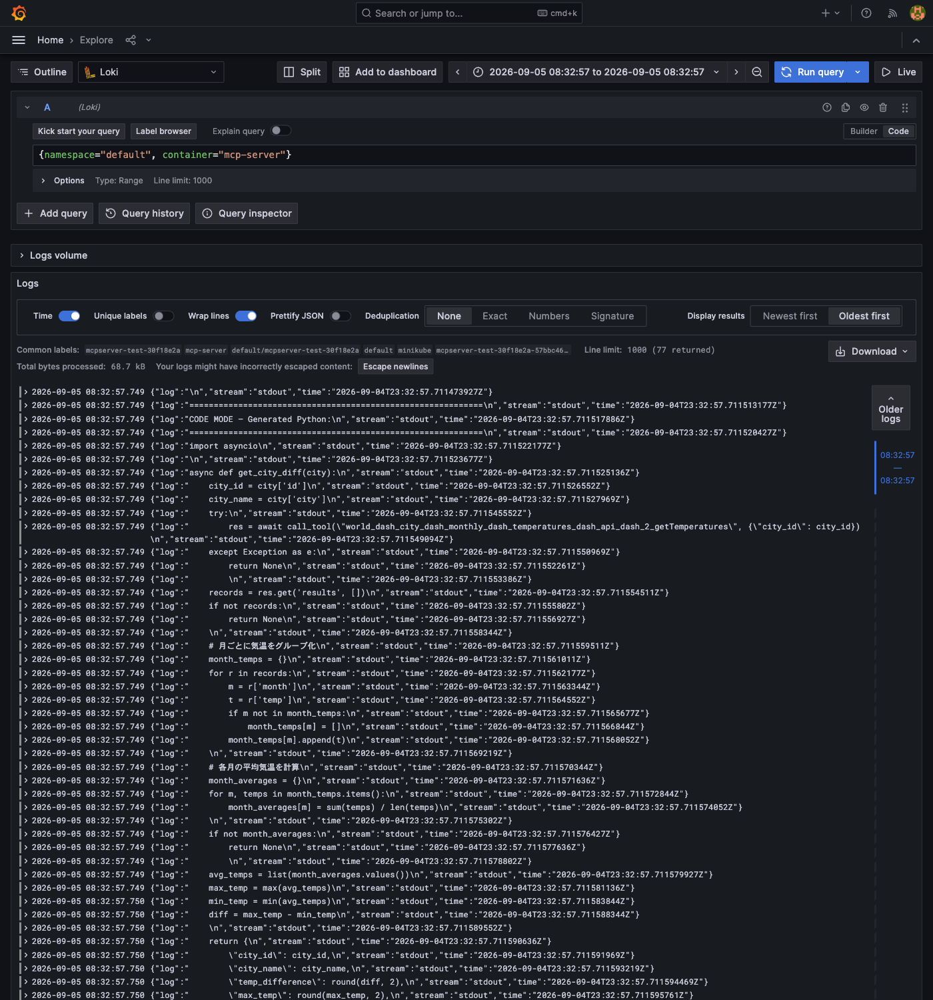

# INSTRUCTIONS — デモ検証手順

Kong Konnect の **Context Mesh / Code Mode** デモの**デプロイ後の検証手順**をまとめる。
上流 API（mock-api）の大量データをサンドボックス内で加工し **Top5 だけ** を AI エージェント
に返し、**LLM トークン量が削減されること**を確認するのがゴール。

> **デプロイ手順は本書には含めない。**
> - mock-api の Minikube デプロイ → [deploy/README.md](deploy/README.md)
> - Konnect UI での MCP / Code Mode 定義 → 本書 §2（Shinichi 追記）
> - ローカル単体検証（通常不要）→ [CODE_MODE_LOCAL_TEST.md](CODE_MODE_LOCAL_TEST.md)

## 検証の全体像



---

## §1. 上流 API（mock-api）の稼働確認

デモの前提として、mock-api がクラスタ内・Mac 双方から到達できることを確認する。

```bash
# 別ターミナルで port-forward を常駐（固定ポート 8088）
kubectl -n demo port-forward svc/mock-api 8088:80

# Mac から
curl http://localhost:8088/health
# → {"status":"ok","cities":100,"temperatures":12000}

# クラスタ内 DNS（Kong DP が使う経路）
kubectl -n demo run dnstest --image=busybox:1.36 --restart=Never --rm -i --quiet \
  --command -- wget -qO- http://mock-api.demo.svc.cluster.local/health
```

チェックリスト:

- [ ] `kubectl -n demo get pods` → `mock-api-*` が Running
- [ ] `localhost:8088/health` が 200 / `cities:100, temperatures:12000`
- [ ] クラスタ内 DNS で `mock-api.demo.svc.cluster.local` に到達可能

---

## §2. Konnect / Context Meshの設定

KonnectのContext Meshは独立したメニューとして定義されています。定義は```Context Mesh```配下の```MCP Server```を登録する形で行います。


MCPの定義には、接続先のAPIの登録が必要です。


---

## §3. Chat UIにおける検証

MCP クライアントを自前で用意しなくても、ブラウザから同じデモクエリを試せる
**Chat UI**（Next.js + Vercel AI SDK。技術背景は
[ADR-0004](docs/decisions/0004-chat-ui-tech-stack.md)）を用意している。
デプロイ手順・アクセス方法は [deploy/README.md #Chat UI](deploy/README.md#chat-uinextjs--vercel-ai-sdk--mcp-client)
（Kong DP 経由、`minikube tunnel` 前提。詳細は[ADR-0007](docs/decisions/0007-chat-ui-kong-route-exposure.md)）。

> 前提: 別ターミナルで `minikube tunnel` を常駐させ、`deploy/kong/chat-ui-kong.yaml`を
> 適用済みであること（手順は[deploy/README.md](deploy/README.md#chat-uinextjs--vercel-ai-sdk--mcp-client)参照）。

ブラウザで `http://localhost/chat-ui` を開き、テキストボックスに
「過去10年の3月の平均気温Top5を教えてください」と入力して送信する。

回答が返るまでの間、画面上に `list_tools` → `get_schema` → `execute`（複数回）という
Code Mode の内部ツール呼び出しが逐次表示され、それぞれの応答サイズ（文字数）も
確認できる。最終的な回答として Top5 のみが整形されて表示される:



### 内部動作の確認方法（キャプチャ付き）

画面上の応答サイズだけでなく、ログ基盤（Grafana Loki + Promtail。
[deploy/observability/README.md](deploy/observability/README.md)、
[ADR-0006](docs/decisions/0006-log-observability-stack.md)）の Explore 画面で
mock-api・MCP サーバーの実ログを LogQL で検索することで、Code Mode が
「大量データの取得・加工をサンドボックス内で完結させ、結果だけを返している」
ことを直接確認できる。

```bash
# 前提: mock-apiやChat UIと同じKong DP経由でGrafanaにアクセス
# （minikube tunnel常駐 + deploy/kong/grafana-kong.yaml適用済みであること。
#   手順・パスワード取得は deploy/observability/README.md 参照）
# ブラウザで http://localhost/grafana → Explore → データソース Loki
```

**mock-api が100回以上コールされているログ**（正規化APIのため `listCities` → 各都市の
`getTemperatures` をループする設計。詳細は[CLAUDE.md](CLAUDE.md)参照）。以下のLogQLで検索する:

```logql
{namespace="demo", app="mock-api"} |= "GET /temperatures"
```

1クエリあたり `Line limit: 1000 (302 returned)` のように、Top10クエリ2回分・Top5クエリ2回分の
実行結果として300件超のヒットが確認できる（1クエリ ≒ 100件の `getTemperatures` 呼び出し）:



**MCP サーバーが生成しているコードを出力しているログ**（`app.py` はKonnect Control Plane
が生成するためこのリポジトリからは変更できない。詳細は
[deploy/observability/README.md](deploy/observability/README.md)）。以下のLogQLで検索する:

```logql
{namespace="default", container="mcp-server"} |= "CODE MODE"
```

各ヒットは生成コードの先頭行のみのため、時刻を絞り込んで（`|=`フィルタを外し対象時刻の
数十ms幅で検索）そのクエリの生成コード全体を「Oldest first」表示で確認する。
実際に「年間の気温差が小さい都市Top10」クエリで生成された集計コードの例:



### テストケース

「過去10年の3月の平均気温Top5」以外にも、複数のクエリパターン（月指定の集計、Top10、
月別全件集計、2つの月の差分算出など）で正しく集計できることを確認済み。各テストケースの
入力・期待値・画面キャプチャ・実ログ（mock-api / mcp-server）は [TEST.md](TEST.md) に
1件ずつ切り分けて記録している。

いずれも `execute`（サンドボックス内で mock-api を約100回呼び出す集計コードを実行）を経て
LLM に返るのは Top5/Top10 の集計結果のみであることを、応答サイズ・生成コードログの両面で
確認済み（2026-09-05）。

---

## §4. トークン削減の確認

Code Mode の効果（生データを LLM に渡さない）を数値で示す。

- **比較対象**: 素の MCP ツール呼び出し（12,000 件が LLM に渡る）vs Code Mode（Top5 のみ）
- 確認方法（例）:
  - [ ] MCP クライアント側のトークン計測 / ログで、レスポンスに含まれるデータ量を比較
  - [ ] Code Mode 有効時、LLM に渡るのは集計結果（5 件）のみであることを確認

§3 の Chat UI 実行結果でも、各 `execute` 呼び出しの応答サイズ（数千文字程度、
12,000 件の生データではない）が画面上で確認できる。さらに厳密な LLM トークン使用量
（`usage.inputTokens` / `outputTokens`）は、chat-ui がリクエストごとに構造化ログとして
stdout へ出力しており（`onEnd`、[ADR-0006](docs/decisions/0006-log-observability-stack.md)）、
ログ基盤（[deploy/observability/README.md](deploy/observability/README.md)）経由の
LogQL で実測値を確認できる。

<!-- 実測値・スクショをここに追記 -->

---

## トラブルシュート

デモ実行時のエラー切り分けは [CODE_MODE_LOCAL_TEST.md](CODE_MODE_LOCAL_TEST.md) の
トラブルシュート節（Unknown tool / max tool calls / サンドボックス時間超過 /
Session not found / egress ガード 等）を参照。

## 参照

- テストケース集（Chat UIデモクエリの入力/出力/ログ）: [TEST.md](TEST.md)
- デプロイ手順: [deploy/README.md](deploy/README.md)
- Chat UI 技術背景: [ADR-0004](docs/decisions/0004-chat-ui-tech-stack.md)
- ログ基盤（トークン使用量の実測）: [deploy/observability/README.md](deploy/observability/README.md)
- 調査メモ / アーキテクチャ: [CODE_MODE.md](CODE_MODE.md)
- ローカル単体検証（通常不要）: [CODE_MODE_LOCAL_TEST.md](CODE_MODE_LOCAL_TEST.md)
- プロジェクト指針 / 制約: [CLAUDE.md](CLAUDE.md)
