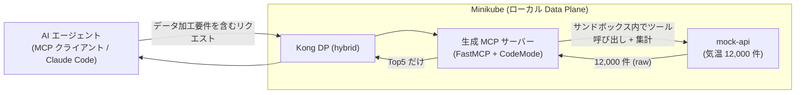

# INSTRUCTIONS — デモ検証手順

Kong Konnect の **Context Mesh / Code Mode** デモの**デプロイ後の検証手順**をまとめる。
上流 API（mock-api）の大量データをサンドボックス内で加工し **Top5 だけ** を AI エージェント
に返し、**LLM トークン量が削減されること**を確認するのがゴール。

> **デプロイ手順は本書には含めない。**
> - mock-api の Minikube デプロイ → [deploy/README.md](deploy/README.md)
> - Konnect UI での MCP / Code Mode 定義 → 本書 §2（Shinichi 追記）
> - ローカル単体検証（通常不要）→ [CODE_MODE_LOCAL_TEST.md](CODE_MODE_LOCAL_TEST.md)

## 検証の全体像



---

## §1. 上流 API（mock-api）の稼働確認

デモの前提として、mock-api がクラスタ内・Mac 双方から到達できることを確認する。

```bash
# 別ターミナルで port-forward を常駐（固定ポート 8088）
kubectl -n demo port-forward svc/mock-api 8088:80

# Mac から
curl http://localhost:8088/health
# → {"status":"ok","cities":100,"temperatures":12000}

# クラスタ内 DNS（Kong DP が使う経路）
kubectl -n demo run dnstest --image=busybox:1.36 --restart=Never --rm -i --quiet \
  --command -- wget -qO- http://mock-api.demo.svc.cluster.local/health
```

チェックリスト:

- [ ] `kubectl -n demo get pods` → `mock-api-*` が Running
- [ ] `localhost:8088/health` が 200 / `cities:100, temperatures:12000`
- [ ] クラスタ内 DNS で `mock-api.demo.svc.cluster.local` に到達可能

---

## §2. Konnect / Context Meshの設定

KonnectのContext Meshは独立したメニューとして定義されています。定義は```Context Mesh```配下の```MCP Server```を登録する形で行います。


MCPの定義には、接続先のAPIの登録が必要です。


---

## §3. デモクエリ実行（Top5 検証）

Code Mode MCP エンドポイントに MCP クライアント（Claude Code 等）を接続し、
以下のクエリを投げる。

> **クエリ**: 「過去 10 年の 3 月の平均気温 Top5 を取得」

期待される内部動作（サンドボックス内）:

1. `listCities` で 100 都市の id を取得
2. 各都市について `getTemperatures(city_id)` を呼び、3 月のレコードを抽出（~100 回呼び出し）
3. 都市ごとに 10 年分（2016–2025）の平均を算出
4. 平均の降順で **Top5 の 5 件だけ** を返す

### 期待結果

- 返却は **5 件のみ**（12,000 件の生データは LLM コンテキストに渡らない）
- ローカルで確認済みの Top5（±小数誤差）:

  | 順位 | 都市 | 国 |
  |---|---|---|
  | 1 | Jakarta | Indonesia |
  | 2 | Singapore | Singapore |
  | 3 | Khartoum | Sudan |
  | 4 | Luanda | Angola |
  | 5 | Chennai | India |

チェックリスト:

- [ ] 返却レコードが 5 件
- [ ] 上位都市が期待値と一致
- [ ] エラー無し（`max_tool_calls` / サンドボックス時間超過が出ない）

---

## §4. トークン削減の確認

Code Mode の効果（生データを LLM に渡さない）を数値で示す。

- **比較対象**: 素の MCP ツール呼び出し（12,000 件が LLM に渡る）vs Code Mode（Top5 のみ）
- 確認方法（例）:
  - [ ] MCP クライアント側のトークン計測 / ログで、レスポンスに含まれるデータ量を比較
  - [ ] Code Mode 有効時、LLM に渡るのは集計結果（5 件）のみであることを確認

<!-- 実測値・スクショをここに追記 -->

---

## トラブルシュート

デモ実行時のエラー切り分けは [CODE_MODE_LOCAL_TEST.md](CODE_MODE_LOCAL_TEST.md) の
トラブルシュート節（Unknown tool / max tool calls / サンドボックス時間超過 /
Session not found / egress ガード 等）を参照。

## 参照

- デプロイ手順: [deploy/README.md](deploy/README.md)
- 調査メモ / アーキテクチャ: [CODE_MODE.md](CODE_MODE.md)
- ローカル単体検証（通常不要）: [CODE_MODE_LOCAL_TEST.md](CODE_MODE_LOCAL_TEST.md)
- プロジェクト指針 / 制約: [CLAUDE.md](CLAUDE.md)
