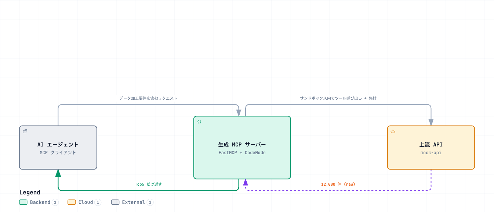
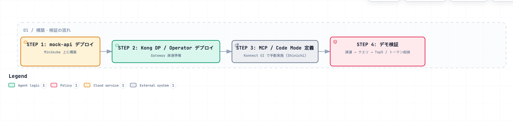

# konnect-code-mode-mcp

> Japanese (authoritative): [README.md](README.md) — this English version is a translation.

This demo environment uses Kong Konnect **Context Mesh** and **Code Mode** to demonstrate
how they reduce LLM token usage for AI agents. The Japanese version is authoritative.

## Purpose

When handling large datasets through MCP, raw data returned by an API enters the LLM context and consumes tokens. **Code Mode** processes data with Python in a sandbox and returns only the smaller processed result to the AI agent.

For World Weather, the upstream API contains 12,000 temperature records. When the AI agent receives a query such as **“Get the top 5 cities by average temperature in March over the past 10 years”**, it:

1. Groups the records.
2. Aggregates a selected field for each group (sum or average).
3. Returns only the **Top5** calculated values to the AI agent (no raw data).

Definitions are configured in the **Konnect UI**. Execution (Kong DP / Context Mesh components) runs on **local Kubernetes (Minikube)**. See the upstream repository [kong-gateway/context-mesh](https://github.com/kong-gateway/context-mesh).

The demo also includes a **Chat UI** (Next.js + Vercel AI SDK; see [ADR-0004](docs/decisions/0004-chat-ui-tech-stack.md)) so you can try the same queries in a browser. The screenshot below shows a World Weather query, the Code Mode internal tool calls list_tools / get_schema / execute (multiple times), and response sizes of a few thousand characters rather than 12,000 raw records:

## Use cases

The Chat UI connects to two MCP Servers at once. Tool names beginning with `weather_` and `insurance_` identify the destination.

| Use case | Value demonstrated | MCP Server | Test cases |
|---|---|---|---|
| World Weather | Aggregate 12,000 records in the sandbox and return only the Top5 to reduce token usage | `/mcp/world-monthly-temperature` | [TEST_WORLD_WEATHER.en.md](TEST_WORLD_WEATHER.en.md) |
| Insurance | Register the local OpenAPI specifications as-is and select and aggregate the required Tool from 6 APIs and 32 Tools | `/mcp/kong-insurance` | [TEST_INSURANCE.en.md](TEST_INSURANCE.en.md) |

## Overview

*(Click the image to open the interactive version.)*

## Repository structure

| Path | Contents |
|---|---|
| [README.md](README.en.md) | This file (purpose, structure, overview) |
| [INSTRUCTIONS.md](INSTRUCTIONS.en.md) | **Demo verification steps** (connectivity, queries, Top5 / token reduction checks after deployment) |
| [TEST_WORLD_WEATHER.md](TEST_WORLD_WEATHER.en.md) | World Weather test cases (inputs/outputs/screenshots/actual logs) |
| [TEST_INSURANCE.md](TEST_INSURANCE.en.md) | Insurance test cases (inputs/outputs/screenshots/actual logs) |
| [deploy/README.md](deploy/README.en.md) | Minikube deployment steps (mock-api) |
| [deploy/insurance/](deploy/insurance/) | Insurance API manifests and Context Mesh registration steps |
| [CODE_MODE.md](CODE_MODE.en.md) | Context Mesh / Code Mode research notes, architecture, and implementation approach |
| [CODE_MODE_LOCAL_TEST.md](CODE_MODE_LOCAL_TEST.en.md) | Demo design and local unit verification steps (normally unnecessary) |
| [CLAUDE.md](CLAUDE.md) | Agent project guidance, requirements, constraints, and conventions (Japanese) |
| [mock-api/](mock-api/) | Demo mock API (temperature), test data, and OpenAPI spec |
| [chat-ui/](chat-ui/) | Demo Chat UI (Next.js + Vercel AI SDK + MCP client) |
| [deploy/](deploy/) | Minikube deployment manifests (mock-api / Chat UI / logging stack) |

## Build and verification flow

*(Click the image to open the interactive version.)*

- **Deployment**: [deploy/README.md](deploy/README.en.md) (mock-api deployment to Minikube).
- **Verification**: [INSTRUCTIONS.md](INSTRUCTIONS.en.md) (connectivity, demo queries, and Top5 / token reduction checks after deployment). See [World Weather](TEST_WORLD_WEATHER.en.md) and [Insurance](TEST_INSURANCE.en.md) for individual test cases.
- **Research notes / architecture**: [CODE_MODE.md](CODE_MODE.en.md) (how Code Mode works, token reduction principles, and code generation details).
- **Local unit verification (usually unnecessary)**: [CODE_MODE_LOCAL_TEST.md](CODE_MODE_LOCAL_TEST.en.md) only if you want to check Code Mode locally without Konnect / K8s.

## References

- Upstream repository: <https://github.com/kong-gateway/context-mesh>
- FastMCP Code Mode: <https://gofastmcp.com/servers/transforms/code-mode>
