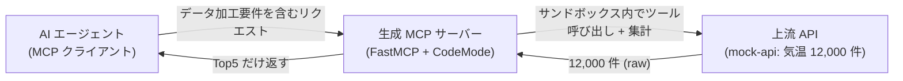
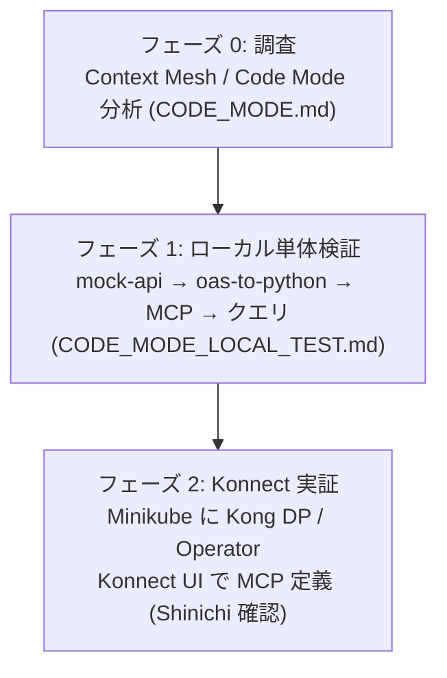

# konnect-code-mode-mcp

Kong Konnect の **Context Mesh** と **Code Mode**（FastMCP の `CodeMode` transform）を使い、
**AI エージェントの LLM トークン量削減**を実証するサンプル / デモ。

## 趣旨

MCP 経由で大量データを扱うと、API が返す生データがそのまま LLM コンテキストに流入して
トークンを浪費する。**Code Mode** はデータ加工をサンドボックス内の Python で行い、
**加工後の小さな結果だけ**を AI エージェントに返すことでこれを解消する。

本デモでは、約 1 万件の気温レコードを返す上流 API に対し、AI エージェントからの
「**過去 10 年の 3 月の平均気温 Top5 を取得**」というクエリを、以下の要件で処理する:

1. レコードのグループ化
2. グループごとの特定フィールド値の集計（Sum / 平均）
3. 算出値の **Top5 のみ**を AI エージェントに返す（生データは返さない）

構成: 定義は **Konnect UI**、実行（Kong DP / Context Mesh コンポーネント）は
**ローカル Kubernetes (Minikube)**。詳細な上流リポジトリは
[kong-gateway/context-mesh](https://github.com/kong-gateway/context-mesh)。

## 全体像



## リポジトリ構成

| パス | 内容 |
|---|---|
| [README.md](README.md) | 本ファイル（趣旨・構成・全体手順） |
| [CODE_MODE.md](CODE_MODE.md) | Context Mesh / Code Mode の調査メモ・アーキテクチャ・実装方針 |
| [CODE_MODE_LOCAL_TEST.md](CODE_MODE_LOCAL_TEST.md) | デモ設計 + ローカル単体検証手順 |
| [CLAUDE.md](CLAUDE.md) | エージェント向けプロジェクト指針・要件・制約・規約 |
| [mock-api/](mock-api/) | デモ用モック API（気温）+ テストデータ + OpenAPI spec |

## 全体手順



1. **フェーズ 0 — 調査**（完了）: 上流リポジトリを分析し、Code Mode の仕組みと
   トークン削減の原理、コード生成の詳細を [CODE_MODE.md](CODE_MODE.md) にまとめた。
2. **フェーズ 1 — ローカル単体検証**: Konnect / K8s を挟まず、モック API と生成した
   FastMCP サーバーだけで Code Mode の挙動とトークン削減を確認する。手順は
   [CODE_MODE_LOCAL_TEST.md](CODE_MODE_LOCAL_TEST.md)。
3. **フェーズ 2 — Konnect 実証**: モック API を Minikube にデプロイし、Konnect UI で
   MCP サーバーを定義、Kong Operator が DP に展開する。Konnect UI 側の操作は Shinichi が
   確認しながら進める（[CODE_MODE.md](CODE_MODE.md) のアーキテクチャ / 未確定事項節を参照）。

## クイックスタート（ローカル）

```bash
# 1) モック API を起動（cities 100 件 / temperatures 12,000 件）
cd mock-api
pip install -r requirements.txt
uvicorn server:app --host 0.0.0.0 --port 8000

# 2) 以降（oas-to-python で MCP 生成 → 起動 → クエリ）は
#    CODE_MODE_LOCAL_TEST.md を参照
```

## 参考

- 上流リポジトリ: <https://github.com/kong-gateway/context-mesh>
- FastMCP Code Mode: <https://gofastmcp.com/servers/transforms/code-mode>
