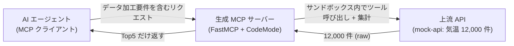
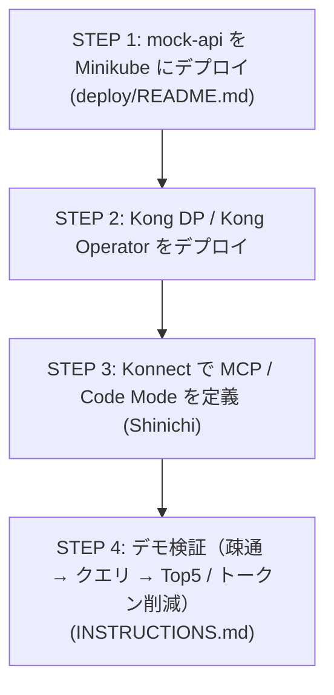

# konnect-code-mode-mcp

Kong Konnect の **Context Mesh** と **Code Mode** を使い、
**AI エージェントの LLM トークン量削減**を実証するデモ環境ですKong Konnectを利用します。

## 趣旨

MCP経由で大量データを扱うと、APIが返す生データがそのままLLMコンテキストに流入してトークンを消費します。**Code Mode** はデータ加工をサンドボックス内の Python で行い、**加工後の小さな結果だけ**を AI エージェントに返すことでこれを解消します。

本デモでは、約1万件の気温レコードを返す上流 API に対し、AI エージェントからの「**過去 10 年の 3 月の平均気温 Top5 を取得**」といったクエリを受け取った際、以下の要件で処理します:

1. レコードのグループ化
2. グループごとの特定フィールド値の集計（Sum / 平均）
3. 算出値の **Top5 のみ**を AI エージェントに返す（生データは返さない）

構成: 定義は **Konnect UI**、実行（Kong DP / Context Mesh コンポーネント）は
**ローカル Kubernetes (Minikube)**。詳細な上流リポジトリは
[kong-gateway/context-mesh](https://github.com/kong-gateway/context-mesh)。

デモ体験用に **Chat UI**（Next.js + Vercel AI SDK。[ADR-0004](docs/decisions/0004-chat-ui-tech-stack.md)）
も用意しており、ブラウザから同じクエリを試せる。以下は実際にクエリを送信した際の画面例。
list_tools / get_schema / execute（複数回）という Code Mode の内部ツール呼び出しと、
各応答サイズ（数千文字程度、12,000 件の生データではない）が可視化されている:

## 全体像

## リポジトリ構成

| パス | 内容 |
|---|---|
| [README.md](README.md) | 本ファイル（趣旨・構成・全体像） |
| [INSTRUCTIONS.md](INSTRUCTIONS.md) | **デモ検証手順**（デプロイ後の疎通・クエリ・Top5 / トークン削減の確認） |
| [TEST.md](TEST.md) | Chat UIデモクエリのテストケース集（入力/出力/画面キャプチャ/実ログ） |
| [deploy/README.md](deploy/README.md) | Minikube デプロイ手順（mock-api） |
| [CODE_MODE.md](CODE_MODE.md) | Context Mesh / Code Mode の調査メモ・アーキテクチャ・実装方針 |
| [CODE_MODE_LOCAL_TEST.md](CODE_MODE_LOCAL_TEST.md) | デモ設計 + ローカル単体検証手順（通常は実施不要） |
| [CLAUDE.md](CLAUDE.md) | エージェント向けプロジェクト指針・要件・制約・規約 |
| [mock-api/](mock-api/) | デモ用モック API（気温）+ テストデータ + OpenAPI spec |
| [chat-ui/](chat-ui/) | デモ体験用 Chat UI（Next.js + Vercel AI SDK + MCP client） |
| [deploy/](deploy/) | Minikube デプロイ用マニフェスト（mock-api / Chat UI / ログ基盤） |

## 構築・検証の流れ

- **デプロイ手順**: [deploy/README.md](deploy/README.md)（mock-api の Minikube デプロイ）。
- **検証手順**: [INSTRUCTIONS.md](INSTRUCTIONS.md)（デプロイ後の疎通・デモクエリ・
  Top5 / トークン削減の確認）。個別テストケースの詳細は [TEST.md](TEST.md)。
- **調査メモ / アーキテクチャ**: [CODE_MODE.md](CODE_MODE.md)（Code Mode の仕組み・
  トークン削減の原理・コード生成の詳細）。
- **ローカル単体検証（通常不要）**: Konnect / K8s を挟まずローカルだけで Code Mode の
  挙動を確認したい場合のみ [CODE_MODE_LOCAL_TEST.md](CODE_MODE_LOCAL_TEST.md)。

## 参考

- 上流リポジトリ: <https://github.com/kong-gateway/context-mesh>
- FastMCP Code Mode: <https://gofastmcp.com/servers/transforms/code-mode>
