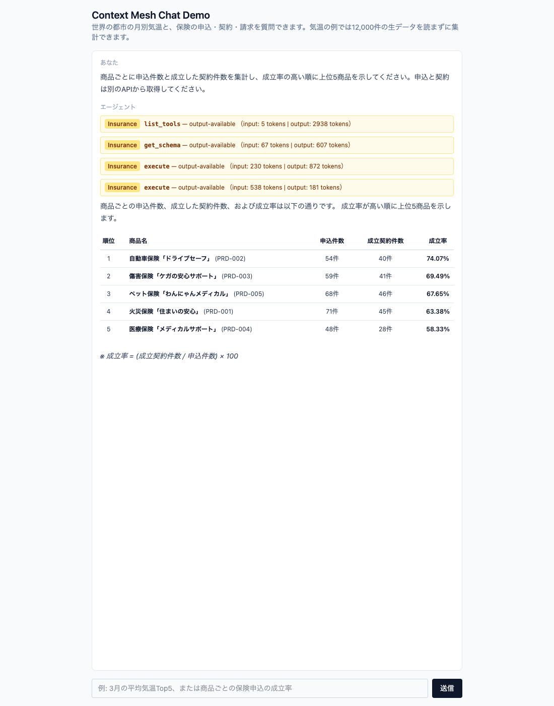
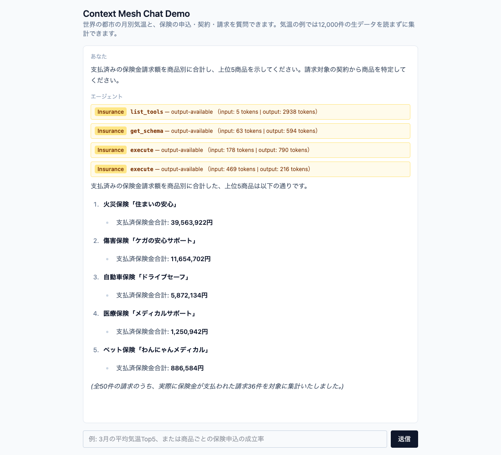
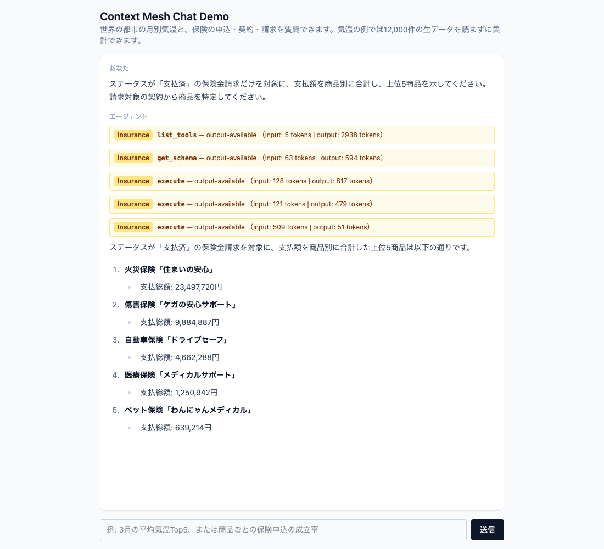
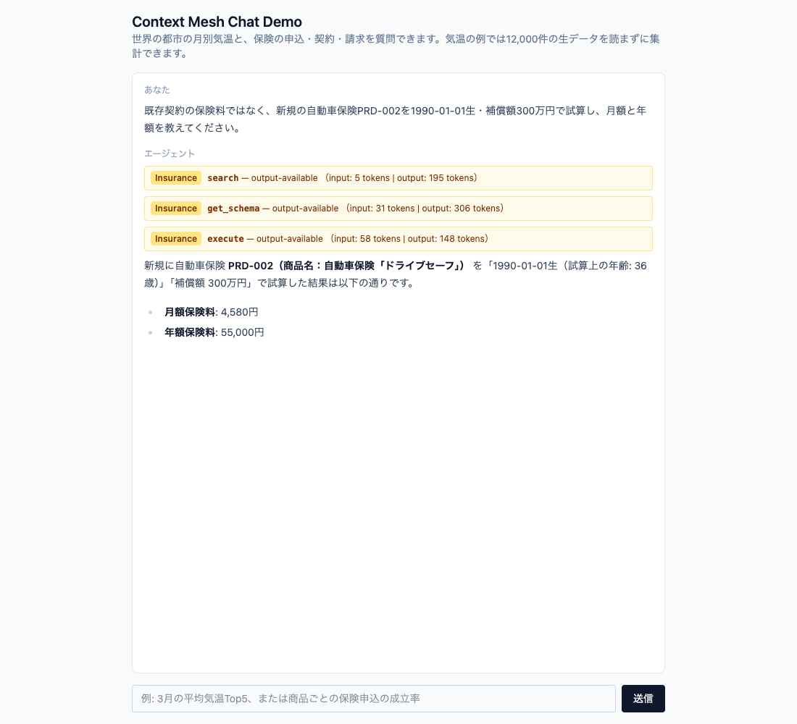

# TEST_INSURANCE — Insuranceのテストケース集

Insuranceのユースケースでは、手元のOpenAPI仕様を無変更でContext Meshへ登録してMCP Server化し、6 API・32 Toolから目的のToolを選び、申込・契約・請求・商品を結合して集計する。気温データをsandbox内で集計してトークン削減を示すユースケースは[TEST_WORLD_WEATHER.md](TEST_WORLD_WEATHER.md)を参照。

## 実施環境

2026-09-29に取得した`docs/evidence/insurance-2026-09-29/`の実測証跡に基づく。

| 項目 | 値 |
|---|---|
| 実施日時 | 2026-09-29 15:47〜15:52 JST（06:47〜06:52 UTC） |
| Chat UI | `main` `a57553b`（PR #24の2 MCP Server同時接続を含む）を`next build`し、ローカルの`next start -p 3100`で起動。`MCP_WEATHER_URL=http://127.0.0.1/mcp/world-monthly-temperature`、`MCP_INSURANCE_URL=http://127.0.0.1/mcp/kong-insurance`（`minikube tunnel`経由）。クラスタ上のChat UI（`chat-ui:0.1.0`）ではない |
| LLM | `gemini-3.5-flash`（Chat UIの既定） |
| MCP Server | `kong-insurance`（Context Mesh MCP Server 3.3.1、runner `kong/mcp-server-runner:0.6.0`）。6 Source、32 Tool |
| 登録した仕様 | kong-api-bundle-insurance **v0.1.3**の`services/<svc>/openapi.yaml`を無変更で登録（英語のsummary／description） |
| Tool名 | `property_dash_insurance_dash_<svc>_dash_api_<operationId>`（simulationは`property_dash_insurance_dash_premium_dash_simulation_dash_api_...`） |
| Insurance API | `insurance` namespace、image `v0.1.1`（seedの状態。書き込み操作は実行していない） |
| 日本語の質問 | ブラウザ（Playwright）から実行し、画面を保存 |
| 英語の質問 | Chat UIのAPI（`POST /chat-ui/api/chat`）へ直接送信。画面キャプチャは無い。回答全文は`docs/evidence/insurance-2026-09-29/I-*-en-answer.md` |

## 実行方法

Chat UIにWorld Weather（`/mcp/world-monthly-temperature`）とInsurance（`/mcp/kong-insurance`）の両方のURLを設定し、各ケースの質問を送る。Tool名の`weather_`／`insurance_`で接続先を区別する。設定手順は[deploy/README.mdのChat UI節](deploy/README.md#chat-uinextjs--vercel-ai-sdk--mcp-client)と[deploy/insurance/README.md](deploy/insurance/README.md)を参照。

## I-1: 申込から契約への成立率

### テストの内容

商品・申込・契約を別のAPIから取得して商品IDで集計し、契約件数÷申込件数による成立率の上位5商品を出す。

### インプット

- 日本語: 「商品ごとに申込件数と成立した契約件数を集計し、成立率の高い順に上位5商品を示してください。申込と契約は別のAPIから取得してください。」
- 英語: "For each insurance product, count applications and issued policies, then show the top five by policy conversion rate. Retrieve applications and policies from their respective APIs."

### 期待する処理

`insurance_list_tools` → `insurance_get_schema` → `insurance_execute` ×2（日・英とも）。最初の`execute`でデータの形を確認し、最後の`execute`で商品、申込300件（100件ずつ3ページ）、契約200件（100件ずつ2ページ）を取得して集計する。

### 基準値

seedを直接集計した基準値。成立率は契約件数÷申込件数を小数点以下2桁の%で表示する。

| 順位 | 商品 | 申込件数 | 契約件数 | 成立率 |
|---:|---|---:|---:|---:|
| 1 | 自動車保険「ドライブセーフ」 | 54 | 40 | 74.07% |
| 2 | 傷害保険「ケガの安心サポート」 | 59 | 41 | 69.49% |
| 3 | ペット保険「わんにゃんメディカル」 | 68 | 46 | 67.65% |
| 4 | 火災保険「住まいの安心」 | 71 | 45 | 63.38% |
| 5 | 医療保険「メディカルサポート」 | 48 | 28 | 58.33% |

### アウトプット

日本語のブラウザ画面と英語のAPI直接送信の回答は、上の5件と順序・数値が一致した。英語回答全文は`docs/evidence/insurance-2026-09-29/I-1-en-answer.md`。英語の回の画面は無い。

### 画面キャプチャ



### ログ

Tool呼び出し順（`toolCalls`）: `insurance_list_tools` → `insurance_get_schema` → `insurance_execute` → `insurance_execute`。

**最後の`execute`の生成コードと結果**（`docs/evidence/insurance-2026-09-29/I-1-ja-mcp-server.log`から抜粋）:

```text
# execute 2/2（ログへの出力時刻は次のリクエスト到着時。Code Modeのrunnerは1リクエスト遅れて書き出す）
2026-09-29T06:48:10.941179756Z ============================================================
2026-09-29T06:48:10.941185881Z CODE MODE — Generated Python:
2026-09-29T06:48:10.941210214Z ============================================================
2026-09-29T06:48:10.941212631Z async def aggregate():
2026-09-29T06:48:10.941213797Z     prod_res = await call_tool("property_dash_insurance_dash_product_dash_api_list_products_products_get", {"limit": 100})
2026-09-29T06:48:10.941215172Z     products = prod_res.get("items", [])
2026-09-29T06:48:10.941216256Z     prod_map = {p["product_id"]: p["product_name"] for p in products}
2026-09-29T06:48:10.941217464Z     
2026-09-29T06:48:10.941218422Z     apps = []
2026-09-29T06:48:10.941219297Z     skip = 0
2026-09-29T06:48:10.941220047Z     limit = 100
2026-09-29T06:48:10.941220797Z     while True:
2026-09-29T06:48:10.941221589Z         res = await call_tool("property_dash_insurance_dash_application_dash_api_list_applications_applications_get", {"skip": skip, "limit": limit})
2026-09-29T06:48:10.941222631Z         items = res.get("items", [])
2026-09-29T06:48:10.941223464Z         if not items:
2026-09-29T06:48:10.941224214Z             break
2026-09-29T06:48:10.941225006Z         apps.extend(items)
2026-09-29T06:48:10.941228381Z         if len(apps) >= res.get("total", 0):
2026-09-29T06:48:10.941229964Z             break
2026-09-29T06:48:10.941230714Z         skip += limit
2026-09-29T06:48:10.941231506Z         
2026-09-29T06:48:10.941236964Z     pols = []
2026-09-29T06:48:10.941239339Z     skip = 0
2026-09-29T06:48:10.941241464Z     limit = 100
2026-09-29T06:48:10.941246131Z     while True:
2026-09-29T06:48:10.941250172Z         res = await call_tool("property_dash_insurance_dash_policy_dash_api_list_policies_policies_get", {"skip": skip, "limit": limit})
2026-09-29T06:48:10.941271797Z         items = res.get("items", [])
2026-09-29T06:48:10.941288006Z         if not items:
2026-09-29T06:48:10.941289797Z             break
2026-09-29T06:48:10.941290464Z         pols.extend(items)
2026-09-29T06:48:10.941291089Z         if len(pols) >= res.get("total", 0):
2026-09-29T06:48:10.941291797Z             break
2026-09-29T06:48:10.941292422Z         skip += limit
2026-09-29T06:48:10.941293047Z 
2026-09-29T06:48:10.941293672Z     app_counts = {}
2026-09-29T06:48:10.941294256Z     pol_counts = {}
2026-09-29T06:48:10.941294881Z     
2026-09-29T06:48:10.941295506Z     for pid in prod_map:
2026-09-29T06:48:10.941296131Z         app_counts[pid] = 0
2026-09-29T06:48:10.941300506Z         pol_counts[pid] = 0
2026-09-29T06:48:10.941302006Z         
2026-09-29T06:48:10.941303631Z     for app in apps:
2026-09-29T06:48:10.941307672Z         pid = app.get("product_id")
2026-09-29T06:48:10.941312422Z         if pid in app_counts:
2026-09-29T06:48:10.941316256Z             app_counts[pid] += 1
2026-09-29T06:48:10.941320589Z             
2026-09-29T06:48:10.941324172Z     for pol in pols:
2026-09-29T06:48:10.941325006Z         pid = pol.get("product_id")
2026-09-29T06:48:10.941325672Z         if pid in pol_counts:
2026-09-29T06:48:10.941329714Z             pol_counts[pid] += 1
2026-09-29T06:48:10.941333381Z             
2026-09-29T06:48:10.941336547Z     results = []
2026-09-29T06:48:10.941339797Z     for pid, pname in prod_map.items():
2026-09-29T06:48:10.941340672Z         acount = app_counts[pid]
2026-09-29T06:48:10.941342422Z         pcount = pol_counts[pid]
2026-09-29T06:48:10.941345797Z         ratio = pcount / acount if acount > 0 else 0.0
2026-09-29T06:48:10.941350131Z         results.append({
2026-09-29T06:48:10.941353964Z             "product_id": pid,
2026-09-29T06:48:10.941369964Z             "product_name": pname,
2026-09-29T06:48:10.941373881Z             "application_count": acount,
2026-09-29T06:48:10.941377297Z             "policy_count": pcount,
2026-09-29T06:48:10.941382589Z             "success_rate": round(ratio * 100, 2)  # パーセント表記（小数点以下2桁）
2026-09-29T06:48:10.941386714Z         })
2026-09-29T06:48:10.941388381Z         
2026-09-29T06:48:10.941390631Z     results_sorted = sorted(results, key=lambda x: x["success_rate"], reverse=True)
2026-09-29T06:48:10.941395881Z     return results_sorted[:5]
2026-09-29T06:48:10.941403381Z 
2026-09-29T06:48:10.941416797Z return await aggregate()
2026-09-29T06:48:10.941420881Z ============================================================
2026-09-29T06:48:10.941424839Z Available tools: ['call_tool']
2026-09-29T06:48:10.941429006Z Result: [{'product_id': 'PRD-002', 'product_name': '自動車保険「ドライブセーフ」', 'application_count': 54, 'policy_count': 40, 'success_rate': 74.07}, {'product_id': 'PRD-003', 'product_name': '傷害保険「ケガの安心サポート」', 'application_count': 59, 'policy_count': 41, 'success_rate': 69.49}, {'product_id': 'PRD-005', 'product_name': 'ペット保険「わんにゃんメディカル」', 'application_count': 68, 'policy_count': 46, 'success_rate': 67.65}, {'product_id': 'PRD-001', 'product_name': '火災保険「住まいの安心」', 'application_count': 71, 'policy_count': 45, 'success_rate': 63.38}, {'product_id': 'PRD-004', 'product_name': '医療保険「メディカルサポート」', 'application_count': 48, 'policy_count': 28, 'success_rate': 58.33}]
```

**上流Insurance APIのアクセスログ**（日本語の回、`docs/evidence/insurance-2026-09-29/I-1-ja-insurance-api.log`から抜粋）:

```text
2026-09-29T06:47:28.815982458Z [product] INFO:     10.244.1.70:58230 - "GET /products?limit=1 HTTP/1.1" 200 OK
2026-09-29T06:47:28.826299583Z [application] INFO:     10.244.1.70:60978 - "GET /applications?limit=1 HTTP/1.1" 200 OK
2026-09-29T06:47:28.834000500Z [policy] INFO:     10.244.1.70:55900 - "GET /policies?limit=1 HTTP/1.1" 200 OK
2026-09-29T06:47:36.671789712Z [product] INFO:     10.244.1.70:46160 - "GET /products?limit=100 HTTP/1.1" 200 OK
2026-09-29T06:47:36.680620545Z [application] INFO:     10.244.1.70:37252 - "GET /applications?skip=0&limit=100 HTTP/1.1" 200 OK
2026-09-29T06:47:36.691609045Z [application] INFO:     10.244.1.70:37268 - "GET /applications?skip=100&limit=100 HTTP/1.1" 200 OK
2026-09-29T06:47:36.699738670Z [application] INFO:     10.244.1.70:37278 - "GET /applications?skip=200&limit=100 HTTP/1.1" 200 OK
2026-09-29T06:47:36.708038379Z [policy] INFO:     10.244.1.70:35672 - "GET /policies?skip=0&limit=100 HTTP/1.1" 200 OK
2026-09-29T06:47:36.716145712Z [policy] INFO:     10.244.1.70:35684 - "GET /policies?skip=100&limit=100 HTTP/1.1" 200 OK
```

## I-2: 支払済請求額の商品別集計

### テストの内容

請求から契約を経由して商品を特定し、ステータスが「支払済」の請求だけを商品別に集計する。

### インプット

- 日本語: 「ステータスが「支払済」の保険金請求だけを対象に、支払額を商品別に合計し、上位5商品を示してください。請求対象の契約から商品を特定してください。」
- 英語: "Consider only insurance claims whose status is 支払済 (paid). Sum the paid amounts by insurance product and show the top five. Resolve each claim's product through its policy."

### 期待する処理

日本語は`insurance_list_tools` → `insurance_get_schema` → `insurance_execute` ×3、英語は`insurance_list_tools` → `insurance_get_schema` → `insurance_execute` ×2。`status == '支払済'`で絞り、`claim_amount_paid`がnullなら0として扱う。請求の`policy_id`から契約の商品IDを引き、商品名へ結びつける。

### 基準値

seedを直接集計した基準値。対象は「支払済」28件。

| 順位 | 商品 | 支払額の合計 |
|---:|---|---:|
| 1 | 火災保険「住まいの安心」 | 23,497,720円 |
| 2 | 傷害保険「ケガの安心サポート」 | 9,884,887円 |
| 3 | 自動車保険「ドライブセーフ」 | 4,662,288円 |
| 4 | 医療保険「メディカルサポート」 | 1,250,942円 |
| 5 | ペット保険「わんにゃんメディカル」 | 639,214円 |

### アウトプット

日本語のブラウザ画面と英語のAPI直接送信の回答は、上の5件と順序・数値が一致した。英語の質問に対する回答も日本語だった。英語回答全文は`docs/evidence/insurance-2026-09-29/I-2-en-answer.md`。英語の回の画面は無い。

#### 条件を明示する前の回

当初の設計どおり「支払済みの保険金請求額を商品別に合計し、上位5商品を示してください。請求対象の契約から商品を特定してください。」と日本語で質問した回は、**基準値と一致しなかった**。回答は火災39,563,922円、傷害11,654,702円、自動車5,872,134円、医療1,250,942円、ペット886,584円（36件）だった。生成コードは`claim_amount_paid > 0`を条件にしたため、ステータス「承認」の請求も含めた。

この回の`toolCalls`は`insurance_list_tools` → `insurance_get_schema` → `insurance_execute` ×2だった。

業務上の条件は質問で明示する。この教訓を受け、「ステータスが「支払済」」を明示した質問を本テストケースとして採用した。



### 画面キャプチャ



### ログ

Tool呼び出し順（`toolCalls`）: 日本語 `insurance_list_tools` → `insurance_get_schema` → `insurance_execute` ×3。英語 `insurance_list_tools` → `insurance_get_schema` → `insurance_execute` ×2。

**最後の`execute`の生成コードと結果**（`docs/evidence/insurance-2026-09-29/I-2-ja-mcp-server.log`から抜粋）:

```text
# execute 3/3（ログへの出力時刻は次のリクエスト到着時。Code Modeのrunnerは1リクエスト遅れて書き出す）
2026-09-29T06:50:37.864691046Z ============================================================
2026-09-29T06:50:37.864697796Z CODE MODE — Generated Python:
2026-09-29T06:50:37.864720171Z ============================================================
2026-09-29T06:50:37.864722171Z async def aggregate_claims():
2026-09-29T06:50:37.864723254Z     # 1. 全claimを取得
2026-09-29T06:50:37.864724504Z     claims_res = await call_tool('property_dash_insurance_dash_claim_dash_api_list_claims_claims_get', {'limit': 100})
2026-09-29T06:50:37.864725754Z     claims = claims_res.get('items', [])
2026-09-29T06:50:37.864726838Z     
2026-09-29T06:50:37.864727838Z     # 2. 全policyを取得 (paging)
2026-09-29T06:50:37.864732921Z     policies = []
2026-09-29T06:50:37.864734171Z     skip = 0
2026-09-29T06:50:37.864735171Z     limit = 100
2026-09-29T06:50:37.864738713Z     while True:
2026-09-29T06:50:37.864741963Z         policies_res = await call_tool('property_dash_insurance_dash_policy_dash_api_list_policies_policies_get', {'skip': skip, 'limit': limit})
2026-09-29T06:50:37.864743296Z         items = policies_res.get('items', [])
2026-09-29T06:50:37.864744338Z         if not items:
2026-09-29T06:50:37.864745338Z             break
2026-09-29T06:50:37.864746379Z         policies.extend(items)
2026-09-29T06:50:37.864753671Z         if len(policies) >= policies_res.get('total', 0):
2026-09-29T06:50:37.864760713Z             break
2026-09-29T06:50:37.864766629Z         skip += limit
2026-09-29T06:50:37.864772129Z 
2026-09-29T06:50:37.864778504Z     # 3. 全productを取得
2026-09-29T06:50:37.864785213Z     products_res = await call_tool('property_dash_insurance_dash_product_dash_api_list_products_products_get', {'limit': 100})
2026-09-29T06:50:37.864788171Z     products = products_res.get('items', [])
2026-09-29T06:50:37.864791546Z 
2026-09-29T06:50:37.864792504Z     # マッピング辞書作成
2026-09-29T06:50:37.864793671Z     # product_id -> product_name
2026-09-29T06:50:37.864794796Z     product_map = {}
2026-09-29T06:50:37.864795754Z     for p in products:
2026-09-29T06:50:37.864796713Z         product_map[p['product_id']] = p['product_name']
2026-09-29T06:50:37.864797838Z         
2026-09-29T06:50:37.864798796Z     # policy_id -> product_id
2026-09-29T06:50:37.864799879Z     policy_map = {}
2026-09-29T06:50:37.864800838Z     for pol in policies:
2026-09-29T06:50:37.864801838Z         policy_map[pol['policy_id']] = pol['product_id']
2026-09-29T06:50:37.864802879Z 
2026-09-29T06:50:37.864803796Z     # 集計
2026-09-29T06:50:37.864804754Z     product_paid_totals = {}
2026-09-29T06:50:37.864808796Z     
2026-09-29T06:50:37.864809838Z     for claim in claims:
2026-09-29T06:50:37.864861421Z         if claim.get('status') == '支払済':
2026-09-29T06:50:37.864866546Z             paid_amount = claim.get('claim_amount_paid', 0)
2026-09-29T06:50:37.864868254Z             if paid_amount is None:
2026-09-29T06:50:37.864869421Z                 paid_amount = 0
2026-09-29T06:50:37.864870546Z             
2026-09-29T06:50:37.864874463Z             policy_id = claim.get('policy_id')
2026-09-29T06:50:37.864875588Z             product_id = policy_map.get(policy_id)
2026-09-29T06:50:37.864876671Z             if product_id:
2026-09-29T06:50:37.864878713Z                 product_name = product_map.get(product_id, f"未知の商品({product_id})")
2026-09-29T06:50:37.864885588Z             else:
2026-09-29T06:50:37.864891379Z                 product_name = "契約情報なし"
2026-09-29T06:50:37.864893504Z                 
2026-09-29T06:50:37.864894671Z             product_paid_totals[product_name] = product_paid_totals.get(product_name, 0) + paid_amount
2026-09-29T06:50:37.864895921Z 
2026-09-29T06:50:37.864901338Z     # ソートして上位5件
2026-09-29T06:50:37.864904588Z     sorted_totals = sorted(product_paid_totals.items(), key=lambda x: x[1], reverse=True)
2026-09-29T06:50:37.864908171Z     
2026-09-29T06:50:37.864909254Z     return sorted_totals[:5]
2026-09-29T06:50:37.864910254Z 
2026-09-29T06:50:37.864911254Z return await aggregate_claims()
2026-09-29T06:50:37.864912338Z ============================================================
2026-09-29T06:50:37.864913463Z Available tools: ['call_tool']
2026-09-29T06:50:37.864914546Z Result: [('火災保険「住まいの安心」', 23497720), ('傷害保険「ケガの安心サポート」', 9884887), ('自動車保険「ドライブセーフ」', 4662288), ('医療保険「メディカルサポート」', 1250942), ('ペット保険「わんにゃんメディカル」', 639214)]
```

**上流Insurance APIのアクセスログ**（日本語の回、`docs/evidence/insurance-2026-09-29/I-2-ja-insurance-api.log`から抜粋）:

```text
2026-09-29T06:50:10.950163506Z [claim] INFO:     10.244.1.70:48536 - "GET /claims?limit=1 HTTP/1.1" 200 OK
2026-09-29T06:50:10.962308881Z [policy] INFO:     10.244.1.70:42730 - "GET /policies?limit=1 HTTP/1.1" 200 OK
2026-09-29T06:50:10.980209672Z [product] INFO:     10.244.1.70:57206 - "GET /products?limit=1 HTTP/1.1" 200 OK
2026-09-29T06:50:15.995888258Z [claim] INFO:     10.244.1.70:58638 - "GET /claims?limit=100 HTTP/1.1" 200 OK
2026-09-29T06:50:21.502553552Z [claim] INFO:     10.244.1.70:58642 - "GET /claims?limit=100 HTTP/1.1" 200 OK
2026-09-29T06:50:21.517117552Z [policy] INFO:     10.244.1.70:43736 - "GET /policies?skip=0&limit=100 HTTP/1.1" 200 OK
2026-09-29T06:50:21.542605136Z [policy] INFO:     10.244.1.70:43752 - "GET /policies?skip=100&limit=100 HTTP/1.1" 200 OK
2026-09-29T06:50:21.560092011Z [product] INFO:     10.244.1.70:58694 - "GET /products?limit=100 HTTP/1.1" 200 OK
```

#### 条件が曖昧だった回のログ

**最後の`execute`の生成コードと結果**（`docs/evidence/insurance-2026-09-29/I-2-ja-ambiguous-mcp-server.log`から抜粋）:

```text
# execute 2/2（ログへの出力時刻は次のリクエスト到着時。Code Modeのrunnerは1リクエスト遅れて書き出す）
2026-09-29T06:49:35.600772878Z ============================================================
2026-09-29T06:49:35.600782587Z CODE MODE — Generated Python:
2026-09-29T06:49:35.600785337Z ============================================================
2026-09-29T06:49:35.600786462Z async def fetch_all(tool_name):
2026-09-29T06:49:35.600787295Z     items = []
2026-09-29T06:49:35.600788087Z     skip = 0
2026-09-29T06:49:35.600788837Z     limit = 100
2026-09-29T06:49:35.600789587Z     while True:
2026-09-29T06:49:35.600790337Z         res = await call_tool(tool_name, {'skip': skip, 'limit': limit})
2026-09-29T06:49:35.600791212Z         items.extend(res.get('items', []))
2026-09-29T06:49:35.600801503Z         total = res.get('total', 0)
2026-09-29T06:49:35.600802628Z         if len(items) >= total or not res.get('items'):
2026-09-29T06:49:35.600831712Z             break
2026-09-29T06:49:35.600833503Z         skip += limit
2026-09-29T06:49:35.600834128Z     return items
2026-09-29T06:49:35.600834753Z 
2026-09-29T06:49:35.600835337Z async def main():
2026-09-29T06:49:35.600835962Z     claims = await fetch_all('property_dash_insurance_dash_claim_dash_api_list_claims_claims_get')
2026-09-29T06:49:35.600836712Z     policies = await fetch_all('property_dash_insurance_dash_policy_dash_api_list_policies_policies_get')
2026-09-29T06:49:35.600837503Z     products = await fetch_all('property_dash_insurance_dash_product_dash_api_list_products_products_get')
2026-09-29T06:49:35.600838212Z     
2026-09-29T06:49:35.600838837Z     prod_map = {p['product_id']: p['product_name'] for p in products}
2026-09-29T06:49:35.600839503Z     policy_map = {pol['policy_id']: pol['product_id'] for pol in policies}
2026-09-29T06:49:35.600840170Z     
2026-09-29T06:49:35.600840795Z     product_totals = {}
2026-09-29T06:49:35.600841420Z     for claim in claims:
2026-09-29T06:49:35.600842003Z         paid_amt = claim.get('claim_amount_paid')
2026-09-29T06:49:35.600842670Z         if paid_amt is not None and paid_amt > 0:
2026-09-29T06:49:35.600843545Z             policy_id = claim.get('policy_id')
2026-09-29T06:49:35.600846878Z             prod_id = policy_map.get(policy_id)
2026-09-29T06:49:35.600847795Z             if prod_id:
2026-09-29T06:49:35.600848545Z                 prod_name = prod_map.get(prod_id, prod_id)
2026-09-29T06:49:35.600849337Z                 product_totals[prod_name] = product_totals.get(prod_name, 0) + paid_amt
2026-09-29T06:49:35.600850253Z             else:
2026-09-29T06:49:35.600850962Z                 product_totals['Unknown Policy'] = product_totals.get('Unknown Policy', 0) + paid_amt
2026-09-29T06:49:35.600851878Z                 
2026-09-29T06:49:35.600852587Z     sorted_totals = sorted(product_totals.items(), key=lambda x: x[1], reverse=True)
2026-09-29T06:49:35.600853587Z     top_5 = sorted_totals[:5]
2026-09-29T06:49:35.600854378Z     
2026-09-29T06:49:35.600855087Z     return {
2026-09-29T06:49:35.600855795Z         'top_5': [{'product_name': name, 'total_paid_amount': amt} for name, amt in top_5],
2026-09-29T06:49:35.600856753Z         'total_claims_processed': len(claims),
2026-09-29T06:49:35.600857628Z         'paid_claims_count': sum(1 for c in claims if c.get('claim_amount_paid') is not None and c.get('claim_amount_paid') > 0)
2026-09-29T06:49:35.600858712Z     }
2026-09-29T06:49:35.600859462Z 
2026-09-29T06:49:35.600860170Z return await main()
2026-09-29T06:49:35.600861920Z ============================================================
2026-09-29T06:49:35.600866128Z Available tools: ['call_tool']
2026-09-29T06:49:35.600872087Z Result: {'top_5': [{'product_name': '火災保険「住まいの安心」', 'total_paid_amount': 39563922}, {'product_name': '傷害保険「ケガの安心サポート」', 'total_paid_amount': 11654702}, {'product_name': '自動車保険「ドライブセーフ」', 'total_paid_amount': 5872134}, {'product_name': '医療保険「メディカルサポート」', 'total_paid_amount': 1250942}, {'product_name': 'ペット保険「わんにゃんメディカル」', 'total_paid_amount': 886584}], 'total_claims_processed': 50, 'paid_claims_count': 36}
```

**上流Insurance APIのアクセスログ**（日本語の回、`docs/evidence/insurance-2026-09-29/I-2-ja-ambiguous-insurance-api.log`から抜粋）:

```text
2026-09-29T06:48:20.750465344Z [claim] INFO:     10.244.1.70:59230 - "GET /claims?limit=1 HTTP/1.1" 200 OK
2026-09-29T06:48:20.761721552Z [policy] INFO:     10.244.1.70:48276 - "GET /policies?limit=1 HTTP/1.1" 200 OK
2026-09-29T06:48:20.772116344Z [product] INFO:     10.244.1.70:43152 - "GET /products?limit=1 HTTP/1.1" 200 OK
2026-09-29T06:48:28.581264417Z [claim] INFO:     10.244.1.70:59418 - "GET /claims?skip=0&limit=100 HTTP/1.1" 200 OK
2026-09-29T06:48:28.594391833Z [policy] INFO:     10.244.1.70:33032 - "GET /policies?skip=0&limit=100 HTTP/1.1" 200 OK
2026-09-29T06:48:28.606135000Z [policy] INFO:     10.244.1.70:33036 - "GET /policies?skip=100&limit=100 HTTP/1.1" 200 OK
2026-09-29T06:48:28.617310917Z [product] INFO:     10.244.1.70:49590 - "GET /products?skip=0&limit=100 HTTP/1.1" 200 OK
```

## I-3: 新規保険料の試算

### テストの内容

既存契約の保険料を参照せず、新規の自動車保険について試算Toolを使う。

### インプット

- 日本語: 「既存契約の保険料ではなく、新規の自動車保険PRD-002を1990-01-01生・補償額300万円で試算し、月額と年額を教えてください。」
- 英語: "Quote a new PRD-002 auto policy for a person born on 1990-01-01 with ¥3,000,000 coverage. Report the monthly and annual premium. Do not report premiums from existing policies."

### 期待する処理

`product_id: PRD-002`、`birth_date: 1990-01-01`、`sum_insured: 3000000`で試算Toolを呼ぶ。日本語の回は`insurance_search` → `insurance_get_schema` → `insurance_execute`。英語の回は`insurance_list_tools` → `insurance_get_schema` → `insurance_execute`だった。**searchを使うかはLLMの判断で変わる**。日本語の回でsearchへ渡したqueryは証跡に記録されていない。

### 基準値

実行日の年齢で試算額が変わるため、固定の期待値は置かない。以下は**2026-09-29の実測値**。

| 年齢 | 月額 | 年額 |
|---:|---:|---:|
| 36歳 | 4,580円 | 55,000円 |

### アウトプット

日本語のブラウザ画面と英語のAPI直接送信の回答は、ともに36歳・月額4,580円・年額55,000円だった。英語回答全文は`docs/evidence/insurance-2026-09-29/I-3-en-answer.md`。英語の回の画面は無い。Opusが同じ引数でMCPの`execute`から試算Toolを直接呼んだ独立の確認でも、`monthly_premium: 4580`、`annual_premium: 55000`、`age: 36`、`base_annual: 55000`を得た。上流への呼び出しは`POST /simulations`が1回で、契約作成の`POST /policies`は無かった。

### 画面キャプチャ



### ログ

Tool呼び出し順（`toolCalls`）: 日本語 `insurance_search` → `insurance_get_schema` → `insurance_execute`。英語 `insurance_list_tools` → `insurance_get_schema` → `insurance_execute`。

**最後の`execute`の生成コードと結果**（`docs/evidence/insurance-2026-09-29/I-3-ja-mcp-server.log`から抜粋）:

```text
# execute 1/1（ログへの出力時刻は次のリクエスト到着時。Code Modeのrunnerは1リクエスト遅れて書き出す）
2026-09-29T06:50:02.489439502Z ============================================================
2026-09-29T06:50:02.489442793Z CODE MODE — Generated Python:
2026-09-29T06:50:02.489445752Z ============================================================
2026-09-29T06:50:02.489447168Z res = await call_tool('property_dash_insurance_dash_premium_dash_simulation_dash_api_simulate_simulations_post', {
2026-09-29T06:50:02.489448543Z     'birth_date': '1990-01-01',
2026-09-29T06:50:02.489449668Z     'product_id': 'PRD-002',
2026-09-29T06:50:02.489450793Z     'sum_insured': 3000000
2026-09-29T06:50:02.489451918Z })
2026-09-29T06:50:02.489452960Z return res
2026-09-29T06:50:02.489454168Z ============================================================
2026-09-29T06:50:02.489455418Z Available tools: ['call_tool']
2026-09-29T06:50:02.489457793Z Result: {'product_id': 'PRD-002', 'product_name': '自動車保険「ドライブセーフ」', 'category': '自動車保険', 'age': 36, 'sum_insured': 3000000, 'monthly_premium': 4580, 'annual_premium': 55000, 'breakdown': {'base_annual': 55000, 'variable_annual': 0, 'smoker_surcharge': 0, 'age_factor': 1.0}}
```

**上流Insurance APIのアクセスログ**（日本語の回、`docs/evidence/insurance-2026-09-29/I-3-ja-insurance-api.log`から抜粋）:

```text
2026-09-29T06:49:45.619513883Z [simulation] INFO:     10.244.1.70:56102 - "POST /simulations HTTP/1.1" 200 OK
```

## searchについての所見

2026-09-29にMCPへ直接送った検索の実測。仕様のsummary／descriptionは英語で登録されている。

| query | 件数 | 上位・所見 |
|---|---:|---|
| `申込一覧の取得` | 0 | 日本語ではヒットしなかった |
| `list applications` | 9 | `list_applications`が1位 |
| `premium quote` | 7 | 試算（simulate）が1位 |
| `underwriting` | 2 | Tool名ではなくdescriptionにある英単語でもヒット |
| `insurance products` | 32 | Source名に`insurance`を含むため全Toolにヒットし、絞り込みにならない |

## execute内のimport

2026-09-29に両方のMCP Serverで同じ結果を確認した。

| 結果 | モジュール |
|---|---|
| 成功 | `asyncio`、`json`、`math`、`re`、`datetime` |
| `ModuleNotFoundError` | `collections`、`statistics` |

## 検証方法メモ

- 上流のアクセスログはInsuranceの各Podから`kubectl logs --timestamps`で取得し、`/health`を除いた。runnerの生成コードと`Result:`も同じ方法で取得した。
- runnerは生成コードと`Result:`を**1リクエスト遅れて**書き出す。表示タイムスタンプは次のリクエストが届いた時刻なので、`docs/evidence/insurance-2026-09-29/chat-ui-chat_completed.log`の`toolCalls`順でケースに割り当てる。
- 書き込み操作はしない。登録したOpenAPI仕様には更新・削除Toolも含まれるため、デモでは参照とデータを変更しない試算に限定する。データをseedへ戻す場合は`kubectl -n insurance rollout restart deploy`を実行する。
- 顧客の個人情報（氏名、マイナンバーに似た値、住所、電話番号）を回答や公開ログ抜粋に出さない。
