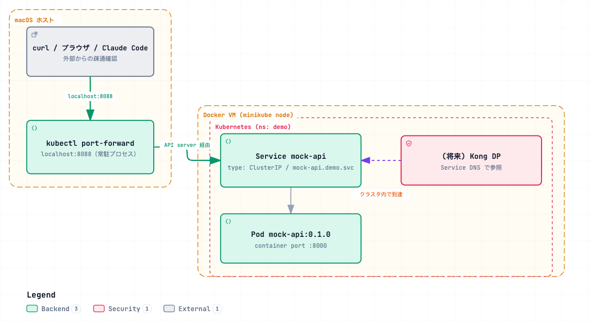

# Minikube Deployment Steps

> Japanese (authoritative): [README.md](README.md) — this English version is a translation.

This file describes how to deploy mock-api. For Kong Operator installation and Konnect Control Plane/DataPlane connection, see [deploy/kong-operator/README.md](kong-operator/README.en.md). For Chat UI deployment, see [deploy/chat-ui/](chat-ui/); for the logging stack (Grafana Loki + Promtail), see [deploy/observability/README.md](observability/README.en.md).

Steps to deploy mock-api (world city temperature API) to Minikube. The Service is `ClusterIP`. In-cluster callers (such as Kong DP) use Service DNS; **direct health checks of mock-api** use `kubectl port-forward` (fixed port `8088`). The production demo query path (through Kong DP) is reachable from Mac using **`minikube tunnel`** (verified on 2026-09-04; see `KongRoute /mock-api` in `deploy/kong/mock-api-kong.yaml`).

## Port assignments (fixed)

| Service | In cluster | Mac local |
|---|---|---|
| mock-api (direct) | Service `demo/mock-api` :80 (→ Pod :8000) / DNS `mock-api.demo.svc.cluster.local` | port-forward: **`localhost:8088`** ← fixed; for mock-api connectivity checks only |
| Kong DP (proxy) | Service `dataplane-ingress-dataplane-*` (LoadBalancer, managed by Kong Operator) | LoadBalancer external-ip:80 through `minikube tunnel` → `http://localhost/mock-api` (`KongRoute strip_path: true`; **verified**) |
| chat-ui | Service `demo/chat-ui` :80 (→ Pod :3000) | Through `minikube tunnel` → `http://localhost/chat-ui` (`KongRoute strip_path: false` + Next.js `basePath`; **verified 2026-09-05**; no port-forward needed) |

## Prerequisites

- Minikube is running (driver=docker, macOS).
- `kubectl` is connected to the cluster.

## Architecture diagram

[](https://picketfence-labs.github.io/diagrams/6161fd80ff08/)

*(Click the image to open the interactive version.)*

> **macOS + docker driver limitation**: Nodes run inside a Docker Desktop VM, so the cluster network cannot be routed directly from the Mac host. **Use `kubectl port-forward` when making local calls from Mac** (mock-api uses fixed port `8088`). Inside the cluster (Kong DP → mock-api), the Service is reachable through DNS `mock-api.demo.svc.cluster.local`.

## Steps

### 1. Build the mock-api image inside Minikube (no external registry needed)

```bash
eval $(minikube docker-env)
docker build -t mock-api:0.1.0 mock-api/
eval $(minikube docker-env -u)   # 元の docker に戻す
```

### 2. Deploy

```bash
kubectl apply -f deploy/mock-api/mock-api.yaml
kubectl -n demo rollout status deploy/mock-api
kubectl -n demo get svc mock-api
```

### 3. Make it reachable from Mac (keep running in a separate terminal)

```bash
kubectl -n demo port-forward svc/mock-api 8088:80
```

### 4. Verify connectivity from Mac (mock-api directly)

```bash
curl http://localhost:8088/health
curl http://localhost:8088/cities | head -c 300
curl "http://localhost:8088/temperatures?city_id=1&month=3"
```

### 5. Make Kong DP reachable from Mac (`minikube tunnel`)

The production demo query is expected to go through Kong DP → `KongRoute`, not directly to mock-api. `minikube tunnel` is a standard Minikube feature that assigns an external IP reachable for LoadBalancer Services. It is separate from MetalLB (removed).

```bash
# mock-api を Kong 経由で公開する KongService/KongRoute を適用
kubectl apply -f deploy/kong/mock-api-kong.yaml

# 別ターミナルで常駐（sudo パスワードを要求される。80/443 の特権ポートバインドのため。
# Ctrl-C で停止）
minikube tunnel

# Kong DP の LoadBalancer external-ip を確認
kubectl get svc -n default -l app=dataplane,gateway-operator.konghq.com/dataplane-service-type=ingress -o wide
```

`minikube tunnel` requires interactive `sudo` password input, so it cannot be started from a non-interactive shell (such as an agent's background process). **The user must run it directly in a terminal.**

Verify connectivity from Mac (path uses `KongRoute` `paths: /mock-api` + `strip_path: true`):

```bash
curl http://localhost/mock-api/health
```

**Verified (2026-09-04)**: Even with docker driver, the LoadBalancer external IP (`127.0.0.1`) is reachable from Mac through `minikube tunnel` (MetalLB was unreachable in the same environment, but `minikube tunnel` is not affected by that limitation).

## Verified operating state

- `kubectl -n demo get pods` → `mock-api-*` is Running.
- From Mac: reachable through `kubectl -n demo port-forward svc/mock-api 8088:80` (`{"status":"ok","cities":100,"temperatures":12000}`).
- In the cluster: reachable at `http://mock-api.demo.svc.cluster.local/health` (path used by Kong DP; configured in OpenAPI spec `servers[0]`).
- Through Kong DP (`minikube tunnel` + `KongRoute /mock-api`): **verified (2026-09-04)**. `curl http://localhost/mock-api/health` → `200 OK` (also confirmed Kong path from the `X-Kong-Upstream-Latency` header). `/cities` and `/temperatures?city_id=1&month=3` are reachable too.

## Cleanup

```bash
kubectl delete -f deploy/mock-api/mock-api.yaml
# port-forward は Ctrl-C で停止
```

## Chat UI (Next.js + Vercel AI SDK + MCP client)

The Chat UI lets you use the demo's AI agent role in a browser. It **connects directly to the MCP Server through the internal Service DNS from inside the cluster** (through Kong DP; `minikube tunnel` is not needed for that connection). Like mock-api, the Chat UI itself is exposed through Kong DP using `KongService` / `KongRoute` (`deploy/kong/chat-ui-kong.yaml`), so no Mac-side port-forward is needed as long as `minikube tunnel` is running (`http://localhost/chat-ui`). See [ADR-0004](../docs/decisions/0004-chat-ui-tech-stack.md) for technology background.

**About Next.js `basePath: '/chat-ui'`**: Chat UI (Next.js) uses multiple paths such as `/_next/*` (static assets) and `/api/chat` (API route), not just `/`. Therefore, it does not work well with a path-prefix rewrite using `strip_path: true` like mock-api (the rewrite prevents absolute application paths such as `/chat-ui/_next/...` from reaching Kong, resulting in 404s). Instead, set `basePath: '/chat-ui'` in `chat-ui/next.config.js` so the Next.js app routes with the prefix included (`KongRoute` uses `strip_path: false`). This value is embedded in the client bundle at build time, so changes require rebuilding the image. Also update the `api` path passed to `DefaultChatTransport` in `useChat` in `chat-ui/app/page.tsx`.

### 1. Find the internal Kong DP Service name and set MCP_WEATHER_URL and MCP_INSURANCE_URL

```bash
kubectl get svc -n default -l app=dataplane,gateway-operator.konghq.com/dataplane-service-type=ingress -o wide
```

Use the Service name returned above (for example, `dataplane-ingress-dataplane-9zrnp`) and update `MCP_WEATHER_URL` and `MCP_INSURANCE_URL` in `deploy/chat-ui/chat-ui.yaml` to the following formats, using that same Service name:

```
MCP_WEATHER_URL=http://<service名>.default.svc.cluster.local/mcp/world-monthly-temperature
MCP_INSURANCE_URL=http://<service名>.default.svc.cluster.local/mcp/kong-insurance
```

### 2. Build the Chat UI image inside Minikube

```bash
eval $(minikube docker-env)
docker build -t chat-ui:0.2.0 chat-ui/
eval $(minikube docker-env -u)
```

Because of `imagePullPolicy: IfNotPresent`, rebuilding with the same tag can leave Pods starting from the old image. When you change the Chat UI, bump the tag in `version` of `chat-ui/package.json` and `image` of `deploy/chat-ui/chat-ui.yaml` before building (0.2.0 added simultaneous connection to the two MCP Servers).

### 3. Register Gemini API key as a Secret

**Do not share the key value in a Claude Code conversation.** The user should write one line `GEMINI_API_KEY=...` in `chat-ui/.env.local` (already in `.gitignore`), then create a Secret using only the file path:

```bash
kubectl create secret generic chat-ui-secrets \
  --from-env-file=chat-ui/.env.local \
  -n demo
```

### 4. Deploy

```bash
kubectl apply -f deploy/chat-ui/chat-ui.yaml
kubectl -n demo rollout status deploy/chat-ui
```

### 5. Make it reachable from Mac through Kong DP

Use the same `minikube tunnel` as mock-api (prerequisite: already running in another terminal; see §5 “Make Kong DP reachable from Mac”). The only additional step is applying the Kong route definition:

```bash
kubectl apply -f deploy/kong/chat-ui-kong.yaml
```

Open `http://localhost/chat-ui` in a browser and submit a query such as “過去10年の3月の平均気温Top5を教えてください” to verify it ( **verified 2026-09-05**).

### Cleanup

```bash
kubectl delete -f deploy/chat-ui/chat-ui.yaml
kubectl delete -f deploy/kong/chat-ui-kong.yaml
kubectl -n demo delete secret chat-ui-secrets
```
