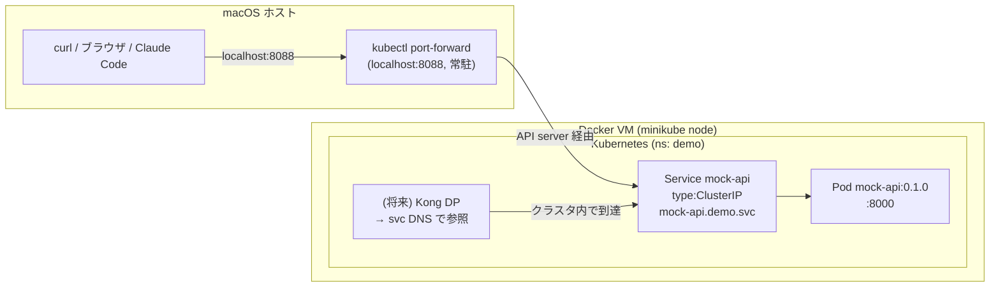

# Minikube デプロイ手順

本ファイルは mock-api のデプロイ手順。Kong Operator インストール + Konnect
Control Plane/DataPlane 接続手順は [deploy/kong-operator/README.md](kong-operator/README.md)、
Chat UI のデプロイ手順は [deploy/chat-ui/](chat-ui/)、ログ基盤（Grafana Loki + Promtail）の
デプロイ手順は [deploy/observability/README.md](observability/README.md) を参照。

mock-api（世界都市気温 API）を Minikube にデプロイする手順。
Service は `ClusterIP`。クラスタ内（Kong DP など）は Service DNS で参照し、
**mock-api 単体の直接ヘルスチェックは `kubectl port-forward`**（固定ポート `8088`）で行う。
デモ本番のクエリ経路（Kong DP 経由）は、後述の **`minikube tunnel`**（2026-09-04 実機検証済み）で
Mac から到達させる方針にした（`deploy/kong/mock-api-kong.yaml` の `KongRoute /mock-api` 参照）。

## ポート割当（固定）

| サービス | クラスタ内 | Mac ローカル |
|---|---|---|
| mock-api（直接） | Service `demo/mock-api` :80（→ Pod :8000） / DNS `mock-api.demo.svc.cluster.local` | port-forward: **`localhost:8088`** ← 固定。mock-api単体の疎通確認用 |
| Kong DP（proxy） | Service `dataplane-ingress-dataplane-*`（LoadBalancer、Kong Operator管理） | `minikube tunnel` 経由の LoadBalancer external-ip:80 → `http://localhost/mock-api`（KongRoute `strip_path`。**検証済み**） |

## 前提

- Minikube 稼働中（driver=docker、macOS）
- `kubectl` がクラスタに接続済み

## 構成図



> **macOS + docker driver の制約**: ノードが Docker Desktop の VM 内で動くため、
> クラスタ内ネットワークは Mac ホストから直接ルーティングできない。**Mac から手元で
> 叩く時は `kubectl port-forward`**（mock-api は固定 `8088`）を使う。クラスタ内
> （Kong DP → mock-api）は Service DNS `mock-api.demo.svc.cluster.local` で到達可能。

## 手順

### 1. mock-api イメージを minikube 内にビルド（外部レジストリ不要）

```bash
eval $(minikube docker-env)
docker build -t mock-api:0.1.0 mock-api/
eval $(minikube docker-env -u)   # 元の docker に戻す
```

### 2. デプロイ

```bash
kubectl apply -f deploy/mock-api/mock-api.yaml
kubectl -n demo rollout status deploy/mock-api
kubectl -n demo get svc mock-api
```

### 3. Mac から到達可能にする（別ターミナルで常駐）

```bash
kubectl -n demo port-forward svc/mock-api 8088:80
```

### 4. 疎通確認（Mac から、mock-api 単体）

```bash
curl http://localhost:8088/health
curl http://localhost:8088/cities | head -c 300
curl "http://localhost:8088/temperatures?city_id=1&month=3"
```

### 5. Kong DP をMacから到達可能にする（`minikube tunnel`）

デモ本番のクエリは mock-api に直接ではなく Kong DP → `KongRoute` 経由で通す想定。
`minikube tunnel` は LoadBalancer Service に到達可能な external-ip を割り当てる
minikube 標準機能で、MetalLB（撤去済み）とは別の仕組み。

```bash
# mock-api を Kong 経由で公開する KongService/KongRoute を適用
kubectl apply -f deploy/kong/mock-api-kong.yaml

# 別ターミナルで常駐（sudo パスワードを要求される。80/443 の特権ポートバインドのため。
# Ctrl-C で停止）
minikube tunnel

# Kong DP の LoadBalancer external-ip を確認
kubectl get svc -n default -l app=dataplane,gateway-operator.konghq.com/dataplane-service-type=ingress -o wide
```

⚠️ `minikube tunnel` は対話的な `sudo` パスワード入力を要求するため、非対話シェル
（エージェントのバックグラウンド実行等）からは起動を完了できない。**利用者本人が
ターミナルで直接実行する**こと。

疎通確認（Mac から。パスは `KongRoute` の `paths: /mock-api` + `strip_path: true`）:

```bash
curl http://localhost/mock-api/health
```

**検証済み（2026-09-04）**: docker driver 環境でも `minikube tunnel` 経由で
LoadBalancer external-ip（`127.0.0.1`）が Mac から到達可能であることを確認
（MetalLB は同環境で到達不可だったが、`minikube tunnel` は制約を受けない）。

## 動作確認済みの状態

- `kubectl -n demo get pods` → `mock-api-*` が Running
- Mac から: `kubectl -n demo port-forward svc/mock-api 8088:80` 経由で到達可能
  （`{"status":"ok","cities":100,"temperatures":12000}`）
- クラスタ内から: `http://mock-api.demo.svc.cluster.local/health` で到達可能
  （Kong DP が使う経路。OpenAPI spec `servers[0]` に設定済み）
- Kong DP 経由（`minikube tunnel` + `KongRoute /mock-api`）: **検証済み（2026-09-04）**。
  `curl http://localhost/mock-api/health` → `200 OK`（`X-Kong-Upstream-Latency` ヘッダーで
  Kong 経由であることも確認）。`/cities`・`/temperatures?city_id=1&month=3` も到達可能

## 片付け

```bash
kubectl delete -f deploy/mock-api/mock-api.yaml
# port-forward は Ctrl-C で停止
```

## Chat UI（Next.js + Vercel AI SDK + MCP client）

デモ本体のAIエージェント役をブラウザから使えるようにするChat UI。mock-apiとは異なり
MCPサーバー（Kong DP経由）へは**クラスタ内から内部Service DNSで直接到達**するため
（`minikube tunnel`は不要）、Mac側はUI自体の閲覧用にport-forwardするだけでよい。
技術スタックの背景は[ADR-0004](../docs/decisions/0004-chat-ui-tech-stack.md)参照。

### 1. Kong DP の内部Service名を確認し、MCP_SERVER_URLを埋める

```bash
kubectl get svc -n default -l app=dataplane,gateway-operator.konghq.com/dataplane-service-type=ingress -o wide
```

上記で得られたService名（例: `dataplane-ingress-dataplane-9zrnp`）を使い、
`deploy/chat-ui/chat-ui.yaml`の`MCP_SERVER_URL`を次の形式に書き換える:

```
http://<service名>.default.svc.cluster.local/mcp/world-monthly-temperature
```

### 2. Chat UI イメージを minikube 内にビルド

```bash
eval $(minikube docker-env)
docker build -t chat-ui:0.1.0 chat-ui/
eval $(minikube docker-env -u)
```

### 3. Gemini APIキーを Secret として登録

**キー値をClaude Codeとの対話には出さない**こと。利用者自身が`chat-ui/.env.local`
（`.gitignore`済み）に`GEMINI_API_KEY=...`の1行を書いてから、ファイルパスだけを使って
Secretを作成する:

```bash
kubectl create secret generic chat-ui-secrets \
  --from-env-file=chat-ui/.env.local \
  -n demo
```

### 4. デプロイ

```bash
kubectl apply -f deploy/chat-ui/chat-ui.yaml
kubectl -n demo rollout status deploy/chat-ui
```

### 5. Mac から到達可能にする（別ターミナルで常駐）

```bash
kubectl -n demo port-forward svc/chat-ui 3000:80
```

ブラウザで `http://localhost:3000` を開き、「過去10年の3月の平均気温Top5を教えてください」
等を送信して動作確認する。

### 片付け

```bash
kubectl delete -f deploy/chat-ui/chat-ui.yaml
kubectl -n demo delete secret chat-ui-secrets
```
