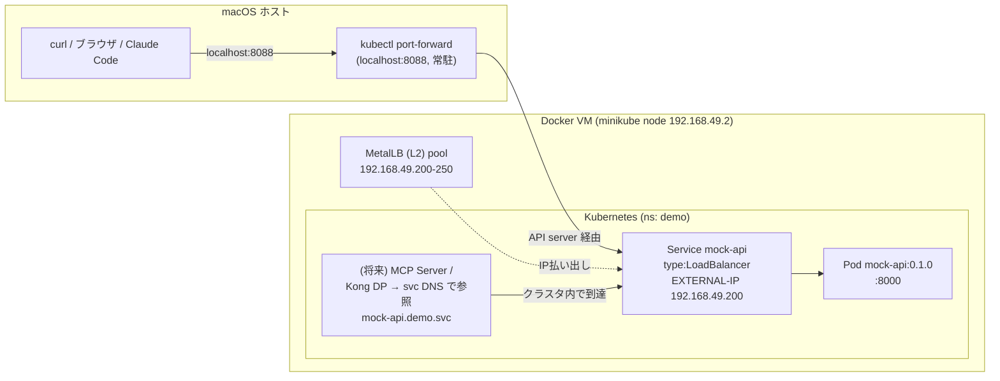

# Minikube デプロイ手順

mock-api（世界都市気温 API）を Minikube 上に `type: LoadBalancer` で公開する手順。
LB の IP 採番は **MetalLB**。ただし後述の理由で、macOS + docker driver では
**Mac ホストからの到達は `kubectl port-forward` に統一**する（mock-api も将来の Kong DP も同様）。

## ポート割当（固定）

| サービス | クラスタ内 | Mac ローカル (port-forward) |
|---|---|---|
| mock-api | Service `demo/mock-api` :80（→ Pod :8000）/ EXTERNAL-IP `192.168.49.200` | **`localhost:8088`** ← 固定。検証は常にこのポート |
| Kong DP | （後日）| （後日、別の固定ポートを割当） |

## 前提

- Minikube 稼働中（driver=docker、macOS）
- `kubectl` がクラスタに接続済み

## 構成図



> **macOS + docker driver の重要な制約**: ノードが Docker Desktop の VM 内で動くため、
> `192.168.49.0/24`（MetalLB が配る EXTERNAL-IP やノード IP）は **Mac ホストから
> 直接ルーティングできない**（ping も通らない）。`minikube tunnel` もこの docker
> ネットワークへの経路を張れず、EXTERNAL-IP は Mac からは到達不可。
>
> - **クラスタ内**では EXTERNAL-IP `192.168.49.200`（および Service DNS
>   `mock-api.demo.svc`）は正常に到達可能。将来の MCP Server / Kong DP は
>   これを上流として参照する（＝実運用フローはこれで完結する）。
> - **Mac から手元で叩く**には `kubectl port-forward` でローカルポート（mock-api は
>   固定で `8088`）に転送する。mock-api も将来の Kong DP もこの方式に統一する。

## 手順

### 1. MetalLB を有効化しアドレスプールを設定

```bash
minikube addons enable metallb
# minikube の metallb は v0.9.6（ConfigMap 方式）。プールを設定して反映:
kubectl apply -f deploy/metallb/ipaddresspool.yaml
kubectl -n metallb-system rollout restart deploy/controller daemonset/speaker
```

### 2. mock-api イメージを minikube 内にビルド（外部レジストリ不要）

```bash
eval $(minikube docker-env)
docker build -t mock-api:0.1.0 mock-api/
eval $(minikube docker-env -u)   # 元の docker に戻す
```

### 3. デプロイ

```bash
kubectl apply -f deploy/mock-api/mock-api.yaml
kubectl -n demo rollout status deploy/mock-api
kubectl -n demo get svc mock-api   # EXTERNAL-IP に 192.168.49.200 が付く
```

### 4. Mac から到達可能にする（別ターミナルで常駐）

docker driver では EXTERNAL-IP に Mac から直接届かないため、port-forward で
**固定ポート `8088`** に転送する（別ターミナルで開いたまま。sudo 不要）:

```bash
kubectl -n demo port-forward svc/mock-api 8088:80
```

### 5. 疎通確認（Mac から）

```bash
curl http://localhost:8088/health
curl http://localhost:8088/cities | head -c 300
curl "http://localhost:8088/temperatures?city_id=1&month=3"
```

## 動作確認済みの状態

- `kubectl -n demo get svc mock-api` → EXTERNAL-IP=`192.168.49.200`
- ノード内から: `minikube ssh "curl -s http://192.168.49.200/health"` → `{"status":"ok",...}`
- Mac から: `kubectl -n demo port-forward svc/mock-api 8088:80` 経由で到達可能
  （`{"status":"ok","cities":100,"temperatures":12000}`）
- Kong DP（クラスタ内）は Service DNS `mock-api.demo.svc.cluster.local` で参照する
  （OpenAPI spec `servers[0]` に設定済み）

## 片付け

```bash
kubectl delete -f deploy/mock-api/mock-api.yaml
# port-forward は Ctrl-C で停止
```
