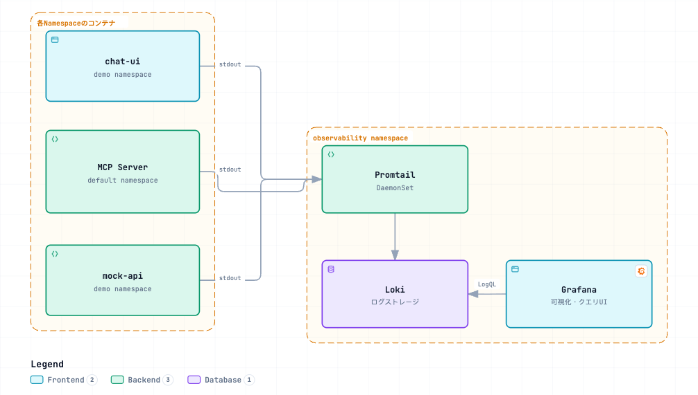

# Deploying the Logging Stack (Grafana Loki + Promtail)

> Japanese (authoritative): [README.md](README.md) — this English version is a translation.

A logging stack that aggregates mock-api, MCP Server, and chat-ui logs. See [ADR-0006](../../docs/decisions/0006-log-observability-stack.md) for the technology selection and rationale (Japanese).

## Architecture

[](https://picketfence-labs.github.io/diagrams/a877dacf0443/)

*(Click the image to open the interactive version.)*

- **chat-ui**: Our code (`chat-ui/app/api/chat/route.ts`) writes one structured JSON line per request to stdout in the `streamText` `onEnd` callback: `{event: "chat_completed", usage, stepCount, toolCallCount, toolCalls, finishReason}`. LogQL can directly aggregate token usage and Tool call counts.
- **MCP Server**: Konnect Control Plane generates `app.py` and the Pod retrieves it on startup, so this repository cannot modify it (see [ADR-0006](../../docs/decisions/0006-log-observability-stack.md)). We add no instrumentation and collect the unstructured logs emitted by Code Mode as-is (generated Python code, `call_tool` results, etc.).
- Promtail automatically collects Pod stdout from all namespaces using a DaemonSet, so it includes mock-api without additional configuration.

## Prerequisites

- Minikube is running and `kubectl` is connected to the cluster.
- The Helm repository `grafana` is registered (`helm repo add grafana https://grafana.github.io/helm-charts`).
- Access Grafana the same way as mock-api and chat-ui (Kong DP + `minikube tunnel`), so keep `minikube tunnel` running in another terminal (see [deploy/README.md](../README.en.md), “Make Kong DP reachable from Mac”; no need to restart it if it is already running).

## Steps

### 1. Deploy Loki + Promtail + Grafana

Deploy `grafana/loki-stack` as a single release (it is marked Deprecated but works for this use; Loki recommends the successor `k8s-monitoring` chart, but `loki-stack` is sufficient for this demo).

Grafana does not have a Next.js-style basePath setting, but it supports reverse-proxy operation with `server.root_url` / `server.serve_from_sub_path`. Enable these for `/grafana` (the concept is the same as chat-ui `basePath`). See [ADR-0007](../../docs/decisions/0007-chat-ui-kong-route-exposure.md) and [Grafana: Run Grafana behind a reverse proxy](https://grafana.com/tutorials/run-grafana-behind-a-proxy/).

```bash
helm repo add grafana https://grafana.github.io/helm-charts   # 未登録の場合のみ
helm repo update

helm upgrade --install loki grafana/loki-stack \
  -n observability --create-namespace \
  --set grafana.enabled=true \
  --set promtail.enabled=true \
  --set loki.persistence.enabled=false \
  --set grafana."grafana\.ini".server.domain="localhost" \
  --set grafana."grafana\.ini".server.root_url="%(protocol)s://%(domain)s/grafana/" \
  --set grafana."grafana\.ini".server.serve_from_sub_path=true \
  --set grafana."grafana\.ini".security.csrf_trusted_origins="localhost" \
  --set grafana."grafana\.ini"."auth\.anonymous".enabled=true \
  --set grafana."grafana\.ini"."auth\.anonymous".org_role="Admin" \
  --set grafana."grafana\.ini".auth.disable_login_form=true
```

`loki.persistence.enabled=false` is a simple demo configuration (logs are lost when the Pod is recreated). To persist logs, set `--set loki.persistence.enabled=true` and specify an appropriate `storageClassName`.

`server.domain` and `security.csrf_trusted_origins` are required (discovered on 2026-09-08; details in [troubleshooting-log.md](../../docs/troubleshooting-log.md), Japanese). Without `domain`, Grafana 10.3 Origin validation (CSRF protection) fails and Loki queries in Explore return `origin not allowed`.

`auth.anonymous.*` skips the login step (added 2026-09-09; acceptable only for this local Minikube demo, which is not reachable from outside Mac through `minikube tunnel`). The anonymous user receives the `Admin` role, and `disable_login_form=true` hides the login form. The `admin` user's password remains available via `kubectl get secret loki-grafana`, but is not needed for normal viewing.

### 2. Expose Grafana through Kong DP

Expose `/grafana` using the same `KongService` / `KongRoute` pattern as mock-api and chat-ui (without strip_path; it works together with `serve_from_sub_path` above; see the comments in the file).

```bash
kubectl apply -f ../kong/grafana-kong.yaml
```

### 3. Access Grafana

Open **http://localhost/grafana** in a browser. The `auth.anonymous` settings above mean **no login is required** (you can work with Admin privileges immediately; a “Sign in” link appears but does not need to be clicked).

**Verified (2026-09-05; anonymous access added 2026-09-09)**: `curl http://localhost/grafana/login`, `/grafana/api/health`, and `/grafana/public/build/*.{css,js}` all return 200 OK through Kong (`<base href="/grafana/" />` also resolves assets correctly using relative paths); `/grafana/api/ds/query` (equivalent to Explore) returns 200 OK without login.

Grafana automatically registers the `Loki` data source at startup (chart default). Open **Explore** in the left menu (compass icon, `http://localhost/grafana/explore`) and search with LogQL:

1. Select **`Code`** with the **`Builder` / `Code`** toggle at the top right of the query input (initially, `Builder` shows a label-selection GUI without a field to paste LogQL; watch for this common stumbling block).
2. Paste LogQL such as the examples below into the text field shown in `Code` mode.
3. Check that the time range at the top right (default **Last 1 hour**) includes the log timestamps you want; otherwise, a correct query returns 0 results.
4. Run it with the **`Run query` button** or Shift+Enter.

```logql
# chat-uiの構造化ログ（token使用量・tool呼び出し回数）
{namespace="demo", app="chat-ui"} |= "chat_completed" | json

# MCP Serverのtool呼び出しログ（Code Mode生成コード・実行結果）
{namespace="default", container="mcp-server"} |= "CODE MODE"

# mock-apiの呼び出しログ
{namespace="demo", app="mock-api"} |= "GET /temperatures"
```

**Known display issue (no impact, verified 2026-09-09)**: Some queries return results normally in the lower “Logs” panel while the “Logs volume” histogram above it displays an unrelated `Failed to load log volume for this query` / `parse error ... unexpected IDENTIFIER`. This is an issue in Grafana's automatically generated aggregation query and does not affect the search results. Ignore the error and check the “Logs” panel.

### 4. Verify operation through the API (without opening Grafana UI)

```bash
kubectl -n observability port-forward svc/loki 3100:3100 &

curl -s -G "http://localhost:3100/loki/api/v1/query_range" \
  --data-urlencode 'query={namespace="demo", app="chat-ui"} |= "chat_completed"' \
  --data-urlencode 'limit=5'
```

## Known limitations

- **MCP Server logs are unstructured**: Since this repository cannot modify `app.py`, exact aggregation of Tool call counts and payload sizes must rely on LogQL regular-expression matching (see [ADR-0006](../../docs/decisions/0006-log-observability-stack.md)).
- Since `loki.persistence.enabled=false`, log history is lost when the `loki-0` Pod is recreated.
