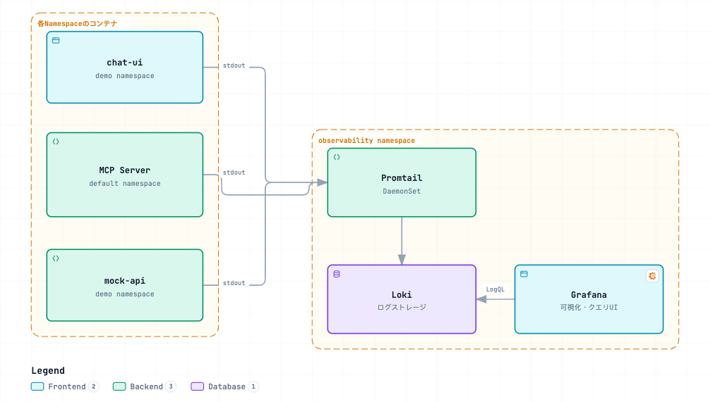

# ログ基盤（Grafana Loki + Promtail）デプロイ手順

mock-api・MCP Server・chat-ui のログを集約するログ基盤。技術選定・方針の背景は
[ADR-0006](../../docs/decisions/0006-log-observability-stack.md)を参照。

## 構成

[](https://picketfence-labs.github.io/diagrams/a877dacf0443/)

*（画像クリックでインタラクティブ版を開く）*

- **chat-ui**: 自分たちで書いているコード（`chat-ui/app/api/chat/route.ts`）の
  `streamText`の`onEnd`コールバックで、リクエストごとに`{event: "chat_completed",
  usage, stepCount, toolCallCount, toolCalls, finishReason}`という構造化JSON 1行を
  stdoutへ出力する。token使用量・tool呼び出し回数をLogQLで直接集計できる
- **MCP Server**: `app.py`はKonnect Control Planeが生成しPod起動時に取得するため
  このリポジトリから変更できない（[ADR-0006](../../docs/decisions/0006-log-observability-stack.md)
  参照）。追加の計装は行わず、Code Mode自体が出力する非構造化ログ（生成Pythonコード・
  `call_tool`結果等）をそのまま収集する
- Promtailは全namespaceのPod stdoutを自動収集するDaemonSetのため、mock-api等
  追加設定なしで収集対象に含まれる

## 前提

- Minikube稼働中、`kubectl`がクラスタに接続済み
- Helmリポジトリ`grafana`が登録済み（`helm repo add grafana https://grafana.github.io/helm-charts`）
- mock-api・chat-uiと同じ方式（Kong DP + `minikube tunnel`）でGrafanaにアクセスするため、
  別ターミナルで`minikube tunnel`を常駐させておく（手順は[deploy/README.md](../README.md)
  「Kong DP をMacから到達可能にする」参照。既に起動済みなら再実行不要）

## 手順

### 1. Loki + Promtail + Grafana のデプロイ

`grafana/loki-stack`（Deprecated表示だが実運用に問題なし。Loki公式は後継として
`k8s-monitoring`chartを推奨しているが、本デモ規模では`loki-stack`で十分）を
1リリースでまとめてデプロイする。

Grafana単体はNext.jsのようなbasePath設定を持たないが、代わりに標準のリバースプロキシ
配下運用機能（`server.root_url` / `server.serve_from_sub_path`）を持つため、これを
`/grafana`向けに有効化しておく（考え方はchat-uiの`basePath`と同じ。参照:
[ADR-0007](../../docs/decisions/0007-chat-ui-kong-route-exposure.md)、
[Grafana公式: Run Grafana behind a reverse proxy](https://grafana.com/tutorials/run-grafana-behind-a-proxy/)）。

```bash
helm repo add grafana https://grafana.github.io/helm-charts   # 未登録の場合のみ
helm repo update

helm upgrade --install loki grafana/loki-stack \
  -n observability --create-namespace \
  --set grafana.enabled=true \
  --set promtail.enabled=true \
  --set loki.persistence.enabled=false \
  --set grafana."grafana\.ini".server.domain="localhost" \
  --set grafana."grafana\.ini".server.root_url="%(protocol)s://%(domain)s/grafana/" \
  --set grafana."grafana\.ini".server.serve_from_sub_path=true \
  --set grafana."grafana\.ini".security.csrf_trusted_origins="localhost" \
  --set grafana."grafana\.ini"."auth\.anonymous".enabled=true \
  --set grafana."grafana\.ini"."auth\.anonymous".org_role="Admin" \
  --set grafana."grafana\.ini".auth.disable_login_form=true
```

`loki.persistence.enabled=false`はデモ用の簡易構成（Pod再作成でログが消える）。
永続化したい場合は`--set loki.persistence.enabled=true`と適切な`storageClassName`を指定する。

`server.domain`と`security.csrf_trusted_origins`は必須（2026-09-08判明。詳細:
[troubleshooting-log.md](../../docs/troubleshooting-log.md)）。`domain`未指定のままだと
Grafana 10.3のOrigin検証（CSRF対策）に失敗し、Explore等でのLokiクエリ実行時に
`origin not allowed`エラーになる。

`auth.anonymous.*`はログイン手順を省略するための設定（2026-09-09追加。デモ用ローカル
Minikube環境限定、`minikube tunnel`経由でMac以外からは到達不可であるため許容）。
匿名ユーザーに`Admin`ロールを付与し、`disable_login_form=true`でログインフォーム自体を
非表示にする。`admin`ユーザーのパスワード（`kubectl get secret loki-grafana`経由で取得可能）
は残るが、通常の閲覧では不要。

### 2. Grafana を Kong DP 経由で公開する

mock-api・chat-uiと同じ`KongService`/`KongRoute`パターン（strip_pathなし。
上記の`serve_from_sub_path`とセットで機能する。詳細はファイル内コメント参照）で
`/grafana`に公開する。

```bash
kubectl apply -f ../kong/grafana-kong.yaml
```

### 3. Grafana へのアクセス

ブラウザで **http://localhost/grafana** を開く。上記の`auth.anonymous`設定により
**ログイン不要**（開くと即座にAdmin権限で操作できる。「Sign in」リンクは表示されるが
クリックする必要はない）。

**検証済み（2026-09-05、匿名アクセスは2026-09-09追加）**: `curl http://localhost/grafana/login`・
`/grafana/api/health`・`/grafana/public/build/*.{css,js}`がいずれもKong経由で200 OKになる
こと（`<base href="/grafana/" />`によりアセットも相対パスで正しく解決される）、および
ログイン無しで`/grafana/api/ds/query`（Explore相当）が200 OKになることを確認済み。

Grafana起動時に`Loki`データソースが自動登録されている（chart既定）。左メニューの
**「Explore」**（コンパスアイコン、`http://localhost/grafana/explore`）を開き、以下の手順で
LogQLを直接検索する:

1. クエリ入力欄の右上にある **`Builder` / `Code`** トグルで **`Code`を選択する**
   （初期状態の`Builder`はラベルをドロップダウンで選ぶGUIで、LogQL文字列を直接貼り付ける
   欄が無い。ここでつまずきやすいので要注意）
2. `Code`モードで現れたテキスト欄に、下記のようなLogQLを貼り付ける
3. 画面右上の時刻レンジ（既定は **Last 1 hour**）が、実際にログを見たい時刻を含んでいるか
   確認する（含んでいない場合、クエリ自体は正しくても結果が0件になる）
4. **`Run query`ボタン**（またはShift+Enter）で実行する

```logql
# chat-uiの構造化ログ（token使用量・tool呼び出し回数）
{namespace="demo", app="chat-ui"} |= "chat_completed" | json

# MCP Serverのtool呼び出しログ（Code Mode生成コード・実行結果）
{namespace="default", container="mcp-server"} |= "CODE MODE"

# mock-apiの呼び出しログ
{namespace="demo", app="mock-api"} |= "GET /temperatures"
```

**既知の表示上の問題（実害なし、2026-09-09確認）**: クエリによっては、結果本体（下段の
「Logs」パネル）は正常に返ってきているにもかかわらず、その上の「Logs volume」
（ヒストグラム）パネルだけが`Failed to load log volume for this query` /
`parse error ... unexpected IDENTIFIER`という無関係なエラーを表示することがある
（Grafanaが自動生成する集計用クエリ側の問題で、検索結果自体には影響しない）。
このエラーが出ても無視して下の「Logs」パネルを確認してよい。

### 4. 動作確認（API経由、Grafana UIを開かずに確認する場合）

```bash
kubectl -n observability port-forward svc/loki 3100:3100 &

curl -s -G "http://localhost:3100/loki/api/v1/query_range" \
  --data-urlencode 'query={namespace="demo", app="chat-ui"} |= "chat_completed"' \
  --data-urlencode 'limit=5'
```

## 既知の制約

- **MCP Server側のログは非構造化**: `app.py`をこのリポジトリから変更できないため、
  tool呼び出し回数・ペイロードサイズの厳密な集計はLogQLの正規表現マッチに頼ることになる
  （[ADR-0006](../../docs/decisions/0006-log-observability-stack.md)参照）
- `loki.persistence.enabled=false`のため、`loki-0` Podが再作成されるとログ履歴は失われる
