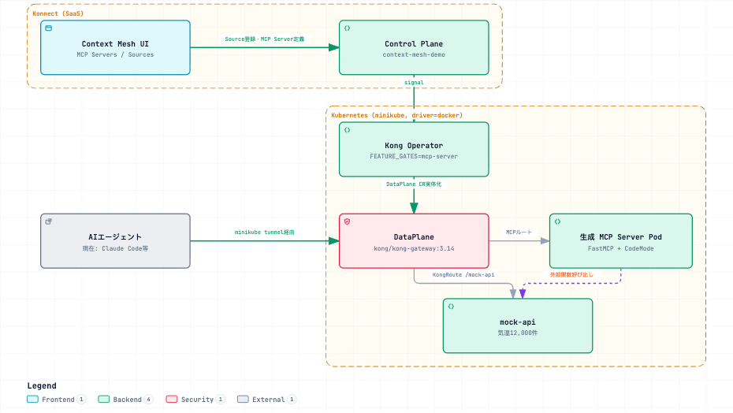

# Development Design Brief: konnect-code-mode-mcp

> Japanese (authoritative): [design-brief.md](design-brief.md) — this English version is a translation.

Basic design for a demo and technical verification repository for Kong Konnect Context Mesh (a Code Mode MCP-equivalent feature). Created using Step 0.5 of the [Dev Repo Bootstrap Checklist](https://github.com/picketfence-labs/obsidian-vault/blob/main/06-Templates/Dev%20Repo%20Bootstrap%20Checklist.md), based on interviews for the Obsidian Vault Project `01-Projects/2026-09_konnect-code-mode-mcp` (as of 2026-09-04).

## 1. Project goal

Consolidate and maintain in this repository an **ongoing internal reference demo** that uses Kong Konnect Context Mesh to demonstrate reduced LLM token usage for AI agents. Context Mesh was not yet GA (planned for September–October 2026), so the operating model includes manual actions in the Konnect UI and cannot be completed using kongctl / Terraform alone.

## 2. Requirements

### Current (definitely in scope now; priority order)

1. ~~**Kong Operator image tag upgrade verification (highest priority)**~~ → **Completed (2026-09-04)**. The internal SE guide pinned the `kong-operator` chart to `docker.io/kong/nightly-kong-operator:20260623` as a workaround for a Kong Operator bug that prevented checking MCP Server status in Konnect. The pinned tag was upgraded to `docker.io/kong/nightly-kong-operator:20260904` (Helm chart `kong-operator` `1.3.0` → `1.4.0`), and the MCP Server was verified to remain `healthy` in the Konnect UI with no regression. See the Vault note `01-Projects/2026-09_konnect-code-mode-mcp/notes/Kong Operator Context Mesh - SE's.md`. Details: [ADR-0005](decisions/0005-kong-operator-image-tag-upgrade.md) and [troubleshooting-log.md](troubleshooting-log.md) (Japanese).
2. ~~**Repository consolidation**~~ → **Completed (2026-09-04)**. Previously, actual operations started from `~/LOCAL_REPO/context-mesh` (reference clone of upstream `kong-gateway/context-mesh`, registered in the Vault as `07-Sources/repos/kong-gateway-context-mesh`, **reference only; do not modify**) for Kong Operator installation and Konnect UI operations. The SE guide's Kong Operator installation steps (Helm / CRD definitions) were incorporated into [deploy/kong-operator/](../deploy/kong-operator/README.en.md) so the work can be reproduced using only this repository (`konnect-code-mode-mcp`). Details: [ADR-0003](decisions/0003-repo-consolidation.md).
3. ~~**mock-api reachability verification through Kong DP**~~ → **Completed (2026-09-04)**. The KongService/KongRoute in `deploy/kong/mock-api-kong.yaml` was already `PROGRAMMED: True`. The user started `minikube tunnel` manually (interactive `sudo` input prevents an agent from starting it alone), then verified that `curl http://localhost/mock-api/health`, `/cities`, and `/temperatures` are reachable through Kong (confirmed by the `X-Kong-Upstream-Latency` header). Details: [ADR-0001](decisions/0001-mock-api-service-exposure.md).
4. **“Unresolved items (to verify)” in CLAUDE.md updated**. The 2026-09-04 review found that all 3 items were already resolved: 2 by existing Obsidian Vault knowledge and 1 by the internal SE guide. No new research was needed; only the resolutions had to be written back to CLAUDE.md. Done; see its “Unresolved items” section (Japanese).

### Future (not in scope now; keep as lower-priority items)

5. ~~**Chat UI construction**~~ → **Completed (2026-09-04)**. A Chat UI was built so the demo could be shown to a general audience instead of connecting agents only through Claude Code CLI `claude mcp add` and entering prompts in the CLI. The stack was selected in [ADR-0004](decisions/0004-chat-ui-tech-stack.md) (Next.js + Vercel AI SDK + `@ai-sdk/mcp`). During implementation, at the user's direction, the LLM provider changed to Gemini (`@ai-sdk/google`) and deployment to a container on Minikube (ADR-0004 updated). The `chat-ui/` Next.js App and `deploy/chat-ui/chat-ui.yaml` were added and deployed as a Pod. Queries such as “Top5 average temperature in March over the past 10 years” were verified in a browser using Playwright to return correct aggregated results through Code Mode (`search` → `get_schema` → `execute`). Separately, persistent connection from the user's personal Claude Code CLI is configured by the Obsidian Vault session with `--scope user` (user decision on 2026-09-04; outside this repository's development scope).
6. ~~**Logging stack setup**~~ → **Completed (2026-09-05)**. Beforehand, mock-api and MCP Server logs were checked by looking at container logs directly. The `grafana/loki-stack` Helm chart (Grafana Loki + Promtail) was deployed in the `observability` namespace and exposed through Kong DP (`/grafana`). A query was submitted through chat-ui, and logs for both mock-api and MCP Server were verified as collected and searchable through the Loki API. Details: [ADR-0006](decisions/0006-log-observability-stack.md) and [deploy/observability/README.md](../deploy/observability/README.en.md).
7. Continue maintaining the demo as Context Mesh specifications change with GA (planned for September–October 2026).
8. Continue operating it as an internal reference and as a feedback path for knowledge to the Obsidian Vault (`02-Areas` / `07-Sources`).

## 3. Architecture

*(Click the image to open the interactive version.)*

- Konnect Control Plane (`context-mesh-demo`) ⇄ Kong Operator (`mcp-server` feature gate) ⇄ K8s DataPlane (`kong/kong-gateway:3.14`, replicas 3).
- mock-api (temperature data, FastAPI, ClusterIP) is reachable (a) from inside the cluster via Service DNS (used by MCP Server Pods), and (b) through Kong DP using `KongService` / `KongRoute` (`/mock-api`, strip_path) for Mac-side reachability checks (`minikube tunnel` required; **verified 2026-09-04**).
  - **Correction from the 2026-09-04 review**: route (b) `/mock-api` is a debug path for direct mock-api access. It is **separate from the MCP endpoint used by the AI agent**.
  - **Confirmed through a live check on 2026-09-04 before starting the Chat UI**: the actual URL is `http://localhost/mcp/world-monthly-temperature` (through Kong DP + `minikube tunnel`, existing `KongRoute mcpserver-test-30f18e2a`). JSON-RPC `initialize` → `tools/list` confirmed 4 Tools (`list_tools` / `search` / `get_schema` / `execute`), and `serverInfo.version` was FastMCP `3.3.1`. No additional upstream auth header is needed for the MCP handshake (the upstream API key is configured at another layer for use by code inside the sandbox).
- Register the mock-api OpenAPI spec as a “Source” in the Konnect UI → automatically generate an MCP Server exposing `search` / `get-schema` / `execute` → dynamically generate code per query and run it in the Code Mode (FastMCP `CodeMode` transform) sandbox.

**Existing decisions (recorded as ADRs in `docs/decisions/`; overview only here)**:

- [ADR-0001](decisions/0001-mock-api-service-exposure.md): networking (LoadBalancer/MetalLB → ClusterIP with `minikube tunnel` / `kubectl port-forward`).
- [ADR-0002](decisions/0002-demo-api-choice.md): choice of demo API (adopted a custom mock-api instead of the Flights/OpenWeather samples in the SE guide).
- [ADR-0003](decisions/0003-repo-consolidation.md): consolidated from `~/LOCAL_REPO/context-mesh` into this repository.
- [ADR-0004](decisions/0004-chat-ui-tech-stack.md): Next.js + Vercel AI SDK + `@ai-sdk/mcp`.
- [ADR-0005](decisions/0005-kong-operator-image-tag-upgrade.md): Kong Operator image tag upgrade (`20260623` → `20260904`) to resolve the workaround.

## 4. Technology stack

- Kubernetes (minikube, driver=docker, macOS).
- Kong Operator (Helm chart `kong/kong-operator`) / Kong Gateway 3.14 (hybrid, `DataPlane` CRD).
- FastMCP (Python, `CodeMode` transform) / oas-to-python (Go, OpenAPI → FastMCP server generation).
- Konnect UI (MCP Server / Source registration; manual operations).
- **Chat UI (completed 2026-09-04)**: Next.js 16 (App Router) + React 19 + Vercel AI SDK (`ai@7.0.92` / `@ai-sdk/google@4.0.63` / `@ai-sdk/react@4.0.95` / `@ai-sdk/mcp@2.0.44`). `@ai-sdk/mcp` `createMCPClient` connects to the MCP Server using Streamable HTTP (through Kong DP internal Service DNS). LLM provider is Gemini (`@ai-sdk/google`, changed from OpenAI at the user's direction). Application: `chat-ui/`; K8s manifest: `deploy/chat-ui/chat-ui.yaml`. Rationale: [ADR-0004](decisions/0004-chat-ui-tech-stack.md).
- **Logging stack (completed 2026-09-04)**: Grafana Loki + Promtail (`grafana/loki-stack` Helm chart) deployed in the `observability` namespace. chat-ui writes token usage and Tool call counts as structured JSON logs to stdout in `onEnd`. MCP Server logs are collected as-is in unstructured form because Control Plane generates `app.py`, which this repository cannot modify. Rationale: [ADR-0006](decisions/0006-log-observability-stack.md); deployment: [deploy/observability/README.md](../deploy/observability/README.en.md).

## 5. Verification method (test cases)

- **Image tag upgrade**: reinstall Kong Operator with a new tag → verify `KonnectGatewayControlPlane` / `DataPlane` readiness → confirm the MCP Server status is `healthy` in the Konnect UI (check that the old status visibility issue is resolved).
- **mock-api through Kong DP**: start `minikube tunnel` → verify `curl http://localhost/mock-api/health` returns 200. **Completed (2026-09-04)**: the user started `minikube tunnel` manually (interactive sudo required), then confirmed that `health` / `cities` / `temperatures` were reachable through Kong. Details: [ADR-0001](decisions/0001-mock-api-service-exposure.md).
- **Demo**: define the MCP Server through Konnect UI → run queries such as “Top5 average temperature in March over the past 10 years” from an AI agent → confirm only a few aggregated results are returned and the 12,000 raw records do not enter the LLM context.
- **Check external prerequisites**: MCP Composer / Context Mesh is already confirmed available in the current tenant (see Obsidian Vault `07-Sources/repos/konnect-code-mode-mcp`). Select a near-latest Kong Operator nightly tag from `docker.io/kong/nightly-kong-operator` while checking backward compatibility.
- **Repository consolidation (requirement 2)**: from a fresh clone of this repository alone, verify that Kong Operator installation through Konnect UI operations and a demo query can be completed without depending on `~/LOCAL_REPO/context-mesh` or consulting its guide separately (added in 2026-09-04 review because the criterion was missing). **Status (2026-09-04)**: procedure and manifests were copied into [deploy/kong-operator/README.md](../deploy/kong-operator/README.en.md) and documented to match existing live Helm release / Konnect CRD values. A complete recreation from a fresh clone has **not been tested** (deferred because replacing the existing Konnect Control Plane / DataPlane is costly; verify the next time the cluster is rebuilt).
- **Resolve CLAUDE.md open items (requirement 4)**: verify in a live installation that the behavior matches the information in this brief and CLAUDE.md (Code Mode always enabled, MCP Composer availability in the tenant, and feature gate command). Added in the 2026-09-04 review to require live verification rather than documentation updates alone.

## 6. Deliverables

- Reproducible setup procedure consolidated in this repository (Kong Operator installation → Konnect UI operations → demo query).
- This design brief (`docs/design-brief.md`), ADRs (`docs/decisions/`), and troubleshooting log (`docs/troubleshooting-log.md`; all established on 2026-09-04).
- Chat UI (Next.js + Vercel AI SDK; [ADR-0004](decisions/0004-chat-ui-tech-stack.md)).
- Logging stack (Grafana Loki + Promtail; [ADR-0006](decisions/0006-log-observability-stack.md)).

## 7. Related existing knowledge and references

### (a) Current understanding of the Obsidian Vault Area “Konnect - Context Mesh” (transcribed as of 2026-09-04)

- **GA planned for September–October 2026** for Context Mesh (a Code Mode MCP-equivalent feature). In the Konnect UI it is called “Context Mesh”, with 2 submenus: “MCP Servers” and “Sources”.
- Overview: register multiple OpenAPI specs as “Sources” → expose only 3 Tools (`search` / `get-schema` / `execute`) as an MCP Server (same concept as Cloudflare Code Mode MCP). Built on the OSS **FastMCP** library's `CodeMode` transform. Kong's additional value is the layer that automatically generates executable FastMCP server code from an OpenAPI spec and deploys it to Kubernetes with lifecycle management (`oas-to-python` generator + Kong Operator). Kong Data Plane runs as a Kubernetes Pod managed by Kong Operator. The code-generation and execution sandbox runs in the same cluster as the Data Plane.
- Required platform: Kong Konnect (cloud management plane for Kong Gateway).
- Related but separate: “AI Gateway” (`AIGatewayMCPServer`) is a separate product line. The Context Mesh team considered wrapping MCP Server Pods with it for ACL control but rejected that design because it “cannot communicate with an MCP Server using the MCP protocol”; the Ingress Gateway design remains.
- Ongoing observations: the Kong Operator bug behind the image tag pin in section 2 was recorded in the Vault as of 2026-09-04. The history and planned integration, if any, of the duplicated generation logic in `oas-to-python` (Go) and `mcp-server-code-gen` (TypeScript/Nunjucks) are unconfirmed. Visual Workflow Editor (`mcp-translator`) is On Hold and not used in this demo.
- As of 2026-08, public information did not include enough technical detail about this feature. The notes above are based on insider information and primary repository research.

### (b) Candidates for local reference whitelist (Obsidian Vault `07-Sources`; read-only, do not modify)

- `kong-gateway-context-mesh` (`~/LOCAL_REPO/context-mesh`): code generator / runtime (`oas-to-python`/Go, `init-container`/`mcp-server-runner`). Read access is allowed in `.claude/settings.json` `additionalDirectories` for this repository.
- `kong-operator` (`~/LOCAL_REPO/kong-operator`): Kubernetes Operator. Implementation separates the `MCPServer` (Konnect mirror) and `MCPServerDataPlane` (manages implementation) CRDs. Read access is allowed in the same way.
- `kong-konnect-context-mesh`: Control Plane implementation (Node.js/TypeScript + PostgreSQL, NestJS). There is no local clone; check GitHub directly when needed.

## Verification log

- 2026-09-04: Created the initial version. Interviews for the Obsidian Vault Project revealed the internal SE guide for Kong Operator installation / Konnect UI operations, that the image tag pin was a bug workaround, and that the Chat UI and logging stack were not yet set up. Incorporated those findings.
- 2026-09-04 (continued): Selected the Chat UI technology stack based on the user's instruction to use `kong-secure-rag` and `kong-azure-obo-demo` as references, with no specific preference ([ADR-0004](decisions/0004-chat-ui-tech-stack.md)). Clarified that setting up persistent access from the user's personal Claude Code using `--scope user` belongs to the Obsidian Vault session and is outside this repository's development scope.
- 2026-09-04 (review): At the user's request, an Obsidian Vault session reviewed this file and incorporated 4 findings. (1) The 3 “unresolved” CLAUDE.md items were already resolved but not recorded; wrote the resolutions back and changed item 4 to require no new research. (2) Corrected statements in ADR-0001 and section 3 that might imply `KongRoute /mock-api` was the demo's MCP endpoint, and clarified that the actual URL was not yet confirmed. (3) Added verification criteria in section 5 for requirements 2 (repository consolidation) and 4 (resolve open items). (4) Replaced the stale section 3 note “ADRs not yet prepared; planned” with links to existing ADRs 0001–0004.
- 2026-09-04 (development session, requirement 1): Verified the Kong Operator image tag upgrade. Investigation of CHANGELOG / git history in `~/LOCAL_REPO/kong-operator` found that pinned tag `20260623` predated the fix for the Konnect status visibility bug (PR #4795, merged 2026-07-07). At the user's decision, upgraded to latest nightly `20260904` (Helm chart `1.3.0` → `1.4.0`); the user confirmed “Healthy” in Konnect UI and no regression both before and after the upgrade. Details: [ADR-0005](decisions/0005-kong-operator-image-tag-upgrade.md) and [troubleshooting-log.md](troubleshooting-log.md) (Japanese).
- 2026-09-04 (development session, requirement 3): Verified mock-api reachability through Kong DP. `minikube tunnel` requires interactive `sudo`, so the user started it manually. After startup, `curl` confirmed that `health` / `cities` / `temperatures` were reachable through Kong (`X-Kong-Upstream-Latency` header confirmed it). Unlike MetalLB, this path is not constrained by the docker driver. Details: [ADR-0001](decisions/0001-mock-api-service-exposure.md).
- 2026-09-04 (development session, before starting the Chat UI): While `minikube tunnel` was running, directly handshook over JSON-RPC with the existing MCP Server (`mcpserver-test-30f18e2a`, Konnect name `world-monthly-temperature`) and resolved 2 open questions in section 3. (1) The actual URL is `http://localhost/mcp/world-monthly-temperature` (`/mcp/<server name>`, as expected). (2) `serverInfo.version` was `3.3.1`, resolving the remaining CLAUDE.md question about whether production used FastMCP `3.3.1` or an unconfirmed `3.4.x` version, and matching the `oas-to-python` `runtime-requirements.txt` pin. `tools/list` confirmed `list_tools` / `search` / `get_schema` / `execute`.
- 2026-09-04 (development session, requirement 5): Implemented and containerized Chat UI (`chat-ui/`) and deployed it to Minikube. At the user's direction, changed the LLM provider from OpenAI (assumed by ADR-0004) to Gemini (`@ai-sdk/google`) and injected the API key using a K8s Secret. Chat UI connects to MCP Server directly using Kong DP internal Service DNS (`minikube tunnel` not required for that connection). In local `next dev` and the live Minikube Pod, submitted queries such as Top5 average temperatures in March / August over the past 10 years and confirmed correct city / temperature results through Code Mode (`search` → `get_schema` → `execute`), with tool calls and response sizes visible in Playwright. Implementation findings: `@ai-sdk/mcp` Tools arrive as `type: 'dynamic-tool'` and need different handling from `'tool-<name>'`; without `stopWhen: stepCountIs(N)`, `streamText` stops after the first Tool call; the label selector in the Kong DP Service search command in `deploy/README.md` did not exist (fixed). Details: [ADR-0004](decisions/0004-chat-ui-tech-stack.md) and [troubleshooting-log.md](troubleshooting-log.md) (Japanese).
- 2026-09-04 (development session, requirement 6): Built the logging stack. After discussing options with the user, chose “structured logs + Grafana Loki + Promtail” over the AI/MCP evaluation-focused options Langfuse (high self-hosting cost) and Arize Phoenix (limited integration track record). Details and comparison: [ADR-0006](decisions/0006-log-observability-stack.md). Research showed that the MCP Server implementation (`app.py`) is generated by Konnect Control Plane and retrieved on Pod startup, so **this repository cannot modify it**. Instrumentation was therefore limited to chat-ui (our code), which writes structured JSON logs for token usage and Tool call counts in `onEnd`; existing unstructured MCP Server logs (Code Mode generated code and `call_tool` results) are collected as-is. Deployed the `grafana/loki-stack` Helm chart in the `observability` namespace and confirmed that structured and MCP Server logs were collected after a real chat-ui query. Deployment: [deploy/observability/README.md](../deploy/observability/README.en.md).
- 2026-09-05 (development session, response to user feedback): Removed the asymmetry that required port-forward for chat-ui while mock-api and MCP Server used Kong DP; exposed it at `http://localhost/chat-ui` through Kong DP. Compared host-based (`nip.io` etc.) with path-based (`/chat-ui` + Next.js `basePath`) routing. At the user's direction, chose path-based routing to match the mock-api URL structure ([ADR-0007](decisions/0007-chat-ui-kong-route-exposure.md)). During implementation, found that `basePath` alone does not prefix the `useChat()` API route (`/api/chat`) or readinessProbe/livenessProbe (`/`); manually added `/chat-ui` to both (details: [troubleshooting-log.md](troubleshooting-log.md), Japanese). Submitted a real demo query to `http://localhost/chat-ui` and confirmed the expected Top5 response.

