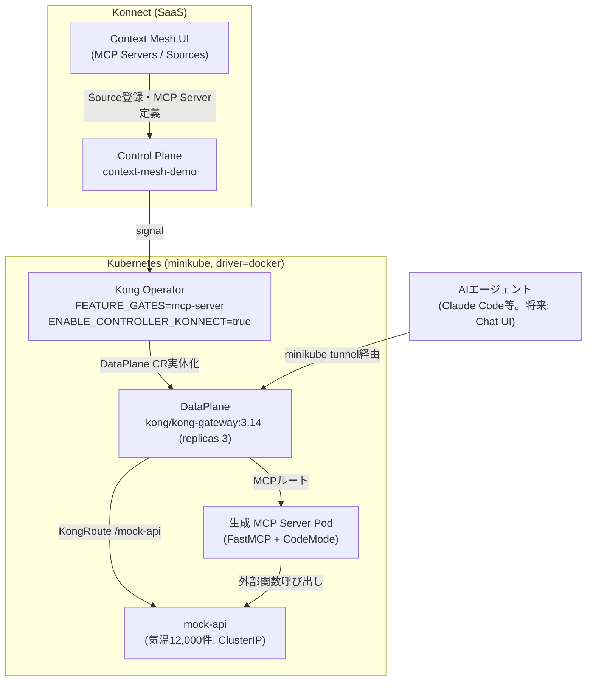

# Dev Design Brief: konnect-code-mode-mcp

Kong Konnect Context Mesh（Code Mode MCP相当機能）のデモ・技術検証リポジトリの基本設計。
[Dev Repo Bootstrap Checklist](https://github.com/picketfence-labs/obsidian-vault/blob/main/06-Templates/Dev%20Repo%20Bootstrap%20Checklist.md)
Step 0.5に基づき作成（Obsidian Vault側 `01-Projects/2026-09_konnect-code-mode-mcp` Projectでの
ヒアリング結果、2026-09-04時点）。

## 1. Projectゴール
Kong Konnect Context Mesh を使い、AIエージェントのLLMトークン量削減を実証する、**社内向けの継続的な
リファレンスデモ**を本リポジトリに一本化して整備する。Context Meshはまだ GA 前（2026年9〜10月予定）
のため、kongctl/Terraform では完結できず Konnect UI 上の手動操作を含む運用体系を前提にする。

## 2. 要件

### 現在（今回のスコープで確実に必要なもの。優先順）

1. ~~**Kong Operator の image tag アップグレード検証（最優先）**~~ → **完了（2026-09-04）**:
   社内SE手順書（`kong-operator`チャートを`docker.io/kong/nightly-kong-operator:20260623`に
   固定する内容。Vault側
   `01-Projects/2026-09_konnect-code-mode-mcp/notes/Kong Operator Context Mesh - SE's.md`参照）
   では、当時「デプロイしても Konnect 側で MCP Server の状態確認が取れない」という
   Kong Operator 側のバグの回避策としてこのタグに固定していた。`docker.io/kong/nightly-kong-operator:20260904`
   （Helm chart `kong-operator` `1.3.0`→`1.4.0`）へアップグレードし、Konnect UI 上で
   MCP Server のステータスが `healthy` のまま回帰無く動作することを検証済み。詳細:
   [ADR-0005](decisions/0005-kong-operator-image-tag-upgrade.md)、
   [troubleshooting-log.md](troubleshooting-log.md)。
2. ~~**リポジトリの一本化**~~ → **完了（2026-09-04）**: これまで `~/LOCAL_REPO/context-mesh`
   （upstream `kong-gateway/context-mesh` の reference clone。Obsidian Vault
   `07-Sources/repos/kong-gateway-context-mesh` に登録済み・**変更禁止の参照専用**）を実運用の
   起点にして Kong Operator インストール・Konnect UI 操作を行っていたが、社内SE手順書の
   Kong Operator インストール手順（Helm/CRD 定義）を [deploy/kong-operator/](../deploy/kong-operator/README.md)
   に取り込み、本リポジトリ（`konnect-code-mode-mcp`）だけで再現できるようにした。詳細:
   [ADR-0003](decisions/0003-repo-consolidation.md)。
3. mock-api の Kong DP 経由到達（`deploy/kong/mock-api-kong.yaml` の KongService/KongRoute、
   `minikube tunnel`）を実機で検証する（前回セッション時点で未検証のまま）。
4. **CLAUDE.md の「未確定事項（要確認）」を最新化する**（2026-09-04レビューで判明: 3件のうち
   2件は Obsidian Vault 側の既存知見で、1件は今回発見した社内SE手順書で、いずれも**既に
   解決済み**。新規調査は不要で、CLAUDE.md へ解決内容を書き戻すだけで完了する。実施済み
   → CLAUDE.md「未確定事項」参照）。

### 将来（今回はやらないが、優先順位2番目以降として控える）

5. **Chat UI 構築**: 現状は Claude Code CLI の `claude mcp add` 経由でエージェントを接続し、
   CLI 上でプロンプト（例:「8月の平均気温が最も低い都市を10挙げてください」）を打っているだけで、
   一般向けに見せられる Chat UI が無い。将来的に構築する。技術スタックは
   [ADR-0004](decisions/0004-chat-ui-tech-stack.md) で決定済み（Next.js + Vercel AI SDK +
   `@ai-sdk/mcp`、`kong-azure-obo-demo/services/chat-ui/` のパターンを参考にする）。
   **Chat UI構築とは別に、利用者個人のClaude Code（CLI）からの継続的な接続は
   Obsidian Vaultセッション側が`--scope user`で設定する**（本リポジトリの開発セッションの
   スコープ外。2026-09-04、利用者の判断）。MCP DPのエンドポイントが確定（現在の要件3番目、
   `minikube tunnel`検証）してから設定する。
6. **ログ基盤整備**: mock-api・MCP Server のログを、現状はコンテナログを直接見て確認している。
   Grafana/Loki、または AI/MCP 評価に向いたログ基盤で両者のログを集約・検証できる仕組みにする。
7. Context Mesh の GA（2026年9〜10月予定）に伴う仕様変更への追随（継続的なメンテナンス）。
8. 社内リファレンスとしての継続運用・Obsidian Vault（`02-Areas`/`07-Sources`）への知見フィード
   バック窓口としての役割を保つ。

## 3. アーキテクチャ

- Konnect Control Plane（`context-mesh-demo`）⇄ Kong Operator（`mcp-server` feature-gate）⇄
  K8s DataPlane（`kong/kong-gateway:3.14`、replicas 3）
- mock-api（気温データ、FastAPI、ClusterIP）は、(a) クラスタ内から Service DNS で直接到達可能
  （MCP Server Pod が使う経路）、(b) `KongService`/`KongRoute`（`/mock-api`、strip_path）で
  Kong DP 経由でも公開している（Mac からの直接到達性確認用、`minikube tunnel`必要・**未検証**）。
  **注意（2026-09-04レビューで訂正）**: (b)の`/mock-api`ルートは mock-api への直接アクセス用の
  デバッグ経路であり、**AIエージェントが実際に接続するデモ本体のMCPエンドポイントとは別物**。
  実際の接続URLはKonnect UI上でMCP Server を定義した時点で `/mcp/<server名>` 形式
  （社内SE手順書の `/mcp/flights-service` 等のパターンを参照）で確定するはずだが、
  本デモではまだ確定していない（次回実機検証時に本ファイル・CLAUDE.mdへ追記する）
- Konnect UI 上で mock-api の OpenAPI spec を「Source」として登録 → MCP Server
  （`search`/`get-schema`/`execute` の3ツール）が自動生成 → Code Mode（FastMCP `CodeMode`
  transform）でクエリごとに動的コード生成・サンドボックス実行

**既存の判断ポイント（ADR化済み、`docs/decisions/`参照。ここでは概要のみ）**:
- [0001](decisions/0001-mock-api-service-exposure.md): mock-apiの公開方式
  （LoadBalancer/MetalLB → ClusterIP + `minikube tunnel`/`kubectl port-forward`併用）
- [0002](decisions/0002-demo-api-choice.md): デモAPIの選択（SE手順書のFlights/OpenWeather
  サンプルではなく独自のmock-apiを採用）
- [0003](decisions/0003-repo-consolidation.md): 実運用手順の一本化先
  （`~/LOCAL_REPO/context-mesh`から本リポジトリへ）
- [0004](decisions/0004-chat-ui-tech-stack.md): Chat UIの技術スタック
  （Next.js + Vercel AI SDK + `@ai-sdk/mcp`）
- [0005](decisions/0005-kong-operator-image-tag-upgrade.md): Kong Operatorのimage tag
  アップグレード（`20260623`→`20260904`、バグ回避策の解消）

## 4. 技術スタック

- Kubernetes（minikube, driver=docker, macOS）
- Kong Operator（Helm chart `kong/kong-operator`）/ Kong Gateway 3.14（hybrid, `DataPlane` CRD）
- FastMCP（Python, `CodeMode` transform）/ oas-to-python（Go, OpenAPI→FastMCPサーバー生成）
- Konnect UI（MCP Server / Source登録、手動操作）
- （将来、決定済み）Chat UI: Next.js (App Router) + React + Vercel AI SDK
  （`ai`/`@ai-sdk/openai`/`@ai-sdk/react`/`@ai-sdk/mcp`）。`@ai-sdk/mcp`の`createMCPClient`で
  MCPサーバーにStreamable HTTP接続。詳細・判断根拠は[ADR-0004](decisions/0004-chat-ui-tech-stack.md)
- （将来・未定）ログ基盤: Grafana/Loki等、技術選定は未定

## 5. 検証方法（テストケース）

- **image tag アップグレード**: 新タグで Kong Operator を再インストール →
  `KonnectGatewayControlPlane`/`DataPlane` の Ready 確認 → Konnect UI 上で MCP Server の
  status が `healthy` になることを確認（旧タグでは確認できなかった問題が解消されているか）
- **mock-api の Kong DP 到達**: `minikube tunnel` 起動 → `curl http://localhost/mock-api/health`
  が 200 を返すことを確認
- **デモ本体**: Konnect UI 経由で MCP Server 定義 → AIエージェントから
  「過去10年の3月の平均気温Top5」等のクエリを実行 → レスポンスが集計後の少数件のみであること
  （生の12,000件がLLMコンテキストに流れないこと）を確認
- **外部依存の前提条件確認**: 現テナントで MCP Composer/Context Mesh が利用可能であることは
  既に確認済み（Obsidian Vault `07-Sources/repos/konnect-code-mode-mcp` 参照）。
  Kong Operator の nightly tag は `docker.io/kong/nightly-kong-operator` のタグ一覧から、
  後方互換性を確認しつつ最新に近いものを選定する
- **リポジトリの一本化（要件2）**: 本リポジトリのみを新規に clone した状態から、Kong Operator
  インストール〜Konnect UI操作〜デモクエリ実行までの一連の手順が、`~/LOCAL_REPO/context-mesh`
  への依存やそちらの手順書を別途参照する必要なしに完了できることを確認する
  （2026-09-04レビューで追加。従来この項目には検証基準が無かった）。**実施状況（2026-09-04）**:
  [deploy/kong-operator/README.md](../deploy/kong-operator/README.md)に手順・マニフェストを
  取り込み、既存の稼働中リソース（Helm release / Konnect CRD群）の実際の設定値と一致させて記述した。
  ただし「新規cloneからのゼロ構築」の実機再現は**未実施**（既存のKonnect Control
  Plane/DataPlaneを壊して作り直すコストが高いため見送り。次にクラスタを作り直す機会に検証する）
- **CLAUDE.mdの未確定事項解消（要件4）**: 本ファイル・CLAUDE.mdへの反映内容
  （Code Mode常時有効・現テナントでのMCP Composer稼働状況・feature gate投入コマンド）が、
  実際にKong Operatorをインストールした際の実機の挙動と一致することを確認する
  （2026-09-04レビューで追加。ドキュメント反映のみで済ませず、実機で裏取りする）

## 6. 成果物

- 本リポジトリに一本化された、再現可能なセットアップ手順（Kong Operatorインストール〜
  Konnect UI操作〜デモクエリ実行）
- 本Design Brief（`docs/design-brief.md`）・ADR（`docs/decisions/`）・troubleshooting-log
  （`docs/troubleshooting-log.md`。いずれも2026-09-04整備済み）
- （将来）Chat UI（Next.js + Vercel AI SDK、[ADR-0004](decisions/0004-chat-ui-tech-stack.md)）、
  ログ基盤

## 7. 関連する既存知見・参照先の棚卸し

### (a) Obsidian Vault Area「Konnect - Context Mesh」の現在地（2026-09-04時点の理解、転記）

- Context Mesh（Code Mode MCP相当機能）の **GA予定: 2026年9〜10月**。Konnect UI上の名称は
  「Context Mesh」（配下に「MCP Servers」「Sources」の2サブメニュー）
- 概要: OpenAPI specを「Source」として複数登録 → `search`/`get-schema`/`execute`の3ツールのみを
  MCPサーバーとして公開（CloudflareのCode Mode MCPと同一コンセプト）。実装基盤はOSSの
  **FastMCP**ライブラリの`CodeMode` transform。Kong独自の付加価値は「OpenAPI spec →
  実行可能なFastMCPサーバーコードを自動生成し、Kubernetes上にライフサイクル管理込みで
  デプロイする」レイヤー（`oas-to-python`生成器 + Kong Operator）。Kong Data PlaneはKubernetes
  のPodとして稼働しKong Operatorで管理。コード生成・実行のサンドボックスはData Planeと
  同じクラスタ内で稼働
- 前提プラットフォーム: Kong Konnect（Kong Gatewayのクラウド管理プレーン）
- 関連するが別物: 「AI Gateway」（`AIGatewayMCPServer`）は独立した別製品ライン。Context Mesh
  チームは一時、MCPサーバーPodをこれでACL制御付きにラップする構成を検討したが、
  「MCPプロトコルでMCPサーバーと会話できない」ことを理由に不採用（Ingress Gateway構成を維持）
- 継続観測ポイント: Kong Operator側のバグ（本Design Brief2章で扱っているimage tag固定の件、
  2026-09-04時点でVault側にも記録済み）、`oas-to-python`（Go）と`mcp-server-code-gen`
  （TypeScript/Nunjucks）でコード生成ロジックが二重実装になっている経緯・統合予定は未確認、
  Visual Workflow Editor（`mcp-translator`）はOn Hold（本デモでは不使用）
- （公開情報にはこの機能の十分な技術詳細が無いことを2026-08時点で確認済み。上記はインサイダー
  情報＋一次リポジトリ調査に基づく）

### (b) ローカル参照ホワイトリスト候補（Obsidian Vault `07-Sources`、変更禁止・参照専用）

- `kong-gateway-context-mesh`（`~/LOCAL_REPO/context-mesh`）: コード生成器・ランタイム
  （`oas-to-python`/Go、`init-container`/`mcp-server-runner`）。**本リポジトリの`.claude/settings.json`
  の`additionalDirectories`で読み取りアクセス許可済み**
- `kong-operator`（`~/LOCAL_REPO/kong-operator`）: Kubernetesオペレーター本体。`MCPServer`
  （Konnectミラー）/`MCPServerDataPlane`（実体管理）の2 CRDに分離した実装。**同様に読み取り
  アクセス許可済み**
- `kong-konnect-context-mesh`: Control Plane実装（Node.js/TypeScript+PostgreSQL、NestJS）。
  ローカルclone無し、必要時はGitHubへ直接アクセスして確認する

## 検証ログ
- 2026-09-04: 初版作成。Obsidian Vault Projectでのヒアリングにより、社内SE手順書
  （`~/LOCAL_REPO/context-mesh`を起点としたKong Operatorインストール・Konnect UI操作）の
  存在と、image tag固定がバグ回避策だったこと、Chat UI・ログ基盤が未整備であることが判明し、
  それを反映して作成。
- 2026-09-04（続き）: Chat UIの技術スタックを、利用者の指示（`kong-secure-rag`・
  `kong-azure-obo-demo`を参考にする、特に好みは無い）に基づき決定
  （[ADR-0004](decisions/0004-chat-ui-tech-stack.md)）。合わせて、利用者個人のClaude Codeから
  デモへ継続的に接続する設定（`--scope user`）はObsidian Vaultセッション側の責務と明確化した
  （本リポジトリの開発セッションのスコープ外）。
- 2026-09-04（レビュー）: 利用者からの依頼でObsidian Vaultセッションが本ファイルをレビューし、
  4件の指摘を反映。(1) CLAUDE.mdの「未確定事項」3件はいずれも既に解決済みだったが未反映
  だったため書き戻した（項目4を「新規調査不要、反映のみ」に修正）。(2) `KongRoute /mock-api`が
  デモ本体のMCPエンドポイントと誤解されかねない記述をADR-0001・本ファイル3章で訂正し、
  実際の接続URLは未確定である旨を明記。(3) 要件2（リポジトリ一本化）・要件4（未確定事項解消）に
  検証基準が無かったため5章に追加。(4) 3章「既存の判断ポイント」の記述が
  「ADR未整備・追加予定」のまま古くなっていたため、実際のADR 0001〜0004へのリンクに置き換え。
- 2026-09-04（開発セッション、要件1実施）: Kong Operatorのimage tagアップグレード検証を実施。
  `~/LOCAL_REPO/kong-operator`のCHANGELOG/git history調査により、固定タグ`20260623`が
  Konnect側ステータス確認不可バグの修正コミット（PR #4795、2026-07-07マージ）より前だったことを
  特定。利用者の判断で最新nightly`20260904`（Helm chart`1.3.0`→`1.4.0`）へアップグレードし、
  アップグレード前後ともKonnect UI上で"Healthy"表示・回帰無しを確認（利用者が実機確認）。
  詳細: [ADR-0005](decisions/0005-kong-operator-image-tag-upgrade.md)、
  [troubleshooting-log.md](troubleshooting-log.md)。
