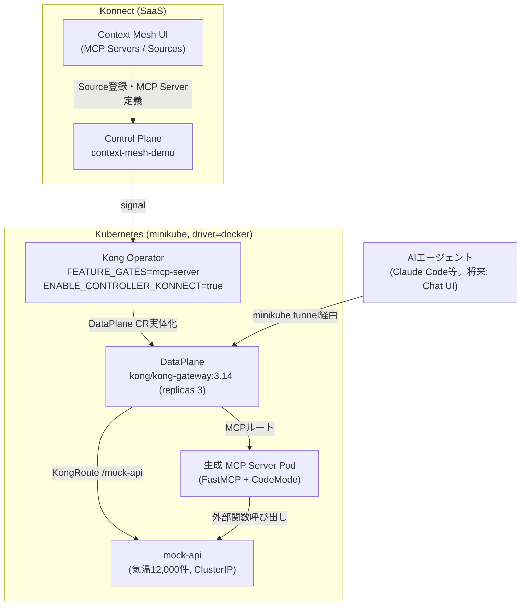

# Dev Design Brief: konnect-code-mode-mcp

Kong Konnect Context Mesh（Code Mode MCP相当機能）のデモ・技術検証リポジトリの基本設計。
[Dev Repo Bootstrap Checklist](https://github.com/picketfence-labs/obsidian-vault/blob/main/06-Templates/Dev%20Repo%20Bootstrap%20Checklist.md)
Step 0.5に基づき作成（Obsidian Vault側 `01-Projects/2026-09_konnect-code-mode-mcp` Projectでの
ヒアリング結果、2026-09-04時点）。

## 1. Projectゴール
Kong Konnect Context Mesh を使い、AIエージェントのLLMトークン量削減を実証する、**社内向けの継続的な
リファレンスデモ**を本リポジトリに一本化して整備する。Context Meshはまだ GA 前（2026年9〜10月予定）
のため、kongctl/Terraform では完結できず Konnect UI 上の手動操作を含む運用体系を前提にする。

## 2. 要件

### 現在（今回のスコープで確実に必要なもの。優先順）

1. **Kong Operator の image tag アップグレード検証（最優先）**: 社内SE手順書
   （`kong-operator`チャートを`docker.io/kong/nightly-kong-operator:20260623`に固定する内容。
   Vault側 `01-Projects/2026-09_konnect-code-mode-mcp/notes/Kong Operator Context Mesh - SE's.md`
   参照）では、当時「デプロイしても Konnect 側で MCP Server の状態確認が取れない」という
   Kong Operator 側のバグの回避策としてこのタグに固定していた。より新しいタグに置き換え、
   Konnect UI 上で MCP Server のステータスが正しく `healthy` になることを検証する。
2. **リポジトリの一本化**: これまで `~/LOCAL_REPO/context-mesh`
   （upstream `kong-gateway/context-mesh` の reference clone。Obsidian Vault
   `07-Sources/repos/kong-gateway-context-mesh` に登録済み・**変更禁止の参照専用**）を実運用の
   起点にして Kong Operator インストール・Konnect UI 操作を行っていたが、以後は本リポジトリ
   （`konnect-code-mode-mcp`）だけで再現できるようにする。具体的には、社内SE手順書の
   Kong Operator インストール手順（Helm/CRD 定義）を `deploy/kong-operator/` 等に取り込む。
3. mock-api の Kong DP 経由到達（`deploy/kong/mock-api-kong.yaml` の KongService/KongRoute、
   `minikube tunnel`）を実機で検証する（前回セッション時点で未検証のまま）。
4. CLAUDE.md の「未確定事項（要確認）」（Konnect UI での Code Mode 有効化手段、現テナントでの
   MCP Composer 利用可否）を解消する。

### 将来（今回はやらないが、優先順位2番目以降として控える）

5. **Chat UI 構築**: 現状は Claude Code CLI の `claude mcp add` 経由でエージェントを接続し、
   CLI 上でプロンプト（例:「8月の平均気温が最も低い都市を10挙げてください」）を打っているだけで、
   一般向けに見せられる Chat UI が無い。将来的に構築する。
6. **ログ基盤整備**: mock-api・MCP Server のログを、現状はコンテナログを直接見て確認している。
   Grafana/Loki、または AI/MCP 評価に向いたログ基盤で両者のログを集約・検証できる仕組みにする。
7. Context Mesh の GA（2026年9〜10月予定）に伴う仕様変更への追随（継続的なメンテナンス）。
8. 社内リファレンスとしての継続運用・Obsidian Vault（`02-Areas`/`07-Sources`）への知見フィード
   バック窓口としての役割を保つ。

## 3. アーキテクチャ

- Konnect Control Plane（`context-mesh-demo`）⇄ Kong Operator（`mcp-server` feature-gate）⇄
  K8s DataPlane（`kong/kong-gateway:3.14`、replicas 3）
- mock-api（気温データ、FastAPI、ClusterIP）を Kong DP 経由（`KongService`/`KongRoute`、
  `/mock-api`）で公開。Mac 側到達は `minikube tunnel`（**未検証**）
- Konnect UI 上で mock-api の OpenAPI spec を「Source」として登録 → MCP Server
  （`search`/`get-schema`/`execute` の3ツール）が自動生成 → Code Mode（FastMCP `CodeMode`
  transform）でクエリごとに動的コード生成・サンドボックス実行

**既存の判断ポイント（ADR化対象。`docs/decisions/`未整備、Bootstrap Checklist Step 1.5で追加予定）**:
- LoadBalancer(MetalLB) vs ClusterIP+`minikube tunnel` vs `kubectl port-forward` →
  ClusterIP+tunnel/port-forward併用に決定済み（2026-09-04）
- Kong Operator image tag: バグ回避のため`nightly:20260623`に固定 → 新タグでの再検証待ち
  （**今回の最優先事項**）
- デモAPI: SE手順書記載のサンプル（Flights/OpenWeather）ではなく独自のmock-api（気温データ）を
  採用 → 決定済み（再現性・カスタマイズ性を優先）
- 実運用の起点: `~/LOCAL_REPO/context-mesh`（参照専用clone）から本リポジトリへ一本化 →
  決定済み（2026-09-04、利用者の判断）

## 4. 技術スタック

- Kubernetes（minikube, driver=docker, macOS）
- Kong Operator（Helm chart `kong/kong-operator`）/ Kong Gateway 3.14（hybrid, `DataPlane` CRD）
- FastMCP（Python, `CodeMode` transform）/ oas-to-python（Go, OpenAPI→FastMCPサーバー生成）
- Konnect UI（MCP Server / Source登録、手動操作）
- （将来・未定）Chat UI: 技術選定は未定
- （将来・未定）ログ基盤: Grafana/Loki等、技術選定は未定

## 5. 検証方法（テストケース）

- **image tag アップグレード**: 新タグで Kong Operator を再インストール →
  `KonnectGatewayControlPlane`/`DataPlane` の Ready 確認 → Konnect UI 上で MCP Server の
  status が `healthy` になることを確認（旧タグでは確認できなかった問題が解消されているか）
- **mock-api の Kong DP 到達**: `minikube tunnel` 起動 → `curl http://localhost/mock-api/health`
  が 200 を返すことを確認
- **デモ本体**: Konnect UI 経由で MCP Server 定義 → AIエージェントから
  「過去10年の3月の平均気温Top5」等のクエリを実行 → レスポンスが集計後の少数件のみであること
  （生の12,000件がLLMコンテキストに流れないこと）を確認
- **外部依存の前提条件確認**: 現テナントで MCP Composer/Context Mesh が利用可能であることは
  既に確認済み（Obsidian Vault `07-Sources/repos/konnect-code-mode-mcp` 参照）。
  Kong Operator の nightly tag は `docker.io/kong/nightly-kong-operator` のタグ一覧から、
  後方互換性を確認しつつ最新に近いものを選定する

## 6. 成果物

- 本リポジトリに一本化された、再現可能なセットアップ手順（Kong Operatorインストール〜
  Konnect UI操作〜デモクエリ実行）
- 本Design Brief（`docs/design-brief.md`）・ADR（`docs/decisions/`、未整備）・
  troubleshooting-log（未整備）
- （将来）Chat UI、ログ基盤

## 7. 関連する既存知見・参照先の棚卸し

- (a) Area: Obsidian Vault `02-Areas/Konnect - Context Mesh`の「現在地」節
  （Context Mesh概要・GA予定・アーキテクチャ）
- (b) ローカル参照ホワイトリスト候補（Obsidian Vault `07-Sources`、変更禁止・参照専用）:
  - `kong-gateway-context-mesh`（`~/LOCAL_REPO/context-mesh`）: コード生成器・ランタイム
  - `kong-operator`（`~/LOCAL_REPO/kong-operator`）: Kubernetesオペレーター本体
  - `kong-konnect-context-mesh`: Control Plane実装（ローカル参照なし、GitHub直接確認）

## 検証ログ
- 2026-09-04: 初版作成。Obsidian Vault Projectでのヒアリングにより、社内SE手順書
  （`~/LOCAL_REPO/context-mesh`を起点としたKong Operatorインストール・Konnect UI操作）の
  存在と、image tag固定がバグ回避策だったこと、Chat UI・ログ基盤が未整備であることが判明し、
  それを反映して作成。
