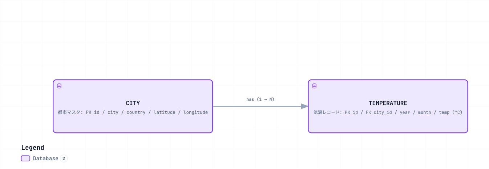

# mock-api — Mock API for Monthly Average Temperatures in Major World Cities (Normalized)

> Japanese (authoritative): [README.md](README.md) — this English version is a translation.

This upstream API returns “large numbers of records” for the Code Mode demo. It is used for local unit verification and for tests that demonstrate Konnect Code Mode MCP.

## Normalized data model

The data is normalized into 2 entities (`temperatures.city_id` → `cities.id`).

[](https://picketfence-labs.github.io/diagrams/9f128b7a374f/)

*(Click the image to open the interactive version.)*

- **cities**: **100 major cities** around the world (`data/cities.json`).
- **temperatures**: 100 cities × 12 months × 10 years (2016–2025) = **12,000 records** (`data/temperatures.json`).
- Since real data was unavailable, these are **approximations** synthesized from each city's annual average temperature (baseline), seasonal amplitude derived from latitude, hemisphere phase, a small year-over-year trend, and deterministic noise. The random seed is fixed to `(city, year, month)`, so **every generation produces the same values**.

## Endpoints

| Method / path | operationId | Response |
|---|---|---|
| `GET /cities` | `listCities` | Only ids and city names for all cities (100 items) |
| `GET /cities/{city_id}` | `getCity` | Details for 1 city (id, city, country, latitude, longitude) |
| `GET /temperatures?city_id=` | `getTemperatures` | Temperature records for the specified city (**city_id required**, default 120 items). Filter further with `month` / `year` |
| `GET /health` | `health` | Health check |

Expected query: **“Get the top 5 cities by average temperature in March over the past 10 years.”** Because the data is normalized, the request first gets ids for 100 cities with `listCities`, then calls `getTemperatures` for each `city_id`, averages the 10 years where `month==3`, and sorts descending to get the Top5. This requires **multiple calls plus aggregation**, the pattern where Code Mode provides its value. Reference result: Jakarta / Singapore / Khartoum / Luanda / Chennai.

## Files

| File | Purpose |
|---|---|
| `generate_data.py` | Deterministic test data generator (outputs cities/temperatures) |
| `data/cities.json` | Generated 100 cities |
| `data/temperatures.json` | Generated 12,000 temperature records |
| `server.py` | FastAPI mock API |
| `openapi.json` | OpenAPI 3.0.3 spec (for `oas-to-python`) |
| `requirements.txt` | FastAPI / uvicorn |

## Usage

### Regenerate data (optional)

```bash
python3 generate_data.py    # data/cities.json と data/temperatures.json を生成（決定論的）
```

### Start the API

```bash
pip install -r requirements.txt
uvicorn server:app --host 0.0.0.0 --port 8000
```

### Verify operation

```bash
curl -s localhost:8000/health
curl -s localhost:8000/cities | jq 'length'                    # 100
curl -s localhost:8000/cities/1                                # Tokyo の詳細
curl -s 'localhost:8000/temperatures?city_id=30' | jq 'length' # 120 (Jakarta)
curl -s 'localhost:8000/temperatures?city_id=30&month=3' | jq 'length'  # 10
curl -s localhost:8000/temperatures | jq .   # city_id 無し → 422 (必須エラー)
```

See [../CODE_MODE_LOCAL_TEST.md](../CODE_MODE_LOCAL_TEST.en.md) for detailed verification steps.
