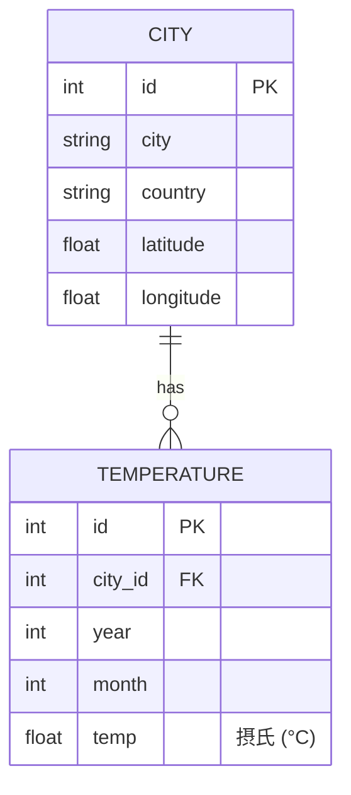

# mock-api — 世界主要都市 月平均気温 モック API（正規化版）

Code Mode デモ用の「大量レコードを返す上流 API」。ローカル単体検証と、
Konnect Code Mode MCP の実証テストの両方で使用する。

## データモデル（正規化）

2 つのエンティティに正規化されている（`temperatures.city_id` → `cities.id`）。



- **cities**: 世界主要 **100 都市**（`data/cities.json`）。
- **temperatures**: 100 都市 × 12 か月 × 10 年 (2016–2025) = **12,000 レコード**（`data/temperatures.json`）。
- 実データが手元に無いため、都市ごとの年平均気温 (平年値) を基準に、緯度から求めた
  季節振幅・半球位相・微小な経年トレンド・決定論的ノイズを合成した**近似値**。
  乱数は `(city, year, month)` をシードに固定しており、**何度生成しても同じ値**になる。

## エンドポイント

| メソッド / パス | operationId | 返却 |
|---|---|---|
| `GET /cities` | `listCities` | 全都市の **id と都市名のみ**（100 件） |
| `GET /cities/{city_id}` | `getCity` | 1 都市の詳細（id, city, country, latitude, longitude） |
| `GET /temperatures?city_id=` | `getTemperatures` | 指定都市の気温レコード（**city_id 必須**、既定 120 件）。`month`/`year` で追加絞り込み可 |
| `GET /health` | `health` | ヘルスチェック |

想定クエリ: **「過去 10 年の 3 月の平均気温 Top5 を取得」**。正規化により、
`listCities` で 100 都市の id を得てから、各 `city_id` について `getTemperatures` を呼び、
`month==3` を 10 年平均 → 降順 Top5、という**複数呼び出し + 集計**になる（Code Mode の
真価が出るパターン）。参考結果: Jakarta / Singapore / Khartoum / Luanda / Chennai。

## ファイル

| ファイル | 役割 |
|---|---|
| `generate_data.py` | テストデータ生成器（決定論的、cities/temperatures を出力） |
| `data/cities.json` | 生成済み 100 都市 |
| `data/temperatures.json` | 生成済み 12,000 気温レコード |
| `server.py` | FastAPI モック API |
| `openapi.json` | OpenAPI 3.0.3 spec（`oas-to-python` に渡す用） |
| `requirements.txt` | FastAPI / uvicorn |

## 使い方

### データ再生成（任意）

```bash
python3 generate_data.py    # data/cities.json と data/temperatures.json を生成（決定論的）
```

### API 起動

```bash
pip install -r requirements.txt
uvicorn server:app --host 0.0.0.0 --port 8000
```

### 動作確認

```bash
curl -s localhost:8000/health
curl -s localhost:8000/cities | jq 'length'                    # 100
curl -s localhost:8000/cities/1                                # Tokyo の詳細
curl -s 'localhost:8000/temperatures?city_id=30' | jq 'length' # 120 (Jakarta)
curl -s 'localhost:8000/temperatures?city_id=30&month=3' | jq 'length'  # 10
curl -s localhost:8000/temperatures | jq .   # city_id 無し → 422 (必須エラー)
```

詳細な検証手順は [../CODE_MODE_LOCAL_TEST.md](../CODE_MODE_LOCAL_TEST.md) を参照。
